# Bezpieczeństwo sieci komputerowych
## Sprawozdanie z laboratorium

Data				| Tytuł zajęć							| Uczestnicy				
--------------------|---------------------------------------|---------------------------
30.10.2018 16:10	| Kryptografia							| Iwo Bujkiewicz (226203)

### Wyniki realizacji zadań

#### Zadanie 2.

Podczas generowania pary kluczy przy użyciu wtyczki Enigmail w programie Thunderbird wybrano rodzaj klucza `Elliptic Curve`, co zaowocowało wygenerowaniem klucza Ed25519, oraz brak terminu ważności. Kryptografia oparta o klucze Ed25519 uważana jest za nieco skuteczniejszą od opartej o klucze RSA (często nawet w postaci 4096-bitowej), jednak nie jest tak powszechnie wykorzystywana ze względu na kompatybilność wsteczną.

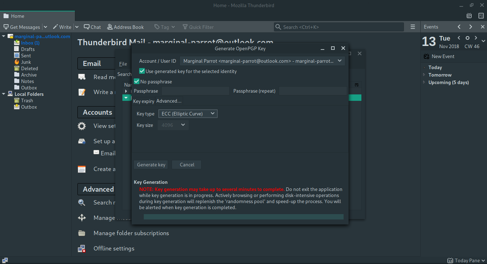
_Generowanie pary kluczy przy użyciu Enigmail_

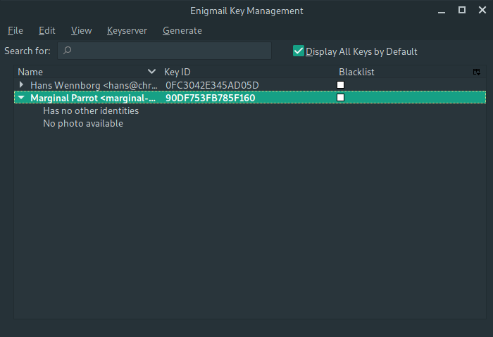
_Klucz publiczny wygenerowany przy użyciu Enigmail_

Podczas generowania pary kluczy przy użyciu GNU Privacy Assistant wybrano domyślny rodza klucza RSA w postaci 2048-bitowej oraz brak terminu ważnośći.

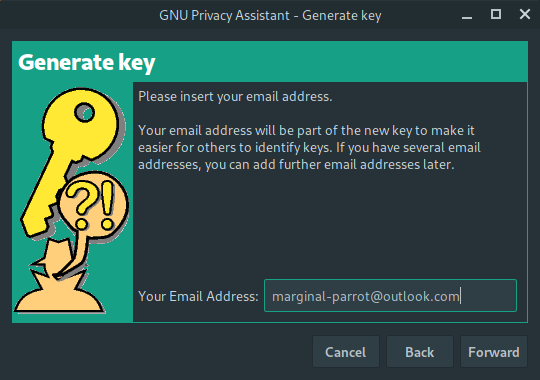
_Generowanie pary kluczy przy użciu GPA_

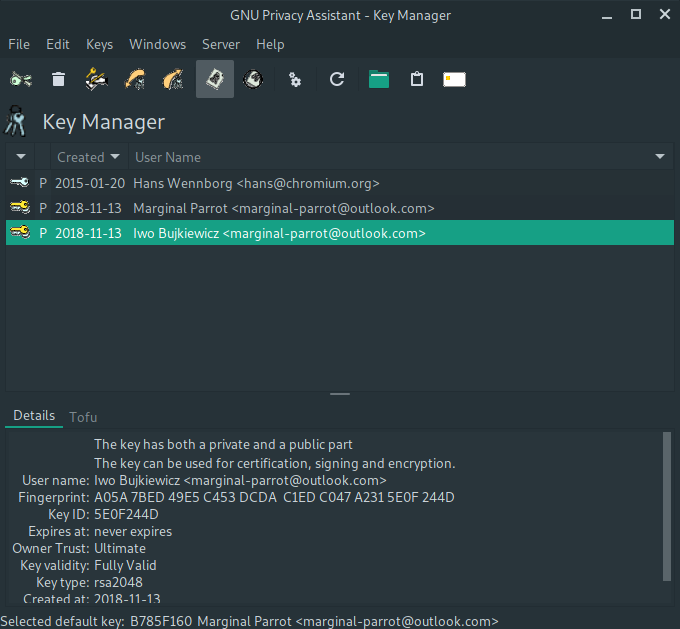
_Para kluczy wygenerowana przy użyciu GPA_

Podczas generowania pary kluczy przy użyciu CLI GPG wybrano generowanie 4096-bitowego klucza RSA oraz termin ważności określony na 2 lata.

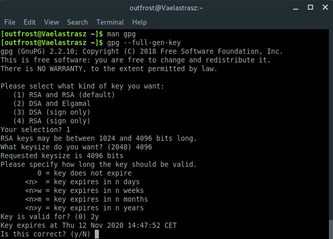
_Generowanie pary kluczy przy użyciu CLI GPG_

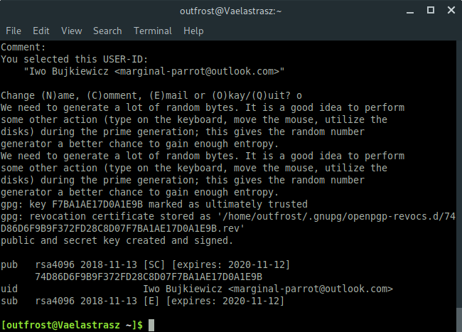
_Generowanie pary kluczy przy użyciu CLI GPG_

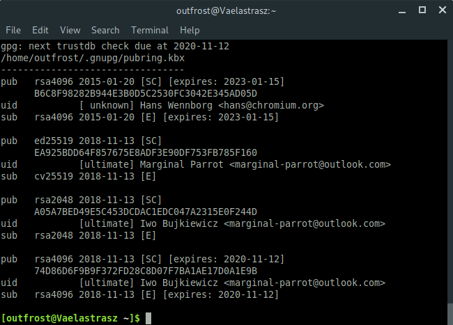
_Klucz publiczny wygenerowany przy użyciu CLI GPG_

Dla żadnego z kluczy prywatnych nie ustalono hasła szyfrującego klucz podczas przechowywania. Do wykonania kolejnych zadań wybrano parę 4096-bitowych kluczy RSA.

<div class="page-break"></div>

#### Zadanie 3.

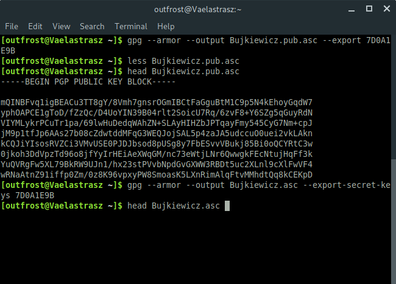
_Klucze publiczny i prywatny wyeksportowane do plików_

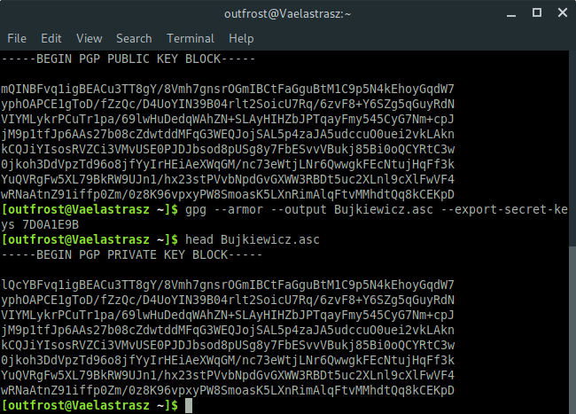
_Klucze publiczny i prywatny wyeksportowane do plików_

```
74D86D6F9B9F372FD28C8D07F7BA1AE17D0A1E9B
```
_Odcisk klucza publicznego_

<div class="page-break"></div>

#### Zadanie 4.

Klucz publiczny wyeksportowano na serwer `pgp.mit.edu`.

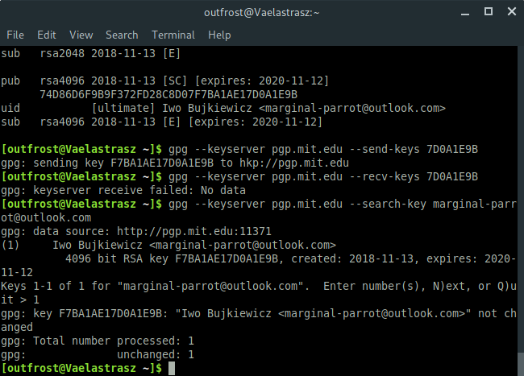
_Eksport klucza publicznego na serwer kluczy i wyszukiwanie klucza na serwerze kluczy_

Klucz można unieważnić, importując w GPG certyfikat unieważnienia klucza, a następnie wysyłając zmodyfikowany w ten sposób klucz na serwery kluczy oraz do indywidualnych osób i organizacji.


_Wycinek manuala GPG - sposób unieważnienia klucza_

<div class="page-break"></div>

#### Zadanie 5.

Z uwagi na wykonywanie zadania w grupie ówczas jednoosobowej, wygenerowany został dodatkowy klucz fikcyjnej osoby.


_Podpisywanie zaimportowanego klucza publicznego_

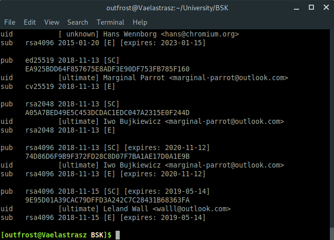
_Podpisany zaimportowany klucz publiczny_

<div class="page-break"></div>

#### Zadanie 6.

Plik tekstowy został podpisany przy użyciu następującej komendy.

```sh
$ gpg --default-key 7D0A1E9B --sign Bujkiewicz.txt
```

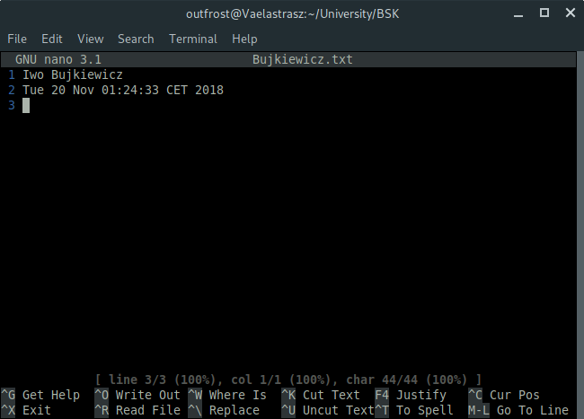
_Zawartość pliku tekstowego_

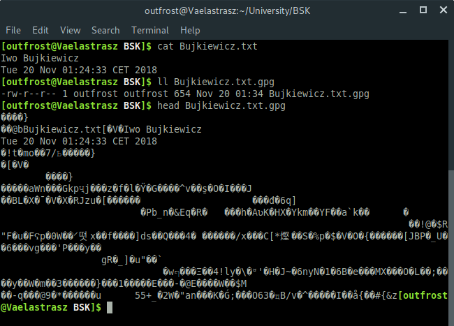
_Plik tekstowy podpisany przy użyciu CLI GPG_

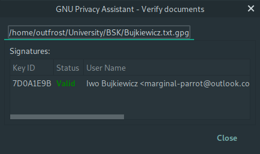
_Weryfikacja podpisu przy użyciu GPA_

#### Zadanie 7.

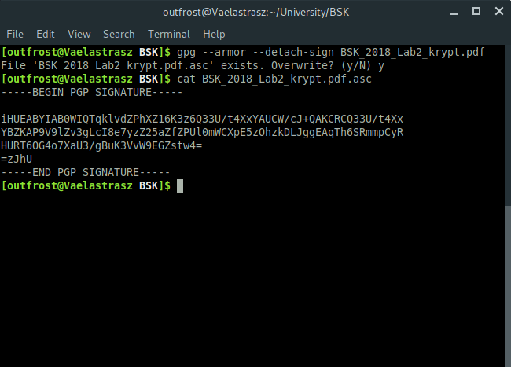
_Podpis pliku PDF z instrukcją_

#### Zadanie 8.

W GPA operacje na plikach wykonywane są za pośrednictwem okna `File Manager`, które umożliwia ich szyfrowanie, deszyfrowanie, podpisywanie oraz weryfikację podpisów. Zaszyfrowany został ten sam plik, który był użyty do zadania 6. Jako odbiorca zaszyfrowanego kluczem publicznym pliku wybrany został posiadacz głównego klucza prywatnego używanego w ćwiczeniu.

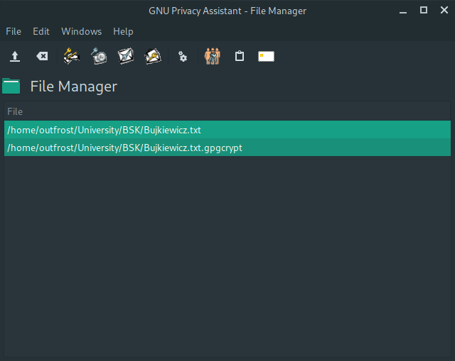
_Plik zaszyfrowany przy użyciu GPA_

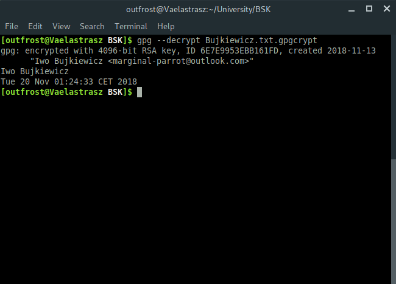
_Plik odszyfrowany przy użyciu CLI GPG_

<div class="page-break"></div>

#### Zadanie 9.

Zaszyfrowany został ten sam plik, który był użyty do zadania 6. Jako odbiorca zaszyfrowanego kluczem publicznym pliku wybrany został posiadacz głównego klucza prywatnego używanego w ćwiczeniu.


_Plik zaszyfrowany przy użyciu CLI GPG_

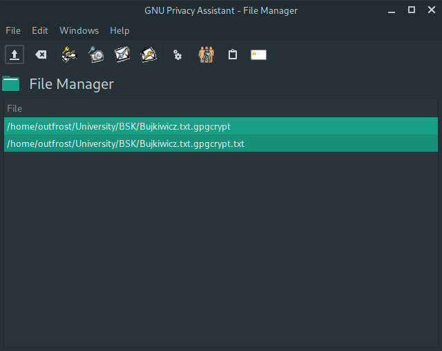
_Plik odszyfrowany przy użyciu GPA_

<div class="page-break"></div>

#### Zadanie 10.

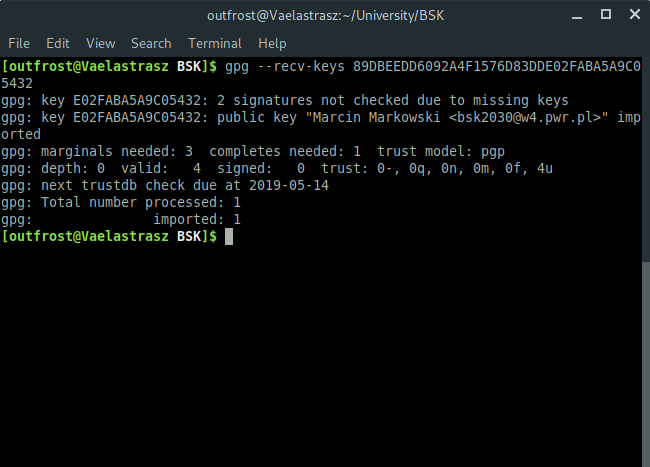
_Klucz prowadzącego pobrany z serwera kluczy_

#### Zadanie 11.

Właściwy plik z treścią zadania 11. został zidentyfikowany poprzez weryfikację podpisu każdego z plików. Zrzut ekranu demonstruje użyte komendy.

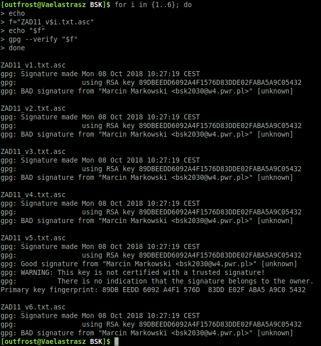
_Weryfikacja sygnatur plików z treścią zadania_

Następnie plik tekstowy został wyodrębniony z pliku z podpisem i odczytany w terminalu. Ze względu na kodowanie tekstu użyte podczas zapisu pliku (`windows-1250`, zamiast `UTF-8`) przy wyświetlaniu zawartości pliku terminal napotkał nieznane znaki.

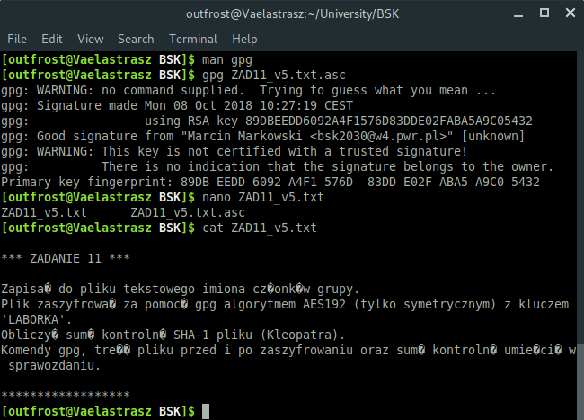
_Zweryfikowana treść zadania 11._

Zadanie polegało na stworzeniu pliku tekstowego, zaszyfrowaniu go algorytmem AES-192 z kluczem `LABORKA`, i sprawdzeniu jego zawartości po zaszyfrowaniu oraz sumy kontrolnej SHA1.

```
Iwo
```
_Treść pliku `Bujkiewicz-11.txt` przed zaszyfrowaniem_

```sh
$ gpg -c --cipher-algo aes192 Bujkiewicz-11.txt
```
_Komenda szyfrująca_

```
�
c���EN���J�'�%6�S}!	��Jr���ʂ�<o�O���#�N�F^7�
m��Eu-�,d�➐����'8�W��v0?
```
_Treść pliku po zaszyfrowaniu (tekstowa reprezentacja pliku binarnego)_

```
c46ce2f4d4a1101c19acf0097b872a0a2f65d926
```
_Suma kontrolna SHA1_

<div class="page-break"></div>

#### Zadanie 12.

Z uwagi na wykonywanie ćwiczenia w grupie ówczas jednoosobowej, wiadomość email została zaszyfrowana, podpisana i wysłana na własny adres email.

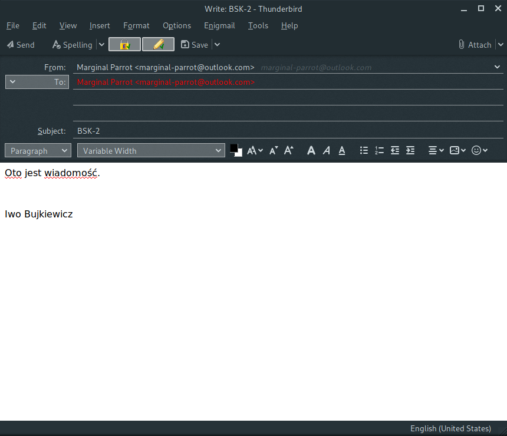
_Wysyłana wiadomość email_

Enigmail automatycznie weryfikuje podpis i odszyfrowuje wiadomość przy odebraniu jej w poprawnej postaci.

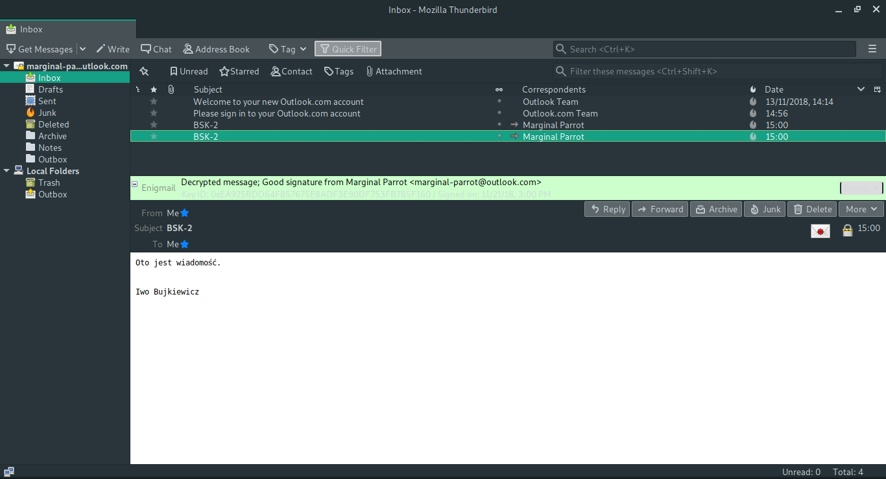
_Odebrana wiadomość email, odszyfrowana po pomyślnej weryfikacji podpisu_

<div class="page-break"></div>

#### Zadanie 13.

Do porównania wybrano algorytmy: domyślny (AES-128), AES-256 oraz Twofish. Szyfrowany był plik o identycznej zawartości, jak w zadaniu 6. Wielkość zaszyfrowanych plików okazała się być identycza dla tych trzech algorytmów, różniły się one natomiast oczywiście zawartością.


_Szyfrowanie symetryczne przy użyciu domyślnego algorytmu - AES-128_

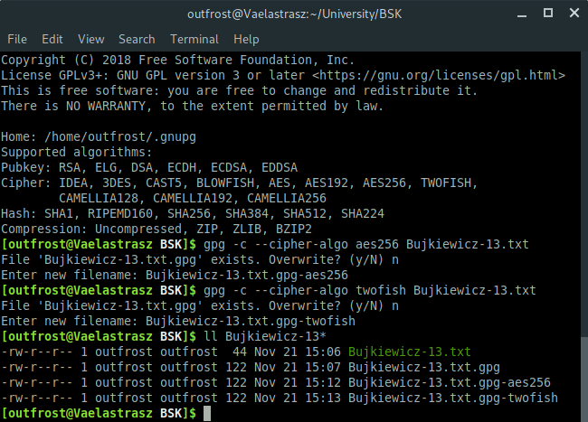
_Szyfrowanie symetryczne przy użyciu algorytmów AES-256 oraz Twofish; porównanie rozmiarów plików_

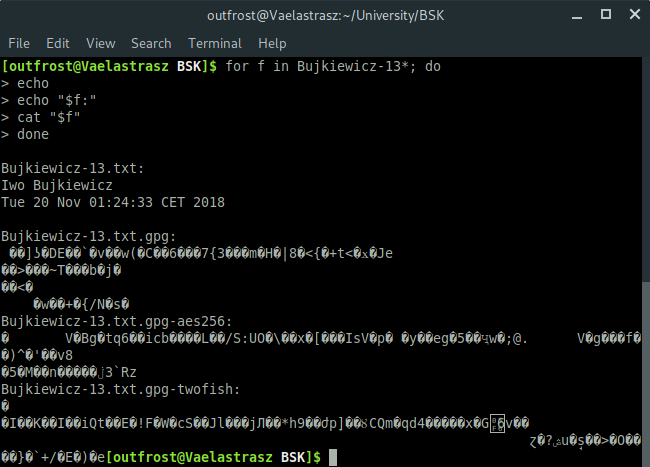
_Porównanie zawartości zaszyfrowanych plików_
