# Bezpieczeństwo sieci komputerowych
## Sprawozdanie z laboratorium

Data				| Tytuł zajęć							| Uczestnicy				
--------------------|---------------------------------------|---------------------------
23.11.2018 10:15	| Bezpieczne usługi sieciowe, wirtualne sieci prywatne	| Iwo Bujkiewicz (226203)

### Wyniki realizacji zadań

#### Zadanie 1.


_Domyślna strona główna uruchomionego serwera Apache2, wyświetlona na drugim komputerze_

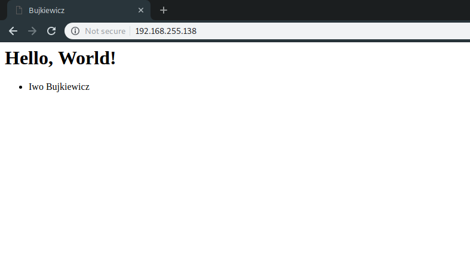
_Zmodyfikowana strona startowa, wyświetlona na drugim komputerze_

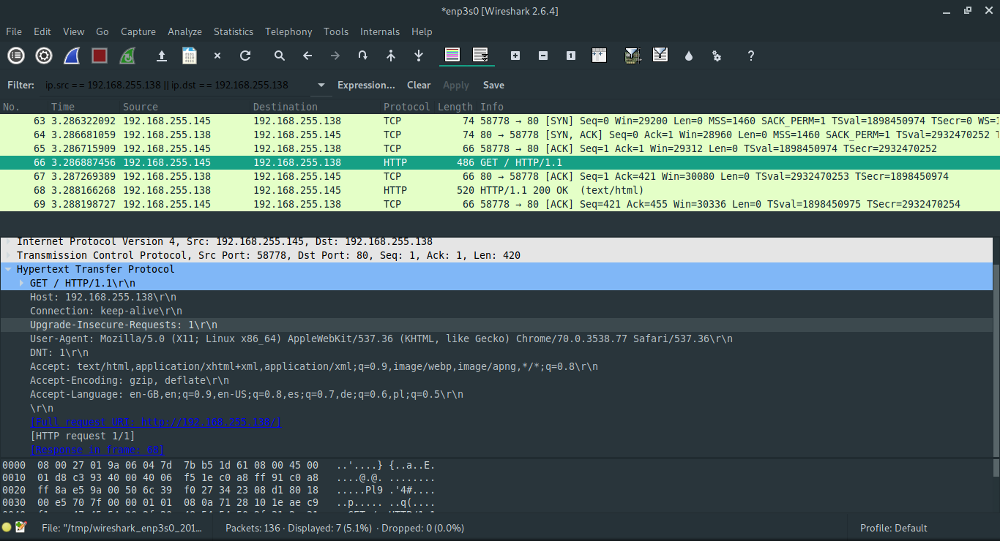
_Niezabezpieczone zapytanie HTTP_


_Niezabezpieczona odpowiedź HTTP z treścią strony_

#### Zadanie 2., Zadanie 3.

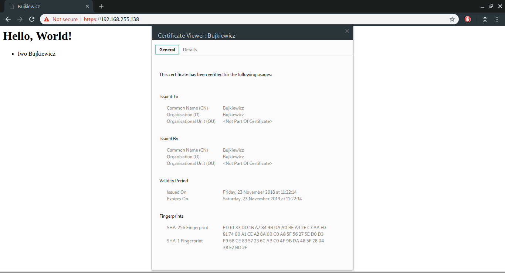
_Zmodyfikowana strona startowa pobrana przez działający HTTPS z certyfikatem X.509_

Przeglądarka używa otrzymanego od serwera HTTP certyfikatu w celu weryfikacji, że klucz publiczny, którym posługuje się serwer, jest faktycznie kluczem publicznym ważnym dla odwiedzanej domeny. W zaprezentowanym przypadku przeglądarka Chromium oznaczyła połączenie z serwerem jako niezabezpieczone, ponieważ otrzymany od serwera certyfikat nie posiadał podpisu żadnego zaufanego organu certyfikującego, a co za tym idzie, klucz publiczny nie mógł zostać uwierzytelniony.

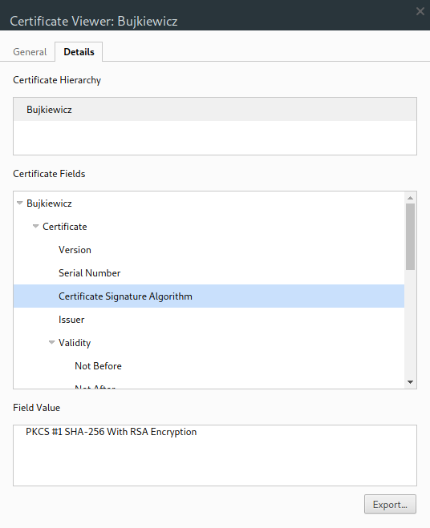
_Algorytm podpisu certyfikatu_

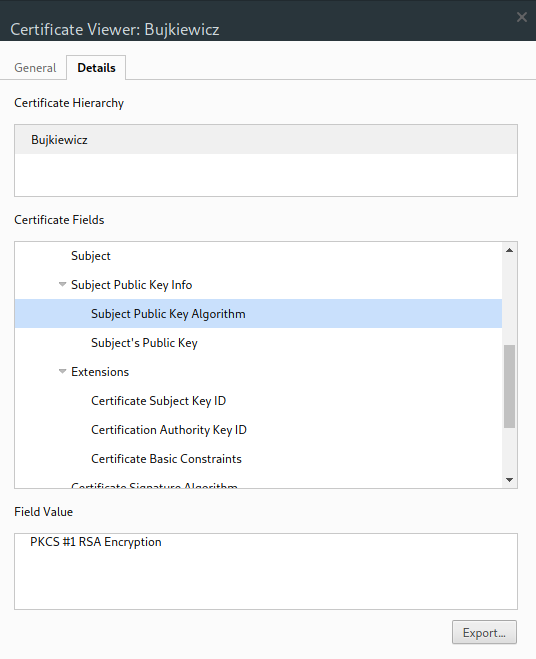
_Algorytm szyfrowania dla klucza publicznego_

Sesja została zestawiona przy użyciu szyfrowania RSA, z kluczem publicznym podpisanym za pomocą sumy kontrolnej SHA2-256, zaszyfrowanej algorytmem RSA.

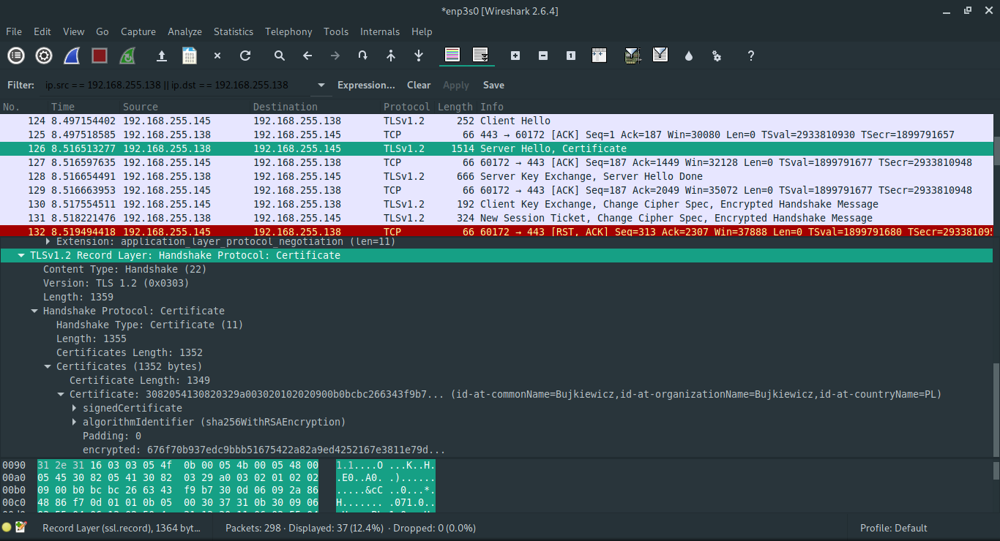
_Podgląd pakietu z certyfikatem_

Certyfikat i dialog nawiązujący połączenie nie są szyfrowane.

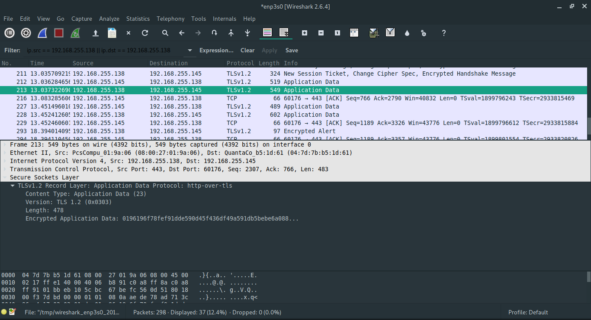
_Podgląd pakietu z danymi HTTP_

Dalsza wymiana informacji z użyciem protokołu HTTP jest szyfrowana algorytmem symetrycznym z użyciem klucza wygenerowanego przez Diffie-Hellman key exchange.

<div class="page-break"></div>

#### Zadanie 4.

Używana przeglądarka Chromium nie udostępnia strony `about:config`, więc listę obsługiwanych zestawów kryptograficznych zaczerpnięto z przeglądarki Mozilla Firefox na komputerze z serwerem HTTP.

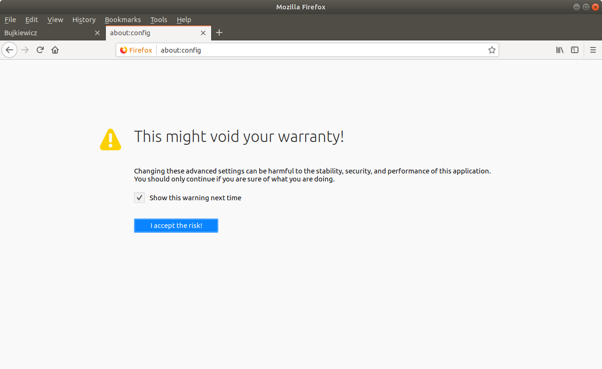
_Ostrzeżenie o "utracie gwarancji"_

> You should only continue if you are sure of what you are doing.

Za tymi drzwiami są smoki i potwory. Studenci W4 powinni się trzymać z daleka.

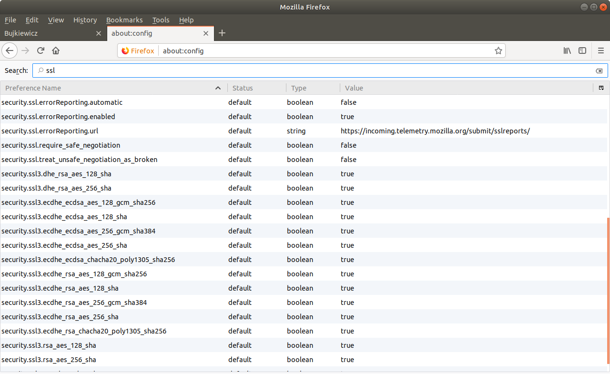
_Lista obsługiwanych zestawów kryptograficznych_

Zestawy obsługiwane przez serwer zostały uzyskane za pomocą komendy

```sh
$ openssl ciphers | tr ":" "\n"
```

Z otrzymanej listy wybrany został zestaw `ECDHE-RSA-AES256-GCM-SHA384`.

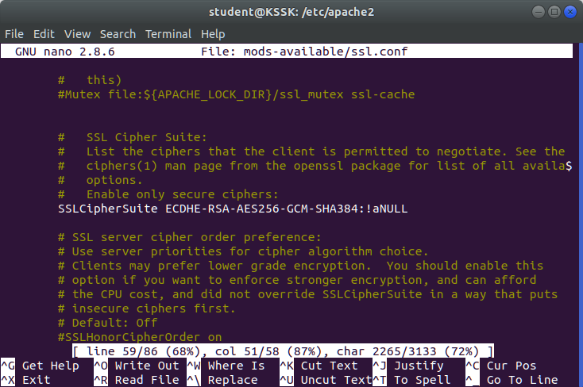
_Zmodyfikowana konfiguracja SSL Apache2_

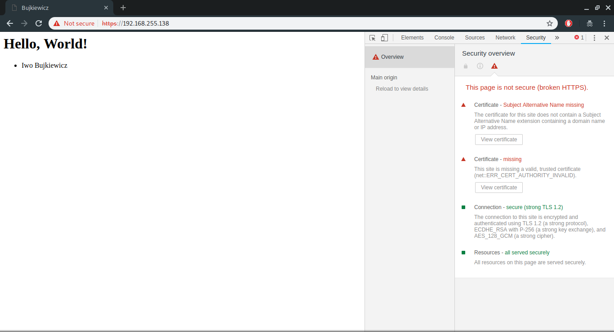
_Szczegóły zabezpieczeń strony przed zmianą_

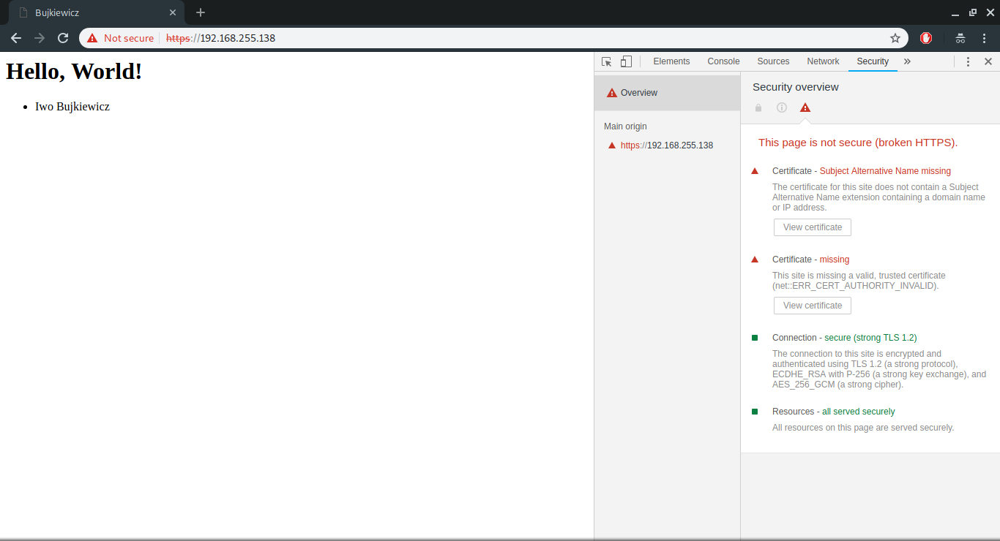
_Szczegóły zabezpieczeń strony po zmianie_

#### Zadanie 6.

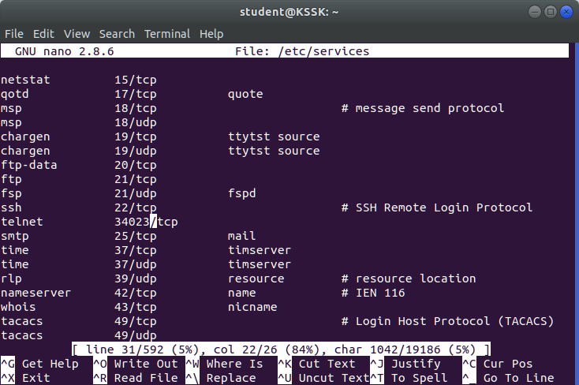
_Zmieniony port usługi telnet_

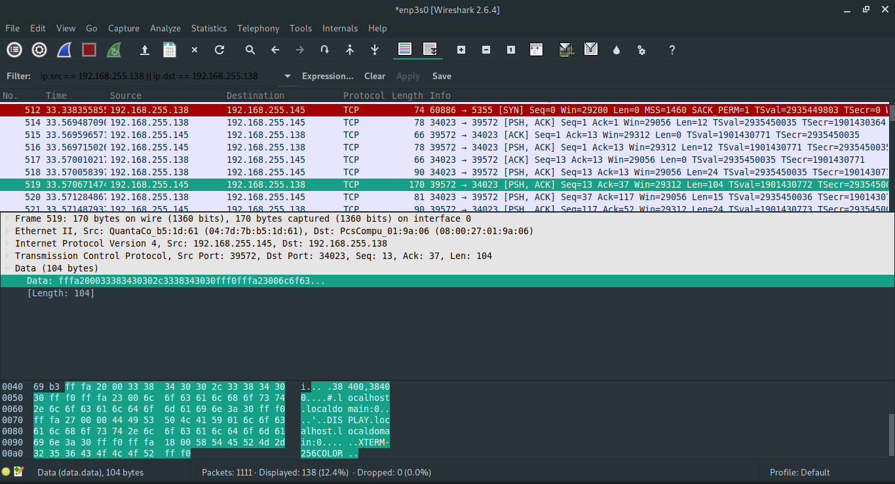
_Podgląd pakietu telnet_

Dane przesyłane za pośrednictwem telnet nie są w żaden sposób zabezpieczone.

#### Zadanie 7.

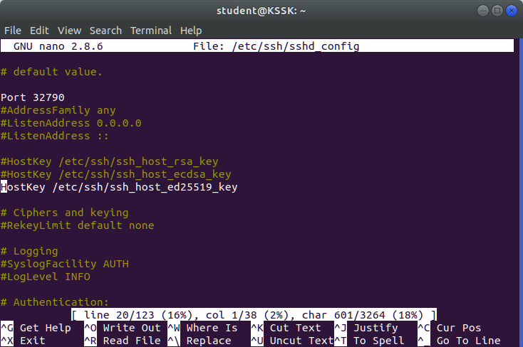
_Zmieniony port oraz plik klucza serwera w konfiguracji `sshd`_

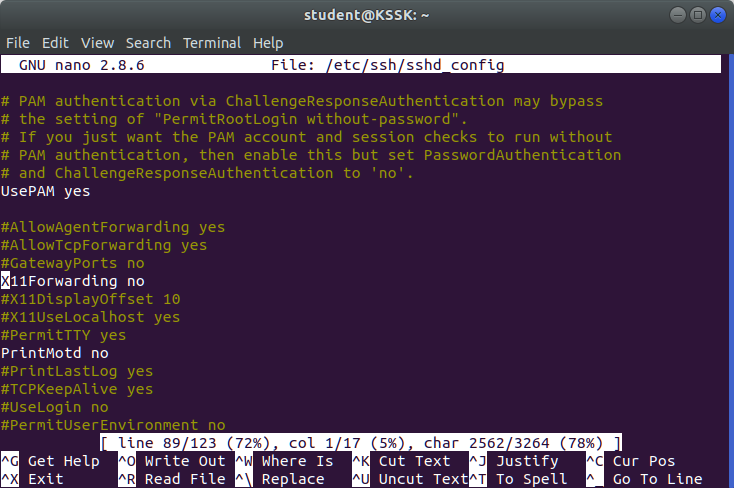
_Wyłączony X11 Forwarding w konfiguracji `sshd`_

Autentyczność serwera można potwierdzić, porównując klucz publiczny, którym się posługuje, ze znaną informacją na temat klucza publicznego serwera. Proces ten jest częściowo zautomatyzowany przez klienty SSH, które przechowują listę znanych hostów i przypisanych im odcisków kluczy publicznych.

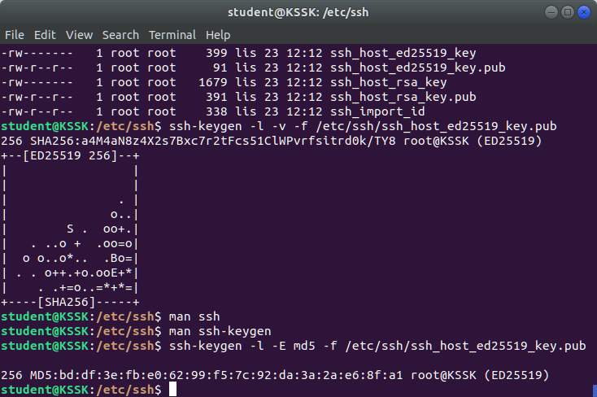
_Klucz publiczny serwera wyeksportowany w postaci odcisku SHA2-256, random artu oraz odcisku MD5_

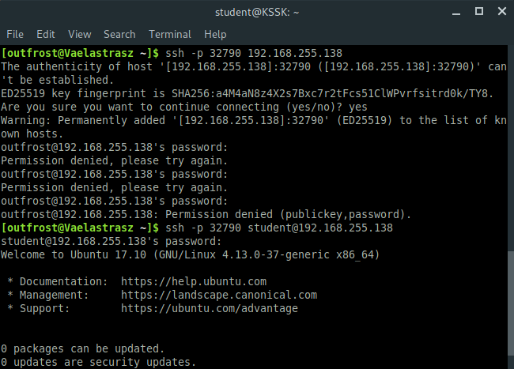
_Potwierdzenie klucza publicznego serwera podczas łączenia się z nim po raz pierwszy_

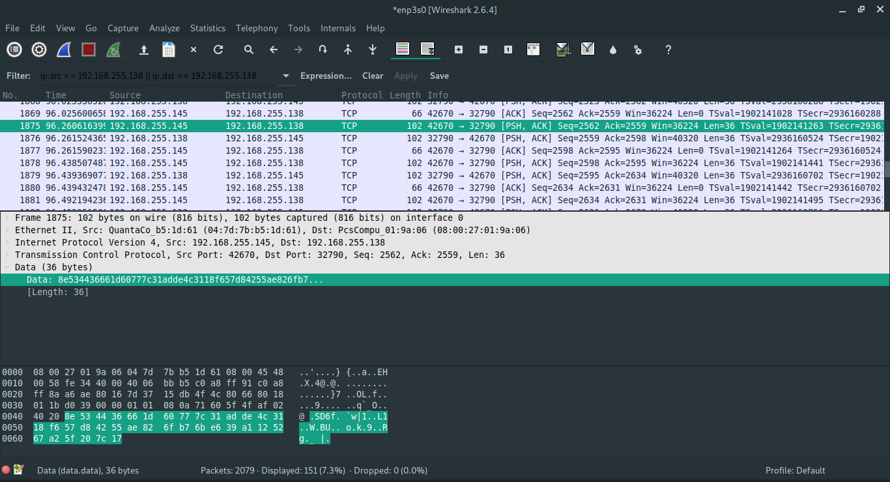
_Podgląd pakietu SSH_

Dane przesyłane za pośrednictwem SSH są szyfrowane.
