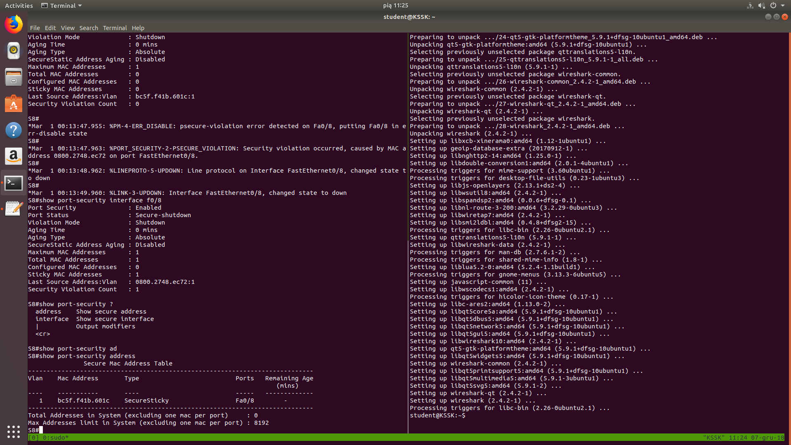
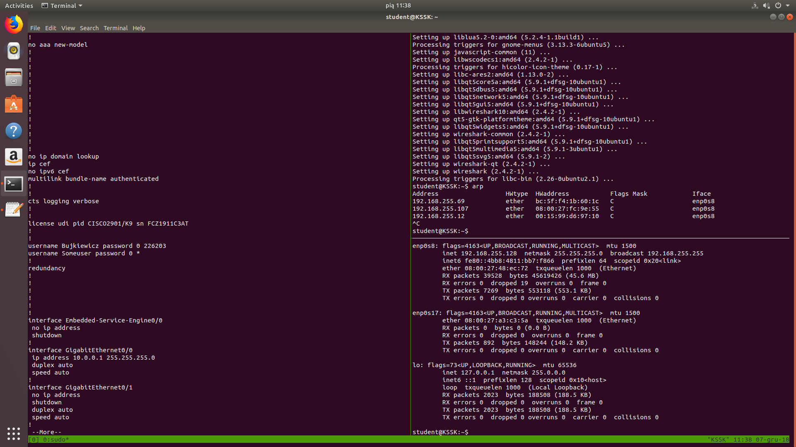
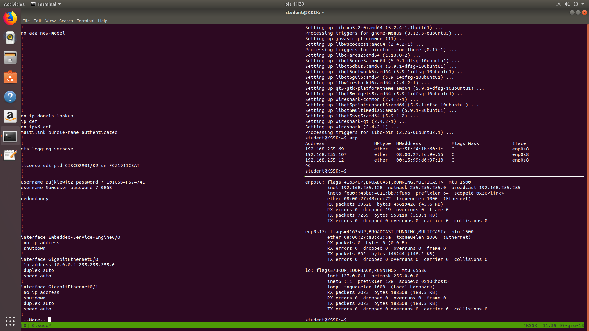
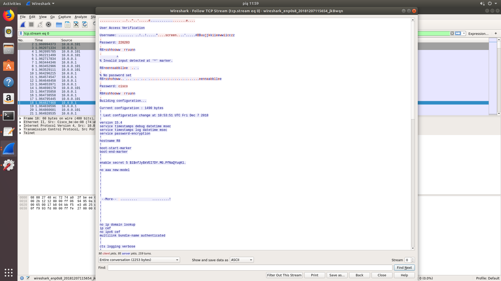
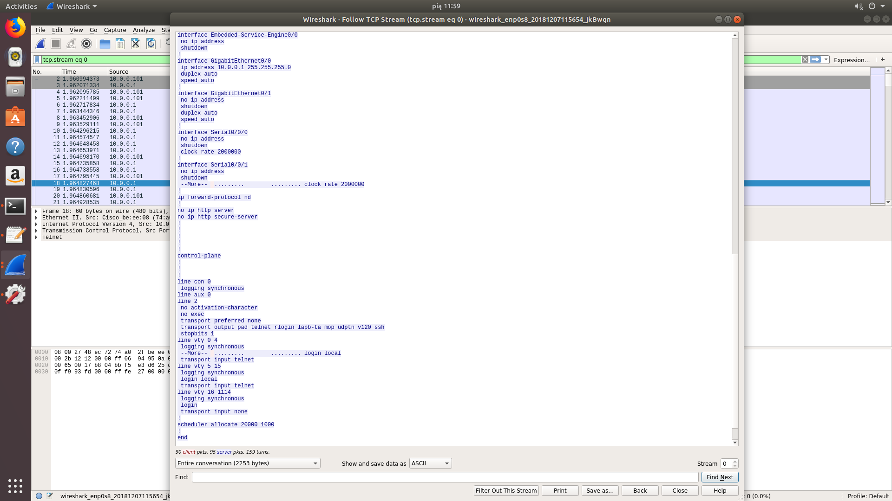
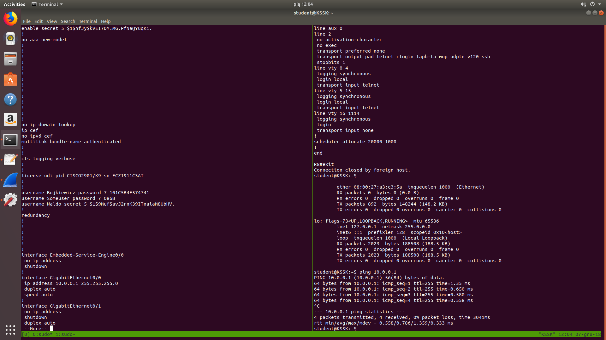
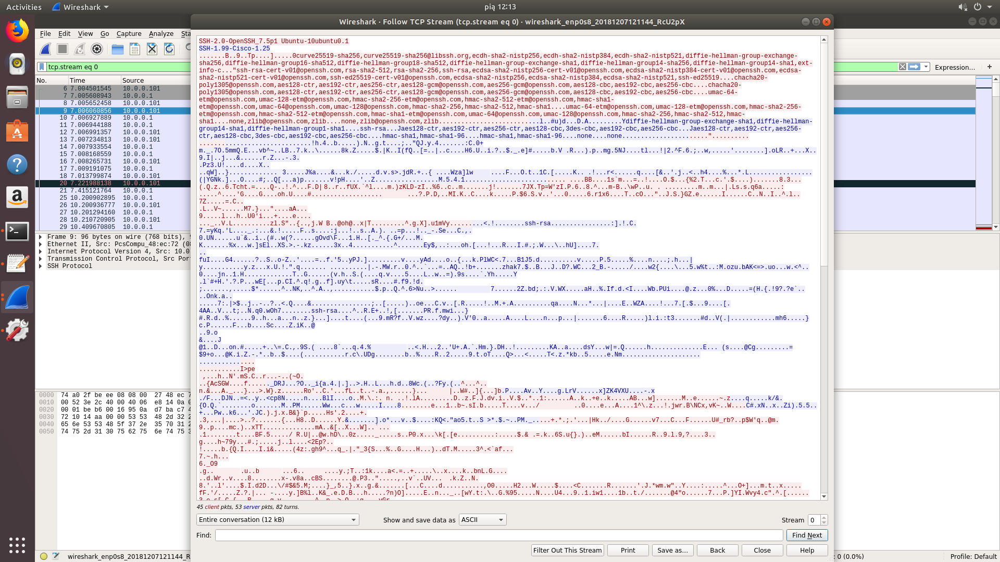
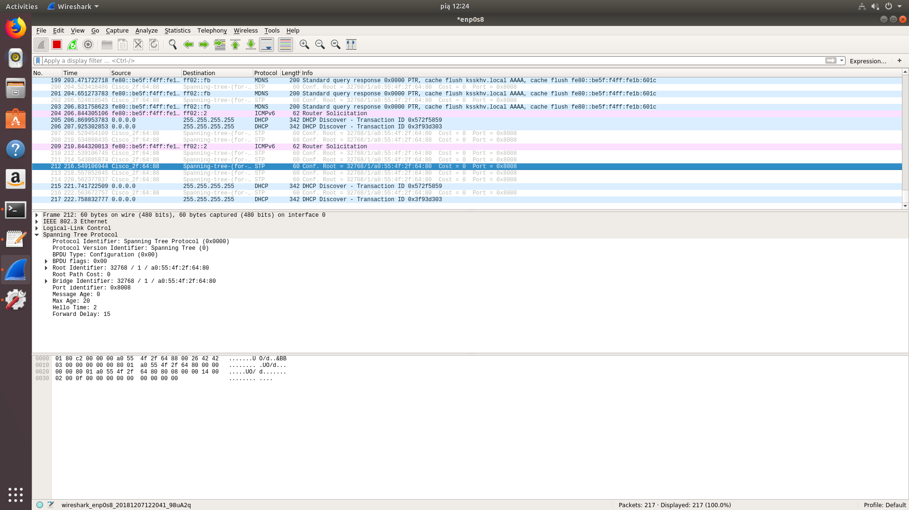
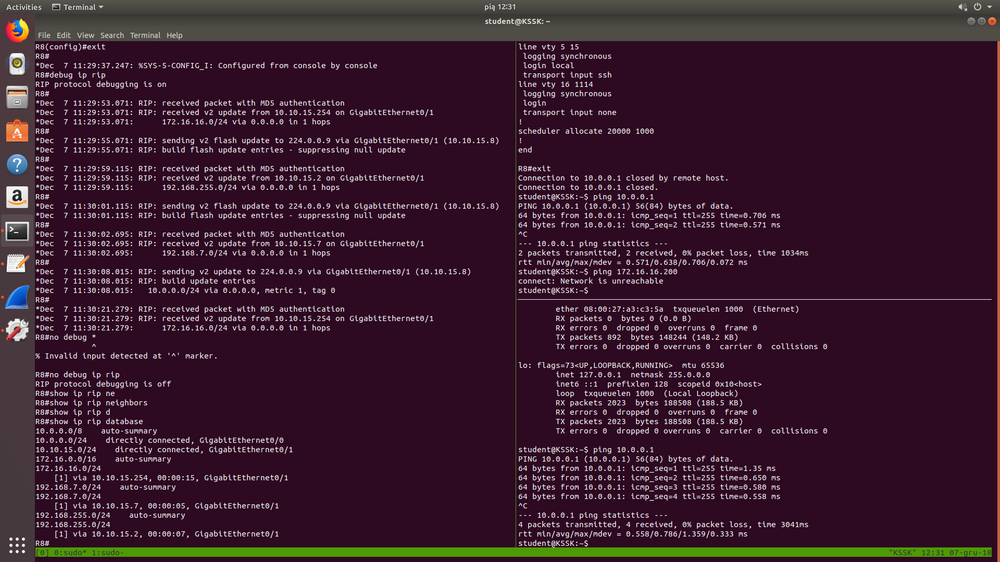

# Bezpieczeństwo sieci komputerowych
## Sprawozdanie z laboratorium

Data				| Tytuł zajęć							| Uczestnicy				
--------------------|---------------------------------------|---------------------------
07.12.2018 10:15	| Bezpieczeństwo infrastruktury sieciowej	| Iwo Bujkiewicz (226203)

### Wyniki realizacji zadań

#### Zadanie 1.

Podłączenie pierwszego PC

```
S8#show port-security interface f0/8
Port Security              : Enabled
Port Status                : Secure-up
Violation Mode             : Shutdown
Aging Time                 : 0 mins
Aging Type                 : Absolute
SecureStatic Address Aging : Disabled
Maximum MAC Addresses      : 1
Total MAC Addresses        : 0
Configured MAC Addresses   : 0
Sticky MAC Addresses       : 0
Last Source Address:Vlan   : bc5f.f41b.601c:1
Security Violation Count   : 0

S8#
*Mar  1 00:13:47.955: %PM-4-ERR_DISABLE: psecure-violation error detected on Fa0/8, putting Fa0/8 in err-disable state
S8#
*Mar  1 00:13:47.963: %PORT_SECURITY-2-PSECURE_VIOLATION: Security violation occurred, caused by MAC address 0800.2748.ec72 on port FastEthernet0/8.
S8#
*Mar  1 00:13:48.962: %LINEPROTO-5-UPDOWN: Line protocol on Interface FastEthernet0/8, changed state to down
S8#
*Mar  1 00:13:49.960: %LINK-3-UPDOWN: Interface FastEthernet0/8, changed state to down
```

Obecność więcej niż jednego logicznego interfejsu sieciowego na pierwszym PC spowodowała wyłączenie portu przez switch jeszcze zanim do portu został podłączony drugi PC. Switch nie zareagował w żaden sposób po zmianie podłączonego komputera.



```
S8#show port-security interface f0/8
Port Security              : Enabled
Port Status                : Secure-shutdown
Violation Mode             : Shutdown
Aging Time                 : 0 mins
Aging Type                 : Absolute
SecureStatic Address Aging : Disabled
Maximum MAC Addresses      : 1
Total MAC Addresses        : 1
Configured MAC Addresses   : 0
Sticky MAC Addresses       : 1
Last Source Address:Vlan   : 0800.2748.ec72:1
Security Violation Count   : 1

S8#show port-security address
               Secure Mac Address Table
-----------------------------------------------------------------------------
Vlan    Mac Address       Type                          Ports   Remaining Age
                                                                   (mins)    
----    -----------       ----                          -----   -------------
   1    bc5f.f41b.601c    SecureSticky                  Fa0/8        -
-----------------------------------------------------------------------------
Total Addresses in System (excluding one mac per port)     : 0
Max Addresses limit in System (excluding one mac per port) : 8192
```
_Konfiguracja portu_

<div class="page-break"></div>

#### Zadanie 2.


_Niezabezpieczone hasła w konfiguracji_


_Hasła "zabezpieczone" prostym szyfrowaniem_


_Przechwycona transmisja: Hasła dostępu i komendy_


_Przechwycona transmisja: Wynik komendy_


_Hasło "zabezpieczone" MD5_


_Przechwycona transmisja SSH_

<div class="page-break"></div>

#### Zadanie 3.

```
R8#debug ip rip
RIP protocol debugging is on
R8#
*Dec  7 11:27:09.467: RIP: ignored v2 packet from 10.10.15.2 (invalid authentication)
R8#
*Dec  7 11:27:18.955: RIP: ignored v2 packet from 10.10.15.7 (invalid authentication)
R8#
*Dec  7 11:27:23.711: RIP: sending v2 update to 224.0.0.9 via GigabitEthernet0/1 (10.10.15.8)
*Dec  7 11:27:23.711: RIP: build update entries
*Dec  7 11:27:23.711: 	10.0.0.0/24 via 0.0.0.0, metric 1, tag 0
R8#
*Dec  7 11:27:34.183: RIP: ignored v2 packet from 10.10.15.254 (invalid authentication)
R8#
*Dec  7 11:27:39.043: RIP: ignored v2 packet from 10.10.15.2 (invalid authentication)
R8#
*Dec  7 11:27:46.819: RIP: ignored v2 packet from 10.10.15.7 (invalid authentication)
R8#
*Dec  7 11:27:50.879: RIP: sending v2 update to 224.0.0.9 via GigabitEthernet0/1 (10.10.15.8)
*Dec  7 11:27:50.879: RIP: build update entries
*Dec  7 11:27:50.879: 	10.0.0.0/24 via 0.0.0.0, metric 1, tag 0
R8#
*Dec  7 11:28:03.267: RIP: ignored v2 packet from 10.10.15.254 (invalid authentication)
R8#
*Dec  7 11:28:09.011: RIP: ignored v2 packet from 10.10.15.2 (invalid authentication)
R8#
*Dec  7 11:28:13.899: RIP: ignored v2 packet from 10.10.15.7 (invalid authentication)
R8#
*Dec  7 11:28:17.107: RIP: sending v2 update to 224.0.0.9 via GigabitEthernet0/1 (10.10.15.8)
*Dec  7 11:28:17.107: RIP: build update entries
*Dec  7 11:28:17.107: 	10.0.0.0/24 via 0.0.0.0, metric 1, tag 0
```

Na początku router nie otrzymywał informacji o trasie do `172.16.16.0/24` ani podsieci bloku `192.168.0.0/16`. Komunikacja z serwerem `172.16.16.200` nie jest możliwa.


_Podsłuchane pakiety routingu_

Po skonfigurowaniu `GigabitEthernet0/0` jako _passive interface_ pakiety routingu nadal trafiały do komputerów.

```
R8#config t
Enter configuration commands, one per line.  End with CNTL/Z.
R8(config)#key chain RIP_22203
R8(config-keychain)#key 1
R8(config-keychain-key)#key-string bsk_lab5
R8(config-keychain-key)#exit
R8(config-keychain)#exit
R8(config)#int g0/1
R8(config-if)#ip rip authentication mode md5
R8(config-if)#ip rip authentication key-chain RIP_226203
R8(config-if)#exit
R8(config)#exit
R8#
*Dec  7 11:29:37.247: %SYS-5-CONFIG_I: Configured from console by console
R8#debug ip rip
RIP protocol debugging is on
R8#
*Dec  7 11:29:53.071: RIP: received packet with MD5 authentication
*Dec  7 11:29:53.071: RIP: received v2 update from 10.10.15.254 on GigabitEthernet0/1
*Dec  7 11:29:53.071:      172.16.16.0/24 via 0.0.0.0 in 1 hops
R8#
*Dec  7 11:29:55.071: RIP: sending v2 flash update to 224.0.0.9 via GigabitEthernet0/1 (10.10.15.8)
*Dec  7 11:29:55.071: RIP: build flash update entries - suppressing null update
R8#
*Dec  7 11:29:59.115: RIP: received packet with MD5 authentication
*Dec  7 11:29:59.115: RIP: received v2 update from 10.10.15.2 on GigabitEthernet0/1
*Dec  7 11:29:59.115:      192.168.255.0/24 via 0.0.0.0 in 1 hops
R8#
*Dec  7 11:30:01.115: RIP: sending v2 flash update to 224.0.0.9 via GigabitEthernet0/1 (10.10.15.8)
*Dec  7 11:30:01.115: RIP: build flash update entries - suppressing null update
R8#
*Dec  7 11:30:02.695: RIP: received packet with MD5 authentication
*Dec  7 11:30:02.695: RIP: received v2 update from 10.10.15.7 on GigabitEthernet0/1
*Dec  7 11:30:02.695:      192.168.7.0/24 via 0.0.0.0 in 1 hops
R8#
*Dec  7 11:30:08.015: RIP: sending v2 update to 224.0.0.9 via GigabitEthernet0/1 (10.10.15.8)
*Dec  7 11:30:08.015: RIP: build update entries
*Dec  7 11:30:08.015: 	10.0.0.0/24 via 0.0.0.0, metric 1, tag 0
R8#
*Dec  7 11:30:21.279: RIP: received packet with MD5 authentication
*Dec  7 11:30:21.279: RIP: received v2 update from 10.10.15.254 on GigabitEthernet0/1
*Dec  7 11:30:21.279:      172.16.16.0/24 via 0.0.0.0 in 1 hops
R8#no debug ip rip
RIP protocol debugging is off
R8#show ip rip neighbors
R8#show ip rip database
10.0.0.0/8    auto-summary
10.0.0.0/24    directly connected, GigabitEthernet0/0
10.10.15.0/24    directly connected, GigabitEthernet0/1
172.16.0.0/16    auto-summary
172.16.16.0/24
    [1] via 10.10.15.254, 00:00:15, GigabitEthernet0/1
192.168.7.0/24    auto-summary
192.168.7.0/24
    [1] via 10.10.15.7, 00:00:05, GigabitEthernet0/1
192.168.255.0/24    auto-summary
192.168.255.0/24
    [1] via 10.10.15.2, 00:00:07, GigabitEthernet0/1
```



Po skonfigurowaniu "bezpiecznego" RIPu, router otrzymał informacje o trasie do sieci `172.16.16.0/24` oraz podsieci bloku `192.168.0.0/16`. Komunikacja z serwerem `172.16.16.200` była nadal niemożliwa, prawdopodobnie przez błąd konfiguracji stacji roboczej (brak trasy domyślnej).
