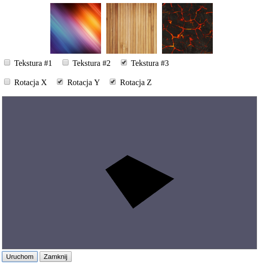

# Grafika komputerowa i komunikacja człowiek-komputer

## Sprawozdanie z laboratorium

Data				| Tytuł zajęć				| Uczestnicy				
--------------------|---------------------------|---------------------------
25.01.2018 18:45	| WebGL						| Iwo Bujkiewicz (226203)

### Zadania

Na zajęciach należało zmodyfikować skrypt renderujący z użyciem WebGL obracający się, oteksturowany sześcian w taki sposób, aby zamiast sześcianu renderowany był czworościan.

### Kolejne etapy realizacji

Do określenia kształtu renderowanego obiektu skrypt wykorzystywał tablicę wierzchołków jego siatki. Znajdowały się w niej współrzędne położenia wierzchołków oraz współrzędne mapowania tekstur dla poszczególnych wierzchołków. W ramach zadania dokonano modyfikacji tej tablicy, tak, aby kolejne elementy reprezentowały wierzchołki czworościanu.

```JavaScript
var triangleVertices = [
	-1, -0.5, -1,   0, 0,
	1, -0.5, -1,    1, 0,
	0, 1, 0,        0.5, 1,

	1, -0.5, -1,    0, 0,
	0, -0.5, 1,     1, 0,
	0, 1, 0,        0.5, 1,

	0, -0.5, 1,     0, 0,
	-1, -0.5, -1,   1, 0,
	0, 1, 0,        0.5, 1,

	1, -0.5, -1,    0, 0,
	-1, -0.5, -1,   1, 0,
	0, -0.5, 1,     0.5, 1
];
```

Wierzchołki łączone były w trójkątne ściany za pomocą tablicy ścian, w której trójkami ułożone były indeksy z tablicy wierzchołków.

```JavaScript
var triangleFaces = [
	0,1,2,
	3,4,5,
	6,7,8,
	9,10,11
];
```

Konieczna była także modyfikacja wywołania funkcji `WebGLRenderingContext.drawElements()`, aby liczba elementów do wyrenderowania odpowiadała ilości wierzchołków ścian zdefiniowanych w tablicach.

```JavaScript
	gl_ctx.drawElements(gl_ctx.TRIANGLES, 4*3, gl_ctx.UNSIGNED_SHORT, 0);
```

<div class="page-break"></div>

Rezultat działania skryptu prezentuje poniższy zrzut ekranu.


*Rysowanie czworościanu z użyciem WebGL*

### Kod źródłowy

Kompletny kod opisanej tu aplikacji został załączony do sprawozdania w osobnych plikach.
