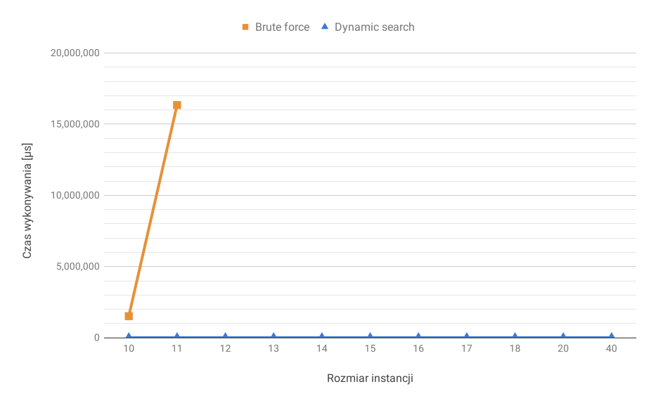
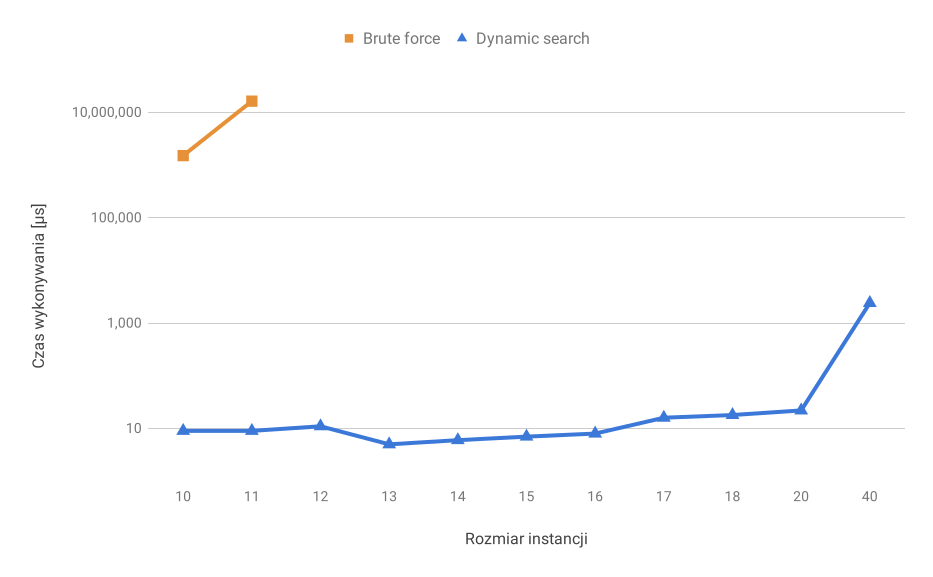

<div class="titlepage-center"></div>

# Projektowanie efektywnych algorytmów
## Jednoprocesorowy problem szeregowania zadań przy kryterium minimalizacji ważonej sumy opóźnień zadań
### Etap 1:<br />Metoda programowania dynamicznego
#### Iwo Bujkiewicz (226203)<br /><br />Piątek 15:15<br />Prowadzący: Mgr inż. Radosław Idzikowski

<div class="page-break"></div>

### 1. Opis problemu

Jednoprocesorowy problem szeregowania zadań przy kryterium minimalizacji ważonej sumy opóźnień zadań (ang. _Single machine total weighted tardiness scheduling problem_, SMTWT) jest problemem NP-trudnym, zdefiniowanym następująco:

Dany jest pewien zestaw zadań, z których każde opisane jest indywidualnym numerem, ilością jednostek czasu potrzebnych do jego wykonania, wagą (priorytetem) i oczekiwanym terminem zakończenia jego wykonywania. Każde zadanie jest dostępne do wykonywania w chwili zero. Zadanie jest spóźnione, jeśli jego wykonywanie zakończy się po oczekiwanym terminie. Miara opóźnienia zadania jest równa różnicy chwili zakończenia jego wykonywania i oczekiwanego terminu zakończenia, jednak nie mniejsza od 0. Zadania wykonywane są bez przerw przez pojedynczy procesor mogący wykonywać co najwyżej jedno zadanie jednocześnie. Znaleźć taką kolejność wykonywania zadań, aby zminimalizować sumę opóźnień wszystkich zadań pomnożonych przez ich wagi.

### 2. Metoda rozwiązania
#### 2.1. Algorytm 1

Pierwszy zastosowany w tym zadaniu algorytm stosował metodę przeglądu zupełnego, inaczej zwaną metodą "brutalnej siły" (ang. _brute force_). Polega ona na sprawdzeniu całej przestrzeni rozwiązań i znalezieniu optymalnego rozwiązania w czasie wprost proporcjonalnym do silni liczby zadań w instancji problemu.

Mimo ogólnej nieprzydatności takich algorytmów, można rozważyć kilka czynników wpływających dość znacząco na faktyczny czas wykonywania algorytmu, takich, jak:

* Sposób generowania permutacji zadań
* Przetwarzanie równoległe

##### 2.1.1. Opis implementacji

Zaimplementowany w ramach zadania algorytm brute force posługiwał się bardzo prostym koncepcyjnie i programistycznie, ale za to kosztownym czasowo sposobem generowania permutacji. Najpierw spośród wszystkich zadań w instancji wybierał te, które nie znalazły się jeszcze w permutacji i umieszczał je w liście podwójnie linkowanej.

```Java
LinkedList<Job> availableJobs = new LinkedList<>();
for (Job job : jobs) {
	if (!startingOrder.contains(job)) {
		availableJobs.add(job);
	}
}
```

Następnie, jeśli do dodania do permutacji pozostawało więcej niż jedno zadanie, algorytm konstruował nową permutację dla każdego dostępnego zadania, z owym zadaniem wstawionym na koniec, i uruchamiał rekurencyjne wykonanie całej procedury na tak powstałej permutacji.

```Java
if (startingOrder.size() < jobs.size() - 1) {
	for (Job job : availableJobs) {
		JobOrder newOrder = new JobOrder(jobs.size());
		newOrder.addAll(startingOrder);
		newOrder.add(job);
		enumerateSolutions(newOrder);
	}
}
```

W przeciwnym razie konstruowana była końcowa permutacja zawierająca wszystkie zadania w analizowanej kolejności, i obliczana była dla niej ważona suma opóźnień. Jeśli była niższa, niż poprzednia, to zarówno analizowana permutacja, jak i jej suma opóźnień były zachowywane jako najlepsze.

<div class="page-break"></div>

```Java
else {
	JobOrder newOrder = new JobOrder(jobs.size());
	newOrder.addAll(startingOrder);
	newOrder.add(availableJobs.pop());
	int newWeightedTardiness = newOrder.totalWeightedTardiness();
	if (newWeightedTardiness < bestWeightedTardiness) {
		bestOrder = newOrder;
		bestWeightedTardiness = newWeightedTardiness;
	}
}
```

Z punktu widzenia czynników decydujących o czasie pracy algorytmu, niewątpliwie nie jest to bardzo wyszukana implementacja. Budowanie listy dostępnych zadań na każdej głębokości rekurencji, a także tworzenie nowej struktury przechowującej permutację zadań przy każdym wywołaniu rekurencyjnym, są dość naiwną metodą działania i powodują spory narzut obliczeniowy, biorąc pod uwagę to, ile wywołań rekurencyjnych wykonuje algorytm brute force nawet dla 10 zadań. Potencjalnie obiecującym sposobem poprawy tej kwestii byłoby wykorzystanie sprawdzonego algorytmu generowania następnej permutacji wyłącznie na podstawie aktualnej, co pozwoliłoby zamienić czas liniowy w ramach jednego wykonania rekurencji na czas stały.

Jest to również implementacja jednowątkowa. Z uwagi na specyfikę metody brute force, bardzo duży zysk w faktycznym czasie wykonywania obliczeń przyniosłoby zrównoleglenie programu pod kątem analizy wielu permutacji jednocześnie. Nie zostało to jednak zaimplementowane i zweryfikowane.

#### 2.2. Algorytm 2

Drugi wykorzystany w projekcie algorytm został skonstruowany w oparciu o [1].

_"Dynamic search"_ rozpoczyna pracę od posortowania zadań w kolejności od najwcześniejszego do najpóźniejszego oczekiwanego terminu zakończenia. Jest to część heurystyczna i daje dobrą, ułożoną najczęściej korzystniej niż losowo, bazę do działań metaheurystycznych.

Następuje właściwe wyszukiwanie rozwiązania z uwzględnieniem funkcji celu. Początkowo algorytm rozpatruje podsekwencję zadań o długości 2, znajdującą się na początku całej sekwencji, a w kolejnych etapach bierze pod uwagę coraz dłuższe (o 1 zadanie na etap) podsekwencje. Na każdym etapie testuje wszystkie możliwości zamiany ostatniego elementu podsekwencji z jednym z poprzednich elementów, a następnie wykonuje taką zamianę, która daje najlepszy wynik funkcji celu (najniższą ważoną sumę opóźnień) dla danej podsekwencji, jeśli ten wynik jest lepszy od stanu aktualnego.

Kluczowa dla algorytmu jest jego ostatnia część, bez której byłby on raczej mało użyteczny. Za każdym razem, kiedy wykonana zostanie zamiana, algorytm powtarza wykonanie aktualnego etapu, co rekurencyjnie powoduje powtórzenie wszystkich dotychczasowych etapów. Pozwala to uniknąć sytuacji, w której 'krytyczne' zadanie zostałoby wypchnięte na późniejszy termin realizacji, znacznie zwiększając ważoną sumę opóźnień, bez możliwości poprawy.

Zadanie 'krytyczne' to takie, którego umieszczenie na dalszych pozycjach sekwencji zwiększa ważoną sumę opóźnień bardziej, niż większość pozostałych zadań. W praktyce są to zazwyczaj zadania, których waga jest stosunkowo wysoka, a dodatkowo charakteryzują się wczesnym terminem zakończenia i/lub długim czasem wykonywania. Ponowne rozpatrzenie aktualnego i poprzednich etapów sprawia, że algorytm jest w stanie dokonać poprawek w rozmieszczeniu rozważanych już wcześniej zadań, w zmienionej sytuacji. Dodatkową zaletą takiego rozwiązania jest fakt, że podczas ponownego przejścia może się okazać, że wzajemna pozycja zadań, dla których nie miała ona wcześniej znaczenia, stała się istotna i można ją poprawić. Przykładem takiej sytuacji jest wykonanie zamiany, w wyniku której z pozycji 8. na pozycję 4. przeniesione zostaje zadanie o dłuższym czasie wykonywania, niż to, które znajdowało się tam poprzednio. Jest możliwe, że przed tą zamianą zadania na pozycjach 5. i 6. nie były spóźnione, ale po zamianie są. Należy wtedy rozpatrzyć, czy zamiana zadań na pozycjach 5. i 6. nie poprawiłaby przypadkiem wyniku funkcji celu.

<div class="page-break"></div>

```sh
Zadanie : { numer, czas_wykonywania, waga, termin }

Dane
	$zadania : Lista (Zadanie) [1..n]

Funkcja ważona_suma_opóźnień($zakres) : Liczba
	$wynik := 0
	$chwila := 0
	dla każdego $i w $zakres
		$chwila := $chwila + $zadania[$i].czas_wykonywania
		$wynik := $wynik + max(0, $zadania[$i].termin - $chwila) * $zadania[$i].waga
	zwróć $wynik
Koniec

Procedura znajdź_rozwiązanie($k)
	jeżeli $k > 2
		wykonaj znajdź_rozwiązanie($k - 1)
	
	$najlepsza_suma_opoznien := ważona_suma_opóźnień(od 1 do $k)
	$najlepsza_pozycja := $k
	
	dla każdego $i od 1 do ($k - 1)
		zamień $zadania[$i] z $zadania[$k]
		jeżeli ważona_suma_opóźnień(od 1 do $k) < $najlepsza_suma_opoznien
			$najlepsza_suma_opoznien := ważona_suma_opóźnień(od 1 do $k)
			$najlepsza_pozycja := $i
		zamień $zadania[$i] z $zadania[$k]
	
	jeżeli $najlepsza_pozycja != $k
		zamień $zadania[$najlepsza_pozycja] z $zadania[$k]
		wykonaj znajdź_rozwiązanie($k)
Koniec

Start
	posortuj $zadania według Zadanie.termin rosnąco
	
	wykonaj znajdź_rozwiązanie(n)
Koniec
```
_Algorytm 2 - pseudokod_

##### 2.2.1. Przykład działania

Rozważmy przykładową sekwencję 4 zadań:

```
numer	czas_wykonywania	waga	termin
1		26					1		118
2		24					10		122
3		79					9		133
4		46					10		127
```

Początkowo sekwencja ma następującą postać i ważoną sumę opóźnień:

```
{ 1, 2, 3, 4 }		480
```

Po posortowaniu według najwcześniejszego terminu otrzymujemy sekwencję z mniejszą sumą opóźnień.

```
{ 1, 2, 4, 3 }		378
```

<div class="page-break"></div>

Rozpoczynamy rekurencję. Na początek rozważamy następującą podsekwencję:

```
{ 1, 2 }		0
```

Żadna zamiana nie poprawi wyniku w tej podsekwencji, przechodzimy zatem do następnej.

```
{ 1, 2, 4 }		0
```

Sytuacja się powtarza, przechodzimy znów do kolejnej podsekwencji.

```
{ 1, 2, 4, 3 }		378
```

Rozważamy po kolei możliwości zamiany miejscami zadania nr 3 z zadaniami 1, 2 i 4. Zamiana miejscami zadań 1 i 3 daje wynik 277, 2 i 3 - 770, 4 i 3 - 480. Wynik 277 jest lepszy od aktualnego (378), wykonujemy więc zamianę zadań 1 i 3.

```
{ 3, 2, 4, 1 }		277
```

Powtarzamy poprzednio wykonane etapy, tym razem na nowej sekwencji

```
{ 3, 2 }		0
{ 3, 2, 4 }		220
```

Sprawdzamy, czy możemy poprawić taką podsekwencję. Zamiana miejscami zadań 3 i 4 daje wynik 144, 2 i 4 - 270. Wynik 144 jest lepszy od aktualnego (220), wykonujemy więc zamianę zadań 3 i 4. Powtarzamy etapy.

```
{ 4, 2, 3 }		144
{ 4, 2 }		0
{ 4, 2, 3 }		144
```

Sprawdzamy, czy możemy poprawić taką podsekwencję. Zamiana miejscami zadań 4 i 3 daje wynik 220, 2 i 3 - 270. Brak możliwości poprawy.

```
{ 4, 2, 3, 1 }		201
```

Sprawdzamy, czy możemy poprawić taką podsekwencję. Zamiana miejscami zadań 4 i 1 daje wynik 378, 2 i 1 - 692, 3 i 1 - 378. Brak możliwości poprawy.

W tym miejscu wychodzimy z rekurencji i działanie algorytmu się kończy. Nasz końcowy wynik to zatem:

```
{ 4, 2, 3, 1 }		201
```

... co jest optymalną kolejnością wykonywania tych czterech zadań.

<div class="page-break"></div>

##### 2.2.2. Opis implementacji

Początkowe sortowanie heurystyczne odbywało się za pośrednictwem wbudowanej w Java API metody `ArrayList.sort()` [4], do której jako argument podawana była instancja specjalnego komparatora.

```Java
public class EarliestDueDateHeuristic implements Comparator<Job> {
	@Override
	public int compare(Job o1, Job o2) {
		return Comparator.<Job>comparingInt(Job::getDueTime).compare(o1, o2);
	}
}
```

Zamiany zadań w sekwencji wykonywane były z użyciem wbudowanej metody `Collections.swap()` [4].

Do wczytywania instancji problemu pobranych z [2] oraz [3] użyto odpowiednio przygotowanych klas `SmallwstLoader` oraz `OrlibLoader`.

### 3. Szczegóły techniczne

Do implementacji algorytmów wybrano język Java w wersji 8 [4]. W celu ułatwienia uruchamiania testów zaimportowano do projektu bibliotekę Reflections (`org.reflections`), jednak nie jest ona konieczna do poprawnego działania żadnych elementów projektu poza klasą `TestRunner`. Kod programu kompilowano i uruchamiano przy użyciu OpenJDK 1.8.0_152 oraz narzędzia Maven 3.3.9 w środowisku IntelliJ IDEA 2018.3 na platformie x86-64 Linux/GNU.

Do przechowywania sekwencji zadań wykorzystano strukturę `ArrayList`, rozszerzoną o dodatkowe metody. Samo pojedyncze zadanie było reprezentowane przez klasę `Job`, implementującą wzorzec JavaBean, posiadającą cztery atrybuty: `id` (numer), `processingTime` (czas potrzebny do wykonania), `dueTime` (oczekiwany termin zakończenia) oraz `weight` (waga).

### 4. Eksperymenty obliczeniowe

Testy zostały przeprowadzone na komputerze z procesorem AMD Ryzen 7 1700 @ 3.0 ~ 3.75 GHz oraz 32 GB pamięci operacyjnej DDR4-2133, pracującym pod kontrolą systemu Linux Mint 18.2 Sonya z 64-bitowym kernelem Linux 4.15.0-29-generic.

Czas pracy algorytmów zmierzono przy użyciu wbudowanej w Java API metody `System.nanoTime()`, podającej aktualne wskazanie precyzyjnego czasomierza JVM, w nanosekundach od pewnej bliżej nieokreślonej, ale niezmiennej podczas pracy programu, chwili [4].

Program podchodził do pomiaru czasu dla instancji o każdym badanym rozmiarze 15 razy w przypadku brute force i 125 razy w przypadku dynamic search. Pierwsze 5 podejść zostało w obu przypadkach odrzucone w celu zapewnienia bufora 'rozgrzewki' dla funkcjonującego w JVM mechanizmu optymalizacji podczas pracy. Z pomiarów uzyskanych przez pozostałe podejścia wyciągnięto średnią arytmetyczną, którą następnie wyskalowano do mikrosekund. W przypadku instancji pobranych z [3] (rozmiary 10-20) podczas każdego podejścia badana była ta sama instancja, zaś w przypadku [2] (rozmiar 40) była to za każdym razem inna (kolejna) ze 125 instancji znajdujących się w pliku `wt40.txt`.

Obliczenia metodą brute force nie zostały wykonane dla instancji z 12 zadaniami i większych z powodu ogromnej ilości czasu, jaką te obliczenia zajmowały. Instancja z pliku `data19.txt` pobranego z [3] nie została zbadana z powodu błędnego formatu pliku.

<div class="page-break"></div>

Rozmiar instancji	| Brute force [µs]	| Dynamic search [µs]
--------------------|-------------------|-----------------------
10					| 1 511 773			| 9
11					| 16 345 629		| 9
12					| 					| 11
13					| 					| 5
14					| 					| 6
15					| 					| 7
16					| 					| 8
17					| 					| 16
18					| 					| 18
20					| 					| 22
40					| 					| 2 412
_Czas wykonywania obliczeń dla poszczególnych rozmiarów instancji_


_Zależność czasu wykonywania obliczeń od rozmiaru instancji_


_Zależność czasu wykonywania obliczeń od rozmiaru instancji - skala logarytmiczna_

W przypadku instancji problemu pobranych z [3] dostępne były również optymalne rozwiązania, porównano je zatem z tymi uzyskanymi przez zaimplementowany algorytm dynamic search. Różnice okazały się zaskakująco nikłe.

Rozmiar instancji	| Uzyskana ważona suma opóźnień	| Optymalna ważona suma opóźnień	| Różnica
--------------------|-------------------------------|-----------------------------------|-----------
10					| 1004							| 1004								| 0
11					| 962							| 962								| 0
12					| 915							| 915								| 0
13					| 681							| 681								| 0
14					| 646							| 646								| 0
15					| 310							| 310								| 0
16					| 321							| 321								| 0
17					| 751							| 746								| **5**
18					| 539							| 539								| 0
20					| 514							| 514								| 0
_Porównanie uzyskanych oraz optymalnych ważonych sum opóźnień rozwiązań problemu_

<div class="page-break"></div>

### 5. Wnioski

* Należy zauważyć, że zaimplementowany algorytm _"dynamic search"_ nie jest tak naprawdę algorytmem realizującym metodę programowania dynamicznego, lecz raczej algorytmem klasy _iterated local search_. Jego złożoność czasowa jest, w przeciwieństwie do faktycznego "programowania dynamicznego", wielomianowa, dzięki czemu znajduje on rozwiązania błyskawicznie szybko. Nie ma jednak gwarancji, że te rozwiązania będą optymalne, choć często się tak zdarza.

* Algorytmy realizujące metodę brutalnej siły nie mają praktycznie żadnego zastosowania w rzeczywistych problemach, gdzie przestrzenie rozwiązań są nieporównywalnie większe od badanych podczas realizacji projektu. W celu znajdywania rozwiązań optymalnych o wiele lepiej jest zastosować metodę programowania dynamicznego bądź podziału i ograniczeń (ang. _branch and bound_), zaś w przypadku braku takiej konieczności informatyka oferuje szeroki wachlarz metod metaheurystycznych, które są w stanie podać rozwiązania zbliżone do optymalnego w czasie wielomianowym.

* Na studiach jest za mało czasu na fajne rzeczy, na przykład takie, jak zrównoleglanie pracy algorytmu.

### 6. Bibliografia

<div class="reference-list"></div>

1. Congram, R.K., Potts, C.N., van de Velde, S.L., 1998. _An iterated dynasearch algorithm for the single-machine total weighted tardiness scheduling problem_

1. Beasley, J.E., 1990-2018. _OR-Library_ (http://people.brunel.ac.uk/~mastjjb/jeb/orlib/wtinfo.html)

1. Idzikowski, R., 2018. _Weighted Sum Tardiness for task scheduling_ (http://radoslaw.idzikowski.staff.iiar.pwr.edu.pl/learning.html)

1. _Java™ Platform, Standard Edition 8 API Specification_ (Oracle America, Inc., March 2015) (https://docs.oracle.com/javase/8/docs/api/)
