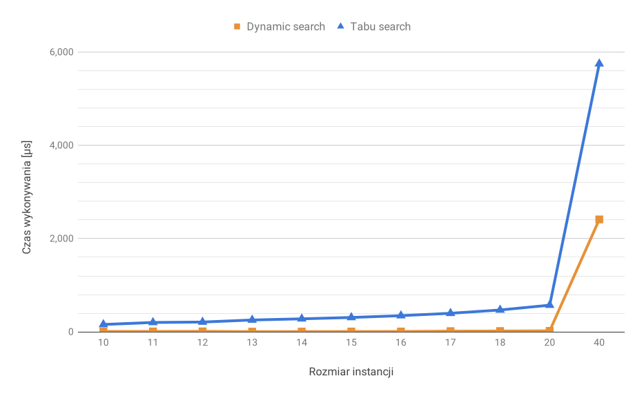
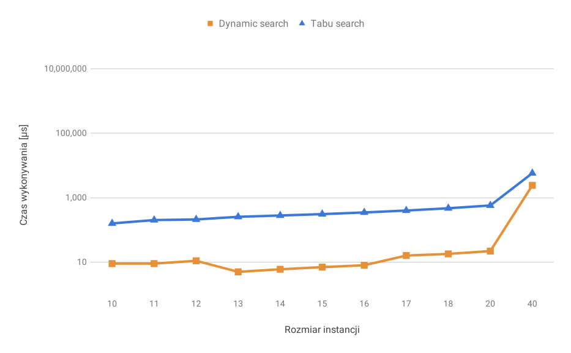

<div class="titlepage-center"></div>

# Projektowanie efektywnych algorytmów
## Jednoprocesorowy problem szeregowania zadań przy kryterium minimalizacji ważonej sumy opóźnień zadań
### Etap 2:<br />Metoda przeszukiwania z zakazami
#### Iwo Bujkiewicz (226203)<br /><br />Piątek 15:15<br />Prowadzący: Mgr inż. Radosław Idzikowski

<div class="page-break"></div>

### 1. Opis problemu

Jednoprocesorowy problem szeregowania zadań przy kryterium minimalizacji ważonej sumy opóźnień zadań (ang. _Single machine total weighted tardiness scheduling problem_, SMTWT) jest problemem NP-trudnym, zdefiniowanym następująco:

Dany jest pewien zestaw zadań, z których każde opisane jest indywidualnym numerem, ilością jednostek czasu potrzebnych do jego wykonania, wagą (priorytetem) i oczekiwanym terminem zakończenia jego wykonywania. Każde zadanie jest dostępne do wykonywania w chwili zero. Zadanie jest spóźnione, jeśli jego wykonywanie zakończy się po oczekiwanym terminie. Miara opóźnienia zadania jest równa różnicy chwili zakończenia jego wykonywania i oczekiwanego terminu zakończenia, jednak nie mniejsza od 0. Zadania wykonywane są bez przerw przez pojedynczy procesor mogący wykonywać co najwyżej jedno zadanie jednocześnie. Znaleźć taką kolejność wykonywania zadań, aby zminimalizować sumę opóźnień wszystkich zadań pomnożonych przez ich wagi.

### 2. Metoda rozwiązania

Zastosowany algorytm _tabu search_ skonstruowano w oparciu o opis z [1].

Algorytm rozpoczyna pracę od posortowania zadań w kolejności od najwcześniejszego do najpóźniejszego oczekiwanego terminu zakończenia. Taka kolejność została wybrana jako punkt startowy dla przeszukiwania lokalnego. Jest to część heurystyczna i daje dobrą, ułożoną najczęściej korzystniej niż losowo, bazę do działań metaheurystycznych.

Następuje właściwe wyszukiwanie rozwiązania z uwzględnieniem funkcji celu. Podczas każdej iteracji głównej pętli algorytm sprawdza wszystkie możliwe pojedyncze ruchy typu _swap_, nie znajdujące się na liście tabu, które zmienią permutację zadań, i wybiera ten, który daje najlepszy spośród nich wynik funkcji celu (jednak niekoniecznie lepszy od aktualnego). Jeżeli wykonany ruch dał wynik funkcji celu lepszy, niż najlepszy dotychczas znaleziony, to otrzymana permutacja zadań jest zapisywana jako dotychczasowo najlepsza, wraz z jej wynikiem funkcji celu.

Niezależnie od wyniku funkcji celu, po wykonaniu każdego ruchu, para zadań, która brała udział w ruchu, dodawana jest do listy tabu. W ten sposób algorytm unika zamiany kolejności niedawno zamienionych zadań, a tym samym uwięzienia w pętli zamieniania ciągle tych samych zadań w sąsiedztwie minimum lokalnego. Gdy po tym kroku lista tabu przekracza zadany rozmiar, najstarszy znajdujący się na niej element jest z niej usuwany.

Powtarza się wykonanie głównej pętli. Działanie algorytmu kończy się w momencie przejścia określonej liczby iteracji bez poprawy najlepszego rozwiązania.

<div class="page-break"></div>

```
Zadanie : { numer, czas_wykonywania, waga, termin }

Dane
	$zadania : Lista (Zadanie) [1..n]
	$długość_listy_tabu : Liczba
	$max_ruchów_bez_poprawy : Liczba

Funkcja ważona_suma_opóźnień($permutacja) : Liczba
	$wynik := 0
	$chwila := 0
	dla każdego $zadanie w $permutacja
		$chwila := $chwila + $zadanie.czas_wykonywania
		$wynik := $wynik + max(0, $zadanie.termin - $chwila) * $zadanie.waga
	zwróć $wynik
Koniec

Funkcja znajdź_rozwiązanie() : Lista (Zadanie)
	$rozwiązanie := $zadania
	$suma_opóźnień_rozwiązania := ważona_suma_opóźnień($rozwiązanie)
	
	$lista_tabu := Lista (Zadanie, Zadanie) []
	$ruchów_bez_poprawy := 0
	
	dopóki $ruchów_bez_poprawy <= $max_ruchów_bez_poprawy
		$ruchów_bez_poprawy++
		
		$najlepsza_suma_opóźnień := 0
		$najlepsza_zamiana_A := 0
		$najlepsza_zamiana_B := 0
		
		dla każdego $i od 1 do n
			dla każdego $k od ($i + 1) do n
				jeżeli $list_tabu nie zawiera ($zadania[$i], $zadania[$k])
				                              ani ($zadania[$k], $zadania[$i])
					zamień $zadania[$i] z $zadania[$k]
					jeżeli ważona_suma_opóźnień($zadania)
					       lub ($najlepsza_zamiana_A == 0 oraz $najlepsza zamiana_B == 0)
						$najlepsza_suma_opóźnień := ważona_suma_opóźnień($zadania)
						$najlepsza_zamiana_A := $i
						$najlepsza_zamiana_B := $k
					zamień $zadania[$i] z $zadania[$k]
		
		jeżeli $najlepsza_zamiana_A != 0 lub $najlepsza_zamiana_B != 0
			zamień $zadania[$najlepsza_zamiana_A] z $zadania[$najlepsza_zamiana_B]
			jeżeli $najlepsza_suma_opóźnień < $suma_opóźnień_rozwiązania
				$rozwiązanie := $zadania
				$suma_opóźnień_rozwiązania := $najlepsza_suma_opóźnień
				$ruchów_bez_poprawy := 0
		
		dodaj ($najlepsza_zamiana_A, $najlepsza_zamiana_B) na koniec $lista_tabu
		dopóki liczebność($lista_tabu) > $długość_listy_tabu
			usuń pierwszy element z $lista_tabu
	
	zwróć $rozwiązanie
Koniec

Start
	posortuj $zadania według Zadanie.termin rosnąco
	
	$rozwiązanie := znajdź_rozwiązanie()
Koniec
```
_Pseudokod_

<div class="page-break"></div>

#### 2.1. Przykład działania

Rozważmy przykładową sekwencję 4 zadań:

```
numer	czas_wykonywania	waga	termin
1		26					1		118
2		24					10		122
3		79					9		133
4		46					10		127
```

Początkowo sekwencja ma następującą postać i ważoną sumę opóźnień:

```
{ 1, 2, 3, 4 }		480
```

Po posortowaniu według najwcześniejszego terminu otrzymujemy sekwencję z mniejszą sumą opóźnień.

```
{ 1, 2, 4, 3 }		378
```

Rozpoczynamy przeszukiwanie. Za długość listy tabu przyjmijmy 4, a za limit ruchów bez poprawy wyników - 8. Rozważamy ruchy typu _swap_ do następujących rozwiązań:

```
{ 2, 1, 4, 3 }		378
{ 4, 2, 1, 3 }		378
{ 3, 2, 4, 1 }		277
{ 1, 4, 2, 3 }		378
{ 1, 3, 4, 2 }		770
{ 1, 2, 3, 4 }		480
```

Wybieramy najlepszą z tych opcji, czyli trzecią. Jest ona lepsza od najlepszego dotychczas rozwiązania, zatem je zastępuje. Do listy tabu dodana zostaje para:

```
( 1, 3 )
```

... ponieważ zamienione miejscami zostały zadania 1 i 3. W kolejnej iteracji rozważamy następujące możliwości:

```
{ 2, 3, 4, 1 }		277
{ 4, 2, 3, 1 }		201
{ 1, 2, 4, 3 }		[ zabroniona ]
{ 3, 4, 2, 1 }		327
{ 3, 1, 4, 2 }		770
{ 3, 2, 1, 4 }		491
```

Jak widać, jedna z nich jest niemożliwa do osiągnięcia ze względu na zakaz na liście tabu. Jest to dla nas korzystne, ponieważ pomijamy rozważanie rozwiązania, które rozważaliśmy przed chwilą. Najlepszą dostępną opcją jest opcja druga, wybieramy ją zatem, a na listę tabu trafia para:

```
( 4, 3 )
```

<div class="page-break"></div>

Nowe rozwiążanie również przebija poprzednio najlepsze, zatem aktualnie najlepszą sumą opóźnień staje się 201. Z nowej pozycji rozważamy:

```
{ 2, 4, 3, 1 }		201
{ 3, 2, 4, 1 }		[ zabroniona ]
{ 1, 2, 3, 4 }		480
{ 4, 3, 2, 1 }		327
{ 4, 1, 3, 2 }		692
{ 4, 2, 1, 3 }		[ zabroniona ]
```

Najlepszą dostępną opcją jest pierwsza, więc ją wykorzystujemy. Na listę tabu trafia:

```
( 4, 2 )
```

Najlepszy wynik nie został jednak poprawiony. W przypadku tego zbioru zadań nie zostanie on już poprawiony, gdyż 201 to optymalna wartość funkcji celu. Po 8 iteracjach algorytm zakończy pracę. Wynikiem jest zatem:

```
{ 4, 2, 3, 1 }		201
```

#### 2.2. Opis implementacji

Początkowe sortowanie heurystyczne odbywało się za pośrednictwem wbudowanej w Java API metody `ArrayList.sort()` [4], do której jako argument podawana była instancja specjalnego komparatora.

```Java
public class EarliestDueDateHeuristic implements Comparator<Job> {
	@Override
	public int compare(Job o1, Job o2) {
		return Comparator.<Job>comparingInt(Job::getDueTime).compare(o1, o2);
	}
}
```

Zamiany zadań w sekwencji wykonywane były z użyciem wbudowanej metody `Collections.swap()` [4].

Do wczytywania instancji problemu pobranych z [2] oraz [3] użyto odpowiednio przygotowanych klas `SmallwstLoader` oraz `OrlibLoader`.

### 3. Szczegóły techniczne

Do implementacji algorytmów wybrano język Java w wersji 8 [4]. W celu ułatwienia uruchamiania testów zaimportowano do projektu bibliotekę Reflections (`org.reflections`), jednak nie jest ona konieczna do poprawnego działania żadnych elementów projektu poza klasą `TestRunner`. Kod programu kompilowano i uruchamiano przy użyciu OpenJDK 1.8.0_152 oraz narzędzia Maven 3.3.9 w środowisku IntelliJ IDEA 2018.3 na platformie x86-64 Linux/GNU.

Do przechowywania sekwencji zadań wykorzystano strukturę `ArrayList`, rozszerzoną o dodatkowe metody. Samo pojedyncze zadanie było reprezentowane przez klasę `Job`, implementującą wzorzec JavaBean, posiadającą cztery atrybuty: `id` (numer), `processingTime` (czas potrzebny do wykonania), `dueTime` (oczekiwany termin zakończenia) oraz `weight` (waga).

<div class="page-break"></div>

### 4. Eksperymenty obliczeniowe

Testy zostały przeprowadzone na komputerze z procesorem AMD Ryzen 7 1700 @ 3.0 ~ 3.75 GHz oraz 32 GB pamięci operacyjnej DDR4-2133, pracującym pod kontrolą systemu Linux Mint 18.2 Sonya z 64-bitowym kernelem Linux 4.15.0-29-generic.

Czas pracy algorytmów zmierzono przy użyciu wbudowanej w Java API metody `System.nanoTime()`, podającej aktualne wskazanie precyzyjnego czasomierza JVM, w nanosekundach od pewnej bliżej nieokreślonej, ale niezmiennej podczas pracy programu, chwili [4].

Program podchodził do pomiaru czasu dla instancji o każdym badanym rozmiarze 125 razy. Pierwsze 5 podejść zostało odrzucone w celu zapewnienia bufora 'rozgrzewki' dla funkcjonującego w JVM mechanizmu optymalizacji podczas pracy. Z pomiarów uzyskanych przez pozostałe podejścia wyciągnięto średnią arytmetyczną, którą następnie wyskalowano do mikrosekund. W przypadku instancji pobranych z [3] (rozmiary 10-20) podczas każdego podejścia badana była ta sama instancja, zaś w przypadku [2] (rozmiar 40) była to za każdym razem inna (kolejna) ze 125 instancji znajdujących się w pliku `wt40.txt`.

Instancja z pliku `data19.txt` pobranego z [3] nie została zbadana z powodu błędnego formatu pliku.

W celu porównania, w tabelach i wykresach zamieszczono również rezultaty uzyskane przy pomocy algorytmu _"dynamic search"_ z poprzedniego etapu projektu.

Rozmiar instancji	| Dynamic search [µs]	| Tabu search [µs]
--------------------|-----------------------|-----------------------
10					| 9						| 159
11					| 9						| 202
12					| 11					| 211
13					| 5						| 255
14					| 6						| 280
15					| 7						| 309
16					| 8						| 348
17					| 16					| 399
18					| 18					| 470
20					| 22					| 573
40					| 2 412					| 5 750
_Czas wykonywania obliczeń dla poszczególnych rozmiarów instancji_


_Zależność czasu wykonywania obliczeń od rozmiaru instancji_


_Zależność czasu wykonywania obliczeń od rozmiaru instancji - skala logarytmiczna_

<div class="page-break"></div>

W przypadku instancji problemu pobranych z [3] dostępne były również optymalne rozwiązania, porównano je zatem z tymi uzyskanymi przez zaimplementowany algorytm _tabu search_. Różnice okazały się identyczne, jak w przypadku _"dynamic search"_, i również zaskakująco nikłe.

Rozmiar instancji	| Uzyskana ważona suma opóźnień	| Optymalna ważona suma opóźnień	| Różnica
--------------------|-------------------------------|-----------------------------------|-----------
10					| 1004							| 1004								| 0
11					| 962							| 962								| 0
12					| 915							| 915								| 0
13					| 681							| 681								| 0
14					| 646							| 646								| 0
15					| 310							| 310								| 0
16					| 321							| 321								| 0
17					| 751							| 746								| **5**
18					| 539							| 539								| 0
20					| 514							| 514								| 0
_Porównanie uzyskanych oraz optymalnych ważonych sum opóźnień rozwiązań problemu_

### 5. Wnioski

* Algorytm realizujący metodę _tabu search_ radzi sobie z problemem szeregowania zadań nieco mniej efektywnie, niż zaimplementowany wcześniej _"dynamic search"_, jednak do czasu. Wykres czasu wykonywania obliczeń w skali logarytmicznej pokazuje, że dla instancji powyżej 20 zadań czas pracy w przypadku _tabu search_ rośnie zdecydowanie wolniej, niż w przypadku _"dynamic search"_. Biorąc pod uwagę rekurencyjną naturę algorytmu _"dynamic search"_, daje to podstawy, by sądzić, że metoda _tabu search_ sprawdzałaby się lepiej w przypadku instancji o dużych liczbach zadań.

* Algorytmy przeszukiwania lokalnego nie dają gwarancji, że osiągnięte przez nie rozwiązania będą optymalne, choć, jak widać, zdarza się to zaskakująco często, przynajmniej wśród instancji o rozmiarach do 40 zadań.

* Dobór typu sąsiedztwa oraz parametrów pracy algorytmu realizującego _tabu search_ może mieć znaczący wpływ na jego wydajność. Zwiększenie ilości dopuszczalnych iteracji bez poprawy wyniku spowoduje wydłużenie czasu wykonywania obliczeń, ale umożliwi nieco dokładniejsze przeszukanie przestrzeni rozwiązań. Zwiększenie długości listy tabu może mieć zarówno pozytywny, jak i negatywny wpływ na jakość dostarczanych rozwiązań; jest to zależne w dużej mierze od konkretnej instancji problemu.

### 6. Bibliografia

<div class="reference-list"></div>

1. _Tabu search_ (September 2018, _Wikipedia, the Free Encyclopedia_) (https://en.wikipedia.org/wiki/Tabu_search)

1. Beasley, J.E., 1990-2018. _OR-Library_ (http://people.brunel.ac.uk/~mastjjb/jeb/orlib/wtinfo.html)

1. Idzikowski, R., 2018. _Weighted Sum Tardiness for task scheduling_ (http://radoslaw.idzikowski.staff.iiar.pwr.edu.pl/learning.html)

1. _Java™ Platform, Standard Edition 8 API Specification_ (Oracle America, Inc., March 2015) (https://docs.oracle.com/javase/8/docs/api/)
