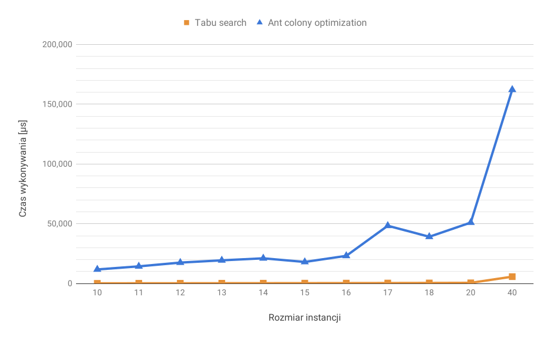
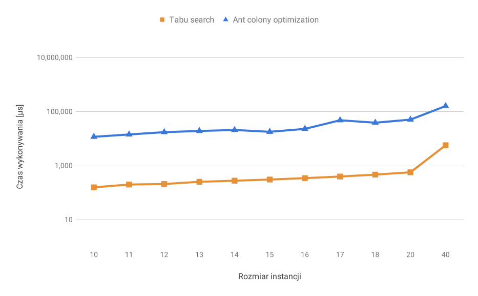

<div class="titlepage-center"></div>

# Projektowanie efektywnych algorytmów
## Jednoprocesorowy problem szeregowania zadań przy kryterium minimalizacji ważonej sumy opóźnień zadań
### Etap 3:<br />Algorytm mrówkowy
#### Iwo Bujkiewicz (226203)<br /><br />Piątek 15:15<br />Prowadzący: Mgr inż. Radosław Idzikowski

<div class="page-break"></div>

### 1. Opis problemu

Jednoprocesorowy problem szeregowania zadań przy kryterium minimalizacji ważonej sumy opóźnień zadań (ang. _Single machine total weighted tardiness scheduling problem_, SMTWT) jest problemem NP-trudnym, zdefiniowanym następująco:

Dany jest pewien zestaw zadań, z których każde opisane jest indywidualnym numerem, ilością jednostek czasu potrzebnych do jego wykonania, wagą (priorytetem) i oczekiwanym terminem zakończenia jego wykonywania. Każde zadanie jest dostępne do wykonywania w chwili zero. Zadanie jest spóźnione, jeśli jego wykonywanie zakończy się po oczekiwanym terminie. Miara opóźnienia zadania jest równa różnicy chwili zakończenia jego wykonywania i oczekiwanego terminu zakończenia, jednak nie mniejsza od 0. Zadania wykonywane są bez przerw przez pojedynczy procesor mogący wykonywać co najwyżej jedno zadanie jednocześnie. Znaleźć taką kolejność wykonywania zadań, aby zminimalizować sumę opóźnień wszystkich zadań pomnożonych przez ich wagi.

### 2. Metoda rozwiązania

Zastosowany algorytm _ant colony optimization_ skonstruowano w oparciu o opis z [1].

Algorytm symuluje podaną jako parametr liczbę mrówek, kolejno generujących rozwiązania problemu. W każdej iteracji algorytmu każda mrówka startuje z pustą sekwencją zadań, a następnie dodaje do niej po jednym zadaniu, aż sekwencja będzie pełną permutacją danego zbioru zadań. Na każdym kroku zadanie wybierane jest na podstawie jednej z zasad:

* Z prawdopodobieństwem `q` wybierane jest takie zadanie spośród jeszcze niezaplanowanych, dla którego iloczyn "śladu feromonowego" (dalej: śladu) oraz heurystycznej wartości "pożądania" do potęgi zadanej parametrem jest największy;
* Z prawdopodobieństwem `q-1` zadanie wybierane jest losowo spośród niezaplanowanych, według podrzędnego prawdopodobieństwa będącego wprost proporcjonalnego do w/w iloczynu.

Heurystyczna wartość pożądania wstawienia danego zadania na danej pozycji jest liczona na podstawie zmodyfikowanej heurystyki najwcześniejszego terminu wykonania:

```
1 / ( max( CzasStartuZadania + CzasWykonywaniaZadania, TerminWykonaniaZadania ) )
```

Gdy zadanie zostanie wybrane, następuje pośrednia aktualizacja śladu. Ślad danego zadania na danej pozycji jest nieznacznie modyfikowany, aby "zniechęcić" dalsze mrówki do eksploatacji tej ścieżki rozwiązania.

Po skompletowaniu permutacji zadań sprawdzane jest, czy wartość funkcji celu jest mniejsza od najlepszej dotychczas uzyskanej. Jeśli tak, to nowa permutacja zastępuje dotychczas najlepszą.

Po przejściu iteracji wszystkich mrówek wykonywana jest duża aktualizacja śladu - ślad każdego zadania na pozycji, na jakiej się znajduje w aktualnie najlepszym rozwiązaniu, jest modyfikowany przez liczbę odwrotnie proporcjonalną do wartości funkcji celu rozwiązania. Oznacza to, że im lepsze jest rozwiązanie, tym bardziej mrówki są zachęcane do korzystania z jego elementów.

Algorytm pracuje w ten sposób do czasu, aż wykona określoną liczbę iteracji wszystkich mrówek bez poprawy najlepszego rozwiązania.

#### 2.1. Opis implementacji

Do obliczania tzw. "metryki" zadania na danej pozycji, czyli wspomnianego iloczynu, używany jest następujący interfejs funkcyjny.

```Java
TriFunction<Integer, Job, Integer, Float> computeMetric = (i, job, startTime) -> {
	return pheromoneTrail.get(i, job)
	       * (float) Math.pow(heuristic.valueFor(job, startTime), heuristicExponent);
};
```

"Ślad feromonowy" zaimplementowany został jako mapowanie pozycji na mapowanie zadania na wartość śladu.

```Java
class PheromoneTrail {
	...
	private Map<Integer, Map<Job, Float>> trail;
	...
```

Aktualizacje śladu wykonywane są z użyciem metody `Map.compute()`, pozwalającej łatwo zmodyfikować istniejące mapowania.

```Java
void update(JobOrder currentSolution) {
	assert currentSolution.size() == trail.size();
	for (int i = 0; i < currentSolution.size(); i++) {
		trail.get(i).compute(currentSolution.get(i),
				(k, v) -> (1.0f - evaporation) * v
				          + evaporation * (1.0f / (float) currentSolution.totalWeightedTardiness()));
	}
}

void intermediateUpdate(int position, Job job, float factor, float vector) {
	trail.get(position).compute(job,
			(k, v) -> (1.0f - factor) * v
			          + factor * vector);
}
```

Do wczytywania instancji problemu pobranych z [2] oraz [3] użyto odpowiednio przygotowanych klas `SmallwstLoader` oraz `OrlibLoader`.

### 3. Szczegóły techniczne

Do implementacji algorytmów wybrano język Java w wersji 8 [4]. W celu ułatwienia uruchamiania testów zaimportowano do projektu bibliotekę Reflections (`org.reflections`), jednak nie jest ona konieczna do poprawnego działania żadnych elementów projektu poza klasą `TestRunner`. Kod programu kompilowano i uruchamiano przy użyciu OpenJDK 1.8.0_152 oraz narzędzia Maven 3.3.9 w środowisku IntelliJ IDEA 2018.3 na platformie x86-64 Linux/GNU.

Do przechowywania sekwencji zadań wykorzystano strukturę `ArrayList`, rozszerzoną o dodatkowe metody. Samo pojedyncze zadanie było reprezentowane przez klasę `Job`, implementującą wzorzec JavaBean, posiadającą cztery atrybuty: `id` (numer), `processingTime` (czas potrzebny do wykonania), `dueTime` (oczekiwany termin zakończenia) oraz `weight` (waga).

<div class="page-break"></div>

### 4. Eksperymenty obliczeniowe

Testy zostały przeprowadzone na komputerze z procesorem AMD Ryzen 7 1700 @ 3.0 ~ 3.75 GHz oraz 32 GB pamięci operacyjnej DDR4-2133, pracującym pod kontrolą systemu Linux Mint 18.2 Sonya z 64-bitowym kernelem Linux 4.15.0-29-generic.

Czas pracy algorytmów zmierzono przy użyciu wbudowanej w Java API metody `System.nanoTime()`, podającej aktualne wskazanie precyzyjnego czasomierza JVM, w nanosekundach od pewnej bliżej nieokreślonej, ale niezmiennej podczas pracy programu, chwili [4].

Program podchodził do pomiaru czasu dla instancji o każdym badanym rozmiarze 125 razy. Pierwsze 5 podejść zostało odrzucone w celu zapewnienia bufora 'rozgrzewki' dla funkcjonującego w JVM mechanizmu optymalizacji podczas pracy. Z pomiarów uzyskanych przez pozostałe podejścia wyciągnięto średnią arytmetyczną, którą następnie wyskalowano do mikrosekund. W przypadku instancji pobranych z [3] (rozmiary 10-20) podczas każdego podejścia badana była ta sama instancja, zaś w przypadku [2] (rozmiar 40) była to za każdym razem inna (kolejna) ze 125 instancji znajdujących się w pliku `wt40.txt`.

Instancja z pliku `data19.txt` pobranego z [3] nie została zbadana z powodu błędnego formatu pliku.

W celu porównania, w tabelach i wykresach zamieszczono również rezultaty uzyskane przy pomocy algorytmu _"tabu search"_ z poprzedniego etapu projektu.

Rozmiar instancji	| Tabu search [µs]		| Ant colony optimization [µs]
--------------------|-----------------------|-----------------------
10					| 159					| 11 783
11					| 202					| 14 375
12					| 211					| 17 508
13					| 255					| 19 404
14					| 280					| 21 090
15					| 309					| 18 052
16					| 348					| 23 166
17					| 399					| 48 352
18					| 470					| 39 128
20					| 573					| 51 007
40					| 5 750					| 162 193
_Czas wykonywania obliczeń dla poszczególnych rozmiarów instancji_


_Zależność czasu wykonywania obliczeń od rozmiaru instancji_


_Zależność czasu wykonywania obliczeń od rozmiaru instancji - skala logarytmiczna_

<div class="page-break"></div>

W przypadku instancji problemu pobranych z [3] dostępne były również optymalne rozwiązania, porównano je zatem z tymi uzyskanymi przez zaimplementowany algorytm _ant colony optimization_. Na tym polu algorytm okazał się wypaść lepiej, niż poprzednio zaimplementowane, gdyż uzyskał optymalne rozwiązanie we wszystkich zbadanych przypadkach.

Rozmiar instancji	| Uzyskana ważona suma opóźnień	| Optymalna ważona suma opóźnień	| Różnica
--------------------|-------------------------------|-----------------------------------|-----------
10					| 1004							| 1004								| 0
11					| 962							| 962								| 0
12					| 915							| 915								| 0
13					| 681							| 681								| 0
14					| 646							| 646								| 0
15					| 310							| 310								| 0
16					| 321							| 321								| 0
17					| 746							| 746								| 0
18					| 539							| 539								| 0
20					| 514							| 514								| 0
_Porównanie uzyskanych oraz optymalnych ważonych sum opóźnień rozwiązań problemu_

### 5. Wnioski

* Zaimplementowany algorytm pracuje nad rozwiązaniami bardzo długo. Nie ma pewności, co może być przyczyną takiego stanu rzeczy. Wykluczyć można wpływ złożoności obliczeniowej struktury `HashMap<K, V>`, stosowanej szeroko w implementacji, ponieważ podstawowe operacje na tej strukturze, tj. wstawianie, znajdywanie/odczytywanie oraz modyfikacja elementu, mają w niemal każdym przypadku złożoność czasową `O(1)`. Analiza kodu programu nie nasunęła dalszych wskazówek co do powolnej pracy.

* Ze względu na wyraźny wpływ losowości na pracę algorytmu, ciężko jest dokładnie stwierdzić, jaki wpływ mają na nią zadane parametry. Eksperymenty z wartościami parametrów nie przyniosły większych różnic, poza jednym - zwiększeniem liczby iteracji bez poprawy rozwiązania. Oczywiście, taka zmiana powoduje znaczne wydłużenie czasu pracy algorytmu, jednak pozwoliła osiągnąć wyniki funkcji celu porównywalne z (lub czasem lepsze od) tymi uzyskanymi przez zaimplementowane poprzednio algorytmy przeszukiwania lokalnego.

### 6. Bibliografia

<div class="reference-list"></div>

1. den Besten, M., Stützle, T., Dorigo M., 2000. _Ant Colony Optimization for the Total Weighted Tardiness Problem_ (_Proceedings of PPSN-VI, Sixth International Conference on Parallel Problem Solving from Nature, vol. 1917 of Lecture Notes in Computer Science_, 2000)

1. Beasley, J.E., 1990-2018. _OR-Library_ (http://people.brunel.ac.uk/~mastjjb/jeb/orlib/wtinfo.html)

1. Idzikowski, R., 2018. _Weighted Sum Tardiness for task scheduling_ (http://radoslaw.idzikowski.staff.iiar.pwr.edu.pl/learning.html)

1. _Java™ Platform, Standard Edition 8 API Specification_ (Oracle America, Inc., March 2015) (https://docs.oracle.com/javase/8/docs/api/)
