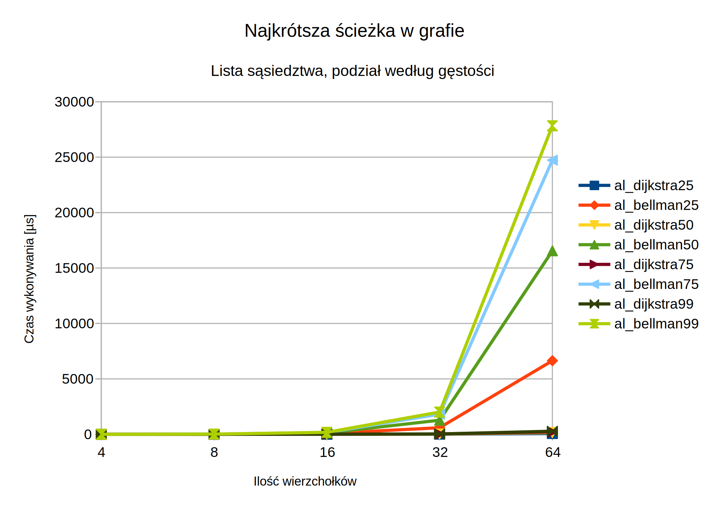
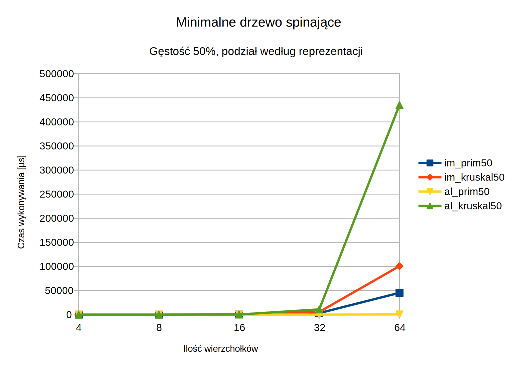

# Struktury danych i złożoność obliczeniowa

## Sprawozdanie z zadania projektowego nr 2

Imię i nazwisko						| Nr indeksu
------------------------------------|---------------
Iwo Bujkiewicz						| 226203

Prowadzący					| Termin					| Data
----------------------------|---------------------------|-----------
Dr inż. Dariusz Banasiak	| wtorek nieparzysty 15:15	| 05.06.2018

### 1. Wstęp

Do zadania projektowego nr 2 zaimplementowano następujące reprezentacje grafów:

* Macierz incydencji
* Lista sąsiedztwa

Obie reprezentacje zaimplementowano bez użycia zaawansowanych struktur danych STL lub zewnętrznych bibliotek, częściowo z użyciem struktur zaimplementowanych samodzielnie w ramach zadania projektowego nr 1.

Zadanie miało na celu eksperymentalne sprawdzenie czasu wykonywania następujących algorytmów grafowych, wyszczególnionych wraz z ich złożonością czasową według ogólnodostępnych źródeł:

* Znajdowanie minimalnego drzewa spinającego
	* Algorytm Dijkstry-Jarníka-Prima (DJP) - O(\|V\|2)
	* Algorytm Kruskala - O(\|E\| log \|V\|)
* Znajdowanie najkrótszej ścieżki w grafie
	* Algorytm Dijkstry - O(\|V\|2)
	* Algorytm Shimbela-Bellmana-Forda-Moore'a (SBFM) - O(\|V\|\|E\|)

### 2. Plan eksperymentu

Zadanie zakładało wielokrotne powtórzenie, dla kilku różnych ilości wierzchołków w grafie i gęstości grafu, testu, polegającego na zmierzeniu czasu wykonywania czterech algorytmów na dwóch rodzajach reprezentacji grafów generowanych losowo na podstawie zadanych parametrów.

Na potrzeby eksperymentu przyjęto zestaw ilości wierzchołków, które były dostatecznie duże, aby otrzymać miarodajne wyniki, ale jednocześnie dostatecznie małe, aby obliczenia nie trwały zbyt długo: 64, 32, 16, 8 oraz 4. Gęstości grafu do przetestowania określony były z góry jako 25%, 50%, 75% oraz 99%. Dla każdej pary (ilość wierzchołków, gęstość) test powtarzany był 100 razy, a wyniki zostały uśrednione.

Grafy generowane były przy użyciu wbudowanego w standard C++11 silnika liczb pseudolosowych implementującego szeroko rozpowszechniony algorytm Mersenne Twister w wersji MT19937. Aby zapewnić spójność oraz zmienną strukturę grafów, generowane były one według następującego algorytmu:

> 1. Wybierz losowo wierzchołek startowy i dołącz go do grafu
> 1. \|V\|-1 razy wybierz losowo wierzchołek jeszcze niedołączony do grafu oraz wierzchołek już dołączony do grafu; stwórz między nimi krawędź i dołącz nowy wierzchołek oraz stworzoną krawędź do grafu
> 1. Oblicz prawdopodobieństwo dodania do grafu krawędzi między dwoma wierzchołkami, tak, aby po uwzględnieniu dołączonych już na początku krawędzi gęstość grafu dążyła do zadanej wartości procentowej
> 1. Dla każdej pary wierzchołków w grafie, jeżeli jeszcze nie ma między nimi krawędzi, wybierz losowo na podstawie obliczonego prawdopodobieństwa, czy wstawić między nimi krawędź; jeśli tak, wstaw krawędź

Czas wykonywania poszczególnych algorytmów mierzony był przy użyciu wbudowanego w standard C++11 mechanizmu czasomierza `std::chrono::high_resolution_clock`.

Program został napisany w języku C++, a następnie skompilowany i zlinkowany przez GCC 5.4.0, przy użyciu narzędzia CMake 3.10.3, dla środowiska x86-64 Linux/GNU. Testy zostały wykonane na komputerze wyposażonym w procesor AMD Ryzen 7 1700 @ 3.0~3.75GHz, pracującym pod kontrolą systemu Linux Mint 18.2 Sonya z 64-bitowym kernelem Linux 4.13.0-37-generic.

### 3. Wyniki

#### Uśrednione wyniki eksperymentu

Poniższa tabela zawiera wszystkie wyniki uzyskane w eksperymencie, uśrednione ze 100 prób, w nanosekundach.

node_count | density | im_prim | im_kruskal | im_dijkstra | im_bellman | al_prim | al_kruskal | al_dijkstra | al_bellman
---------|---------|---------|---------|---------|---------|---------|---------|---------|---------
64 | 25 | 26536559.02 | 55807210.12 | 185602.43 | 26228020.82 | 196787.27 | 137763213.35 | 71798.61 | 6637943.37
64 | 50 | 45290427.91 | 100711624.66 | 321196.05 | 45374111.61 | 418999.32 | 435104973.93 | 159371.73 | 16554970.26
64 | 75 | 56537897.63 | 122135555.26 | 333521.17 | 56520807.13 | 615760.52 | 670235411.96 | 216895.65 | 24729214.35
64 | 99 | 60356945.23 | 136140048.79 | 418480.62 | 60617506.59 | 711552.79 | 793480999.99 | 280351.68 | 27827256.7
32 | 25 | 1900600.24 | 3039808.25 | 28624.35 | 1794173.17 | 44281.2 | 3236109.4 | 16019.52 | 594632.48
32 | 50 | 3164193.8 | 5658599.22 | 41627.96 | 3109750.5 | 70335.4 | 10972667.77 | 24915.27 | 1273650.33
32 | 75 | 3917035.87 | 6404513.04 | 52311.65 | 3812592.68 | 89983.79 | 16221845.93 | 34428.2 | 1817147.81
32 | 99 | 4139217.58 | 7025751.81 | 49740.27 | 4090531.36 | 98910.61 | 19012142.94 | 35377.62 | 2010110.25
16 | 25 | 155181.77 | 176086.74 | 5434.67 | 146110.16 | 14080.37 | 100095.95 | 4353.51 | 70515.25
16 | 50 | 253988.66 | 324642.07 | 8092.5 | 246254.5 | 19504.39 | 292895.07 | 6453.05 | 124606.73
16 | 75 | 308421.64 | 404257.94 | 9502.35 | 306684.64 | 22957.58 | 464261.74 | 7933.36 | 166420.5
16 | 99 | 335440.13 | 458727.6 | 10013.22 | 334691.06 | 24630.43 | 564927.09 | 8220.84 | 182147.16
8 | 25 | 18350.64 | 13431.59 | 1231.7 | 14259.77 | 6365.29 | 11965.47 | 1447.13 | 11396.56
8 | 50 | 27503.27 | 23967.75 | 2177.09 | 23613.61 | 7246.71 | 20228.64 | 2189.76 | 17473.31
8 | 75 | 33293.68 | 30789.59 | 2286.93 | 29389.52 | 7932.8 | 27176.27 | 2298.53 | 20691.56
8 | 99 | 35713.2 | 32765.41 | 2476.82 | 31438.22 | 8080.31 | 29986.44 | 2447 | 21407.03
4 | 25 | 2162.6 | 1185.85 | 386.9 | 1104.06 | 1942.14 | 2582.28 | 506.95 | 1828.34
4 | 50 | 2659.73 | 1597.81 | 500.2 | 1660.47 | 2169.97 | 3133.38 | 597.8 | 2323.13
4 | 75 | 2934.69 | 1806.89 | 540.98 | 1940.07 | 2147.56 | 3602.12 | 627.03 | 2556.44
4 | 99 | 3021.05 | 1893.36 | 558.22 | 1982.6 | 2158.85 | 3782.02 | 632.37 | 2576.48

#### Wykresy i tabele - podział według problemu i gęstości

Poniższa tabela zawiera uśrednione czasy działania algorytmów znajdujących minimalne drzewo spinające w macierzy incydencji, dla różnych gęstości grafu, w mikrosekundach.

node_count | im_prim25 | im_kruskal25 | im_prim50 | im_kruskal50 | im_prim75 | im_kruskal75 | im_prim99 | im_kruskal99
---------|---------|---------|---------|---------|---------|---------|---------|---------
4 | 2.1626 | 1.18585 | 2.65973 | 1.59781 | 2.93469 | 1.80689 | 3.02105 | 1.89336
8 | 18.35064 | 13.43159 | 27.50327 | 23.96775 | 33.29368 | 30.78959 | 35.7132 | 32.76541
16 | 155.18177 | 176.08674 | 253.98866 | 324.64207 | 308.42164 | 404.25794 | 335.44013 | 458.7276
32 | 1900.60024 | 3039.80825 | 3164.1938 | 5658.59922 | 3917.03587 | 6404.51304 | 4139.21758 | 7025.75181
64 | 26536.55902 | 55807.21012 | 45290.42791 | 100711.62466 | 56537.89763 | 122135.55526 | 60356.94523 | 136140.04879

Poniższa tabela zawiera uśrednione czasy działania algorytmów znajdujących minimalne drzewo spinające w liście sąsiedztwa, dla różnych gęstości grafu, w mikrosekundach.

node_count | al_prim25 | al_kruskal25 | al_prim50 | al_kruskal50 | al_prim75 | al_kruskal75 | al_prim99 | al_kruskal99
---------|---------|---------|---------|---------|---------|---------|---------|---------
4 | 1.94214 | 2.58228 | 2.16997 | 3.13338 | 2.14756 | 3.60212 | 2.15885 | 3.78202
8 | 6.36529 | 11.96547 | 7.24671 | 20.22864 | 7.9328 | 27.17627 | 8.08031 | 29.98644
16 | 14.08037 | 100.09595 | 19.50439 | 292.89507 | 22.95758 | 464.26174 | 24.63043 | 564.92709
32 | 44.2812 | 3236.1094 | 70.3354 | 10972.66777 | 89.98379 | 16221.84593 | 98.91061 | 19012.14294
64 | 196.78727 | 137763.21335 | 418.99932 | 435104.97393 | 615.76052 | 670235.41196 | 711.55279 | 793480.99999

Poniższa tabela zawiera uśrednione czasy działania algorytmów znajdujących najkrótszą ścieżkę w macierzy incydencji, dla różnych gęstości grafu, w mikrosekundach.

node_count | im_dijkstra25 | im_bellman25 | im_dijkstra50 | im_bellman50 | im_dijkstra75 | im_bellman75 | im_dijkstra99 | im_bellman99
---------|---------|---------|---------|---------|---------|---------|---------|---------
4 | 0.3869 | 1.10406 | 0.5002 | 1.66047 | 0.54098 | 1.94007 | 0.55822 | 1.9826
8 | 1.2317 | 14.25977 | 2.17709 | 23.61361 | 2.28693 | 29.38952 | 2.47682 | 31.43822
16 | 5.43467 | 146.11016 | 8.0925 | 246.2545 | 9.50235 | 306.68464 | 10.01322 | 334.69106
32 | 28.62435 | 1794.17317 | 41.62796 | 3109.7505 | 52.31165 | 3812.59268 | 49.74027 | 4090.53136
64 | 185.60243 | 26228.02082 | 321.19605 | 45374.11161 | 333.52117 | 56520.80713 | 418.48062 | 60617.50659

Poniższa tabela zawiera uśrednione czasy działania algorytmów znajdujących najkrótszą ścieżkę w liście sąsiedztwa, dla różnych gęstości grafu, w mikrosekundach.

node_count | al_dijkstra25 | al_bellman25 | al_dijkstra50 | al_bellman50 | al_dijkstra75 | al_bellman75 | al_dijkstra99 | al_bellman99
---------|---------|---------|---------|---------|---------|---------|---------|---------
4 | 0.50695 | 1.82834 | 0.5978 | 2.32313 | 0.62703 | 2.55644 | 0.63237 | 2.57648
8 | 1.44713 | 11.39656 | 2.18976 | 17.47331 | 2.29853 | 20.69156 | 2.447 | 21.40703
16 | 4.35351 | 70.51525 | 6.45305 | 124.60673 | 7.93336 | 166.4205 | 8.22084 | 182.14716
32 | 16.01952 | 594.63248 | 24.91527 | 1273.65033 | 34.4282 | 1817.14781 | 35.37762 | 2010.11025
64 | 71.79861 | 6637.94337 | 159.37173 | 16554.97026 | 216.89565 | 24729.21435 | 280.35168 | 27827.2567

#### Wykresy i tabele - podział według problemu i reprezentacji

Poniższa tabela zawiera uśrednione czasy działania algorytmów znajdujących minimalne drzewo spinające w grafach o gęstości 25%, dla różnych reprezentacji, w mikrosekundach.

node_count | im_prim25 | im_kruskal25 | al_prim25 | al_kruskal25
---------|---------|---------|---------|---------
4 | 2.1626 | 1.18585 | 1.94214 | 2.58228
8 | 18.35064 | 13.43159 | 6.36529 | 11.96547
16 | 155.18177 | 176.08674 | 14.08037 | 100.09595
32 | 1900.60024 | 3039.80825 | 44.2812 | 3236.1094
64 | 26536.55902 | 55807.21012 | 196.78727 | 137763.21335

Poniższa tabela zawiera uśrednione czasy działania algorytmów znajdujących minimalne drzewo spinające w grafach o gęstości 50%, dla różnych reprezentacji, w mikrosekundach.

node_count | im_prim50 | im_kruskal50 | al_prim50 | al_kruskal50
---------|---------|---------|---------|---------
4 | 2.65973 | 1.59781 | 2.16997 | 3.13338
8 | 27.50327 | 23.96775 | 7.24671 | 20.22864
16 | 253.98866 | 324.64207 | 19.50439 | 292.89507
32 | 3164.1938 | 5658.59922 | 70.3354 | 10972.66777
64 | 45290.42791 | 100711.62466 | 418.99932 | 435104.97393

Poniższa tabela zawiera uśrednione czasy działania algorytmów znajdujących minimalne drzewo spinające w grafach o gęstości 75%, dla różnych reprezentacji, w mikrosekundach.

node_count | im_prim75 | im_kruskal75 | al_prim75 | al_kruskal75
---------|---------|---------|---------|---------
4 | 2.93469 | 1.80689 | 2.14756 | 3.60212
8 | 33.29368 | 30.78959 | 7.9328 | 27.17627
16 | 308.42164 | 404.25794 | 22.95758 | 464.26174
32 | 3917.03587 | 6404.51304 | 89.98379 | 16221.84593
64 | 56537.89763 | 122135.55526 | 615.76052 | 670235.41196

Poniższa tabela zawiera uśrednione czasy działania algorytmów znajdujących minimalne drzewo spinające w grafach o gęstości 99%, dla różnych reprezentacji, w mikrosekundach.

node_count | im_prim99 | im_kruskal99 | al_prim99 | al_kruskal99
---------|---------|---------|---------|---------
4 | 3.02105 | 1.89336 | 2.15885 | 3.78202
8 | 35.7132 | 32.76541 | 8.08031 | 29.98644
16 | 335.44013 | 458.7276 | 24.63043 | 564.92709
32 | 4139.21758 | 7025.75181 | 98.91061 | 19012.14294
64 | 60356.94523 | 136140.04879 | 711.55279 | 793480.99999

Poniższa tabela zawiera uśrednione czasy działania algorytmów znajdujących najkrótszą ścieżkę w grafach o gęstości 25%, dla różnych reprezentacji, w mikrosekundach.

node_count | im_dijkstra25 | im_bellman25 | al_dijkstra25 | al_bellman25
---------|---------|---------|---------|---------
4 | 0.3869 | 1.10406 | 0.50695 | 1.82834
8 | 1.2317 | 14.25977 | 1.44713 | 11.39656
16 | 5.43467 | 146.11016 | 4.35351 | 70.51525
32 | 28.62435 | 1794.17317 | 16.01952 | 594.63248
64 | 185.60243 | 26228.02082 | 71.79861 | 6637.94337

Poniższa tabela zawiera uśrednione czasy działania algorytmów znajdujących najkrótszą ścieżkę w grafach o gęstości 50%, dla różnych reprezentacji, w mikrosekundach.

node_count | im_dijkstra50 | im_bellman50 | al_dijkstra50 | al_bellman50
---------|---------|---------|---------|---------
4 | 0.5002 | 1.66047 | 0.5978 | 2.32313
8 | 2.17709 | 23.61361 | 2.18976 | 17.47331
16 | 8.0925 | 246.2545 | 6.45305 | 124.60673
32 | 41.62796 | 3109.7505 | 24.91527 | 1273.65033
64 | 321.19605 | 45374.11161 | 159.37173 | 16554.97026

Poniższa tabela zawiera uśrednione czasy działania algorytmów znajdujących najkrótszą ścieżkę w grafach o gęstości 75%, dla różnych reprezentacji, w mikrosekundach.

node_count | im_dijkstra75 | im_bellman75 | al_dijkstra75 | al_bellman75
---------|---------|---------|---------|---------
4 | 0.54098 | 1.94007 | 0.62703 | 2.55644
8 | 2.28693 | 29.38952 | 2.29853 | 20.69156
16 | 9.50235 | 306.68464 | 7.93336 | 166.4205
32 | 52.31165 | 3812.59268 | 34.4282 | 1817.14781
64 | 333.52117 | 56520.80713 | 216.89565 | 24729.21435

Poniższa tabela zawiera uśrednione czasy działania algorytmów znajdujących najkrótszą ścieżkę w grafach o gęstości 99%, dla różnych reprezentacji, w mikrosekundach.

node_count | im_dijkstra99 | im_bellman99 | al_dijkstra99 | al_bellman99
---------|---------|---------|---------|---------
4 | 0.55822 | 1.9826 | 0.63237 | 2.57648
8 | 2.47682 | 31.43822 | 2.447 | 21.40703
16 | 10.01322 | 334.69106 | 8.22084 | 182.14716
32 | 49.74027 | 4090.53136 | 35.37762 | 2010.11025
64 | 418.48062 | 60617.50659 | 280.35168 | 27827.2567

### 4. Wnioski

Na podstawie uzyskanych wyników można zauważyć, że w większości przypadków lista sąsiedztwa jest zdecydowanie bardziej efektywną reprezentacją grafu, niż macierz incydencji, jednak są wyjątki.

* W przypadku algorytmu **DJP** obliczenia na **liście sąsiedztwa** przebiegają nieporównywalnie szybciej.
* Algorytm **Kruskala** wykazuje zbliżone czasy wykonywania pomiędzy reprezentacjami do pewnej wielkości grafu (około 16 wierzchołków), ale dla większych grafów wyraźnie preferuje **macierz incydencji**.
* Algorytm **Dijkstry** wykonywany jest zwykle od 30% do nawet 60% szybciej na **liście sąsiedztwa**.
* Dla algorytmu **SBFM** różnica na korzyść **listy sąsiedztwa** jest jeszcze większa i wynosi od 50% do 75%.

Nie jest to w żaden sposób zaskakujące, ponieważ wszystkie te algorytmy operują na danych na temat krawędzi - ich metrykach i tym, jakie wierzchołki łączą - a te są dostępne dla każdej krawędzi w O(1) w przypadku listy sąsiedztwa, a O(|V|) w przypadku macierzy incydencji. Dodatkowy czas spędzany jest na każdym kroku wyszukiwania na znajdywaniu parametrów krawędzi.

Algorytm Kruskala wyróżnia się spośród pozostałych, ponieważ przy dużych grafach działa szybciej na macierzy incydencji. Jest to spowodowane tym, że użyta w eksperymencie implementacja nie sortuje pozostałych do rozpatrzenia krawędzi według metryki, dlatego w każdej iteracji algorytmu program musi przeszukać O(|E|) krawędzi, aby znaleźć tą o najniższej metryce. Stąd też większa, niż teoretycznie, złożoność czasowa O(|E|2).

Pozostałe algorytmy wykazują empiryczną złożoność czasową zgodną z teorią.
