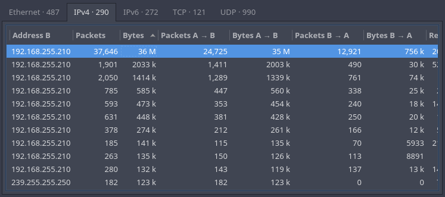
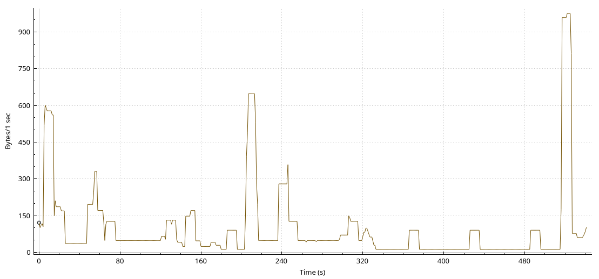
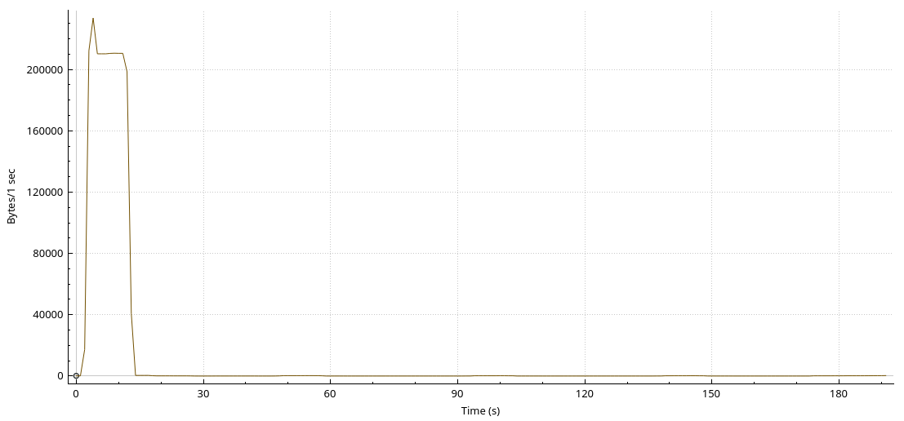
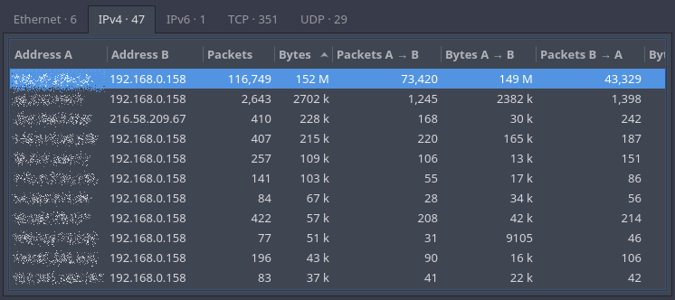
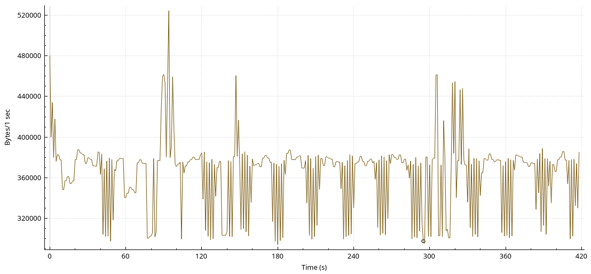

### Dane firmy

Bolesława Drobnera 12 l. 14  
48-300 Wrocław

Parametr	| Wartość
------------|------------
Ilość pracowników	| 40
Czas przeglądania stron internetowych	| 20 %
Ilość klientów radia internetowego 24h	| 5
Ilość klientów telewizji internetowej 24h	| 1
Narzędzia pracy wszystkich pracowników	| Komunikatory Telefony IP / Softphone'y E-mail
Ilość dwugodzinnych wideokonferencji w tygodniu	| 2
Ilość klientów tychże wideokonferencji	| 2
Rozmiar backupowanej bazy danych	| 14 GB

### Sposoby generowania ruchu

* ###### Web

	Strony internetowe: twitter.com, 9gag.com, pwr.edu.pl pobierane przez przeglądarki Google Chrome, Mozilla Firefox

* ###### Telewizja internetowa

	Strumień wideo na żywo HD 1080-30p z platformy Twitch wyświetlany w przeglądarce Google Chrome

* ###### Komunikator

	Szyfrowane wiadomości tekstowe wysyłane i odbierane przez komunikator Telegram

### Analiza otrzymanych logów

Dla ruchu typu Web (przeglądanie stron internetowych) zarejestrowano pakiety z dwóch sesji. Uzyskane wyniki filtrowano według portów. W pierwszej sesji łączono się z wieloma róznymi serwerami WWW.

W drugiej sesji wysyłano wiele kolejnych żądań do jednego serwera WWW.

W przypadku telewizji internetowej zarejestrowano pakiety z jednej sesji oglądania strumienia na żywo z platformy Twitch, trwającej 7 minut. Uzyskane wyniki filtrowano według portów.

Pakiety zarejestrowane podczas oceny obciążenia łącza przez komunikator Telegram analizowano pod kątem ilości i łącznego rozmiaru pakietów w konwersacjach z poszczególnymi, zdalnymi adresami IP. Podczas rejestrowania sesji wysłano i odebrano bardzo dużą liczbę wiadomości, stąd też do obliczeń postanowiono uwzględnić konwersację o największej ilości zarejestrowanych pakietów oraz danych.

### Ruch sieciowy i wymagana przepustowość dla poszczególnych usług

Usługa					| Ilość pobranych danych	| Ilość wysłanych danych	| Czas sesji	| Średnie pobieranie	| Średnie wysyłanie	| Szczytowe użycie łącza
------------------------|---------------------------|---------------------------|---------------|-----------------------|-----------------------|---------------------------
Web						| 51 MB		| 1 MB		| 720 s		| 580 kb/s	| 12 kb/s	| 1640 kb/s
Telewizja internetowa	| 149 MB	| 3 MB		| 420 s		| 2900 kb/s | 60 kb/s	| 3600 kb/s
komunikator				| 52 kB		| 39 kB		| 75 s		| 6 kb/s	| 4 kb/s	| 37 kb/s			

### Ruch internetowy i wymagana przepustowość łącza dla firmy

Dla uproszczenia przyjęto, że ruch sieciowy generowany przez pocztę elektroniczną jest identyczny, jak generowany przez przeglądanie stron internetowych, ale rozdzielony równomiernie pomiędzy pobieranie i wysyłanie. Użycie łącza przez VoIP oszacowano na podstawie bitrate kodeka G.711 (64 kb/s), zakładając nie więcej niż 8 rozmów w tym samym czasie. Jako użycie łącza przez pojedynczy strumień radia internetowego przyjęto najpowszechniejszą wartość bitrate dla strumieni MP3 - 128 kb/s. Do oszacowania obciążenia ze strony wideokonferencji posłużono się przepustowościami łącza internetowego rekomendowanymi dla Google Hangouts.

Grupa ruchu sieciowego				| Obliczenia	| Szacowana wymagana przepustowość pobierania	| Szacowana wymagana przepustowość wysyłania
------------------------------------|---------------|-----------------------------------------------|---------------------------------------------
Pracownicy przeglądający strony WWW	| `IlośćPracowników * CzasPrzeglądania * ŚrednieUżycie * (SzczytoweUżycie / (ŚredniePobieranie + ŚrednieWysyłanie))`	| 12860 kb/s	| 270 kb/s
Pracownicy używający komunikatorów	| `IlośćPracowników * ŚrednieUżycie`	| 240 kb/s	| 160 kb/s
Pracownicy używający poczty elektronicznej	| `IlośćPracowników * CzasPrzeglądania * SzczytoweUżycie / 2`		| 6560 kb/s	| 6560 kb/s
Pracownicy używający VoIP			| `IlośćRozmów * Bitrate`	| 512 kb/s	| 512 kb/s
Radio internetowe					| `IlośćKlientów * Bitrate`	| 640 kb/s	| 0
Telewizja internetowa				| `IlośćKlientów * ŚrednieUżycie`	| 2965 kb/s	| 0
Wideokonferencje					| `IlośćKlientów * ŚrednieUżycie`	| 6400 kb/s	| 5200 kb/s
Aktualizacje oprogramowania			| `IlośćPracowników * 50 MB / 10 min`	| 27300 kb/s	| 0
Backup bazy danych					| `RozmiarBazyDanych * 0.2 / 30 min`	| 0	| 65250 kb/s
**Szacowany szczytowy ruch sumaryczny**	| 			| 

### Wybór dostawcy i łącza

### Wnioski

### Q&A

###### Które usługi mają symetryczny profil ruchu, a które asymetryczny?

###### W jakich przypadkach w firmie niezbędne jest symetryczne łącze internetowe?

###### Co to jest CIR?

###### Czy najważniejszym parametrem dla usługi sieciowej jest przepustowość?

###### Jakie usługi sieciowe wymagają także zapewnienia innych parametrów sieci? Jakie to parametry?

###### Czy cena za łącza internetowe rośnie liniowo wraz z przepustowością łącz?
