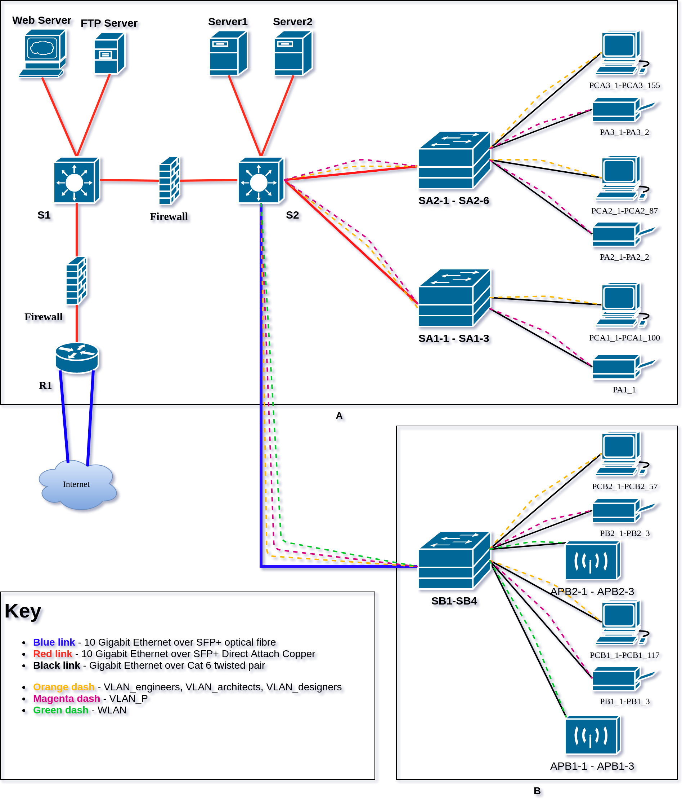

# Technologie sieciowe 2 - projekt

Autorzy | Prowadzący | Termin zajęć
-------|-------|-------
Sebastian Korniewicz (226183) Iwo Bujkiewicz (226203) | Dr inż. Róża Goścień | Czwartek TN, 13:15 - 15:00

## Etap 4

### 1. Wstęp

Celem projektu jest utworzenie dokumentacji umożliwiającej wykonanie infrastruktury sieciowej dla nowo otwartej siedziby dużego biura projektowego znajdującego się przy ulicy Henryka Sienkiewicza 62 we Wroclawiu. W skład obiektu wchodzą dwa budynki - jeden trzypiętrowy i jeden dwupiętrowy. Odległość między budynkami wynosi 115 metrów. Przewidywana liczba stanowisk komputerowych wynosi przynajmniej 510.

Bardzo istotnym elementem pracy biura projektowego jest kontakt z kontrahentami, zarówno w charakterze usługodawcy, jak i klienta; z tego powodu muszą być firmie zapewnione stabilne, wysokoprzepustowe łącza internetowe. W instytucji zatrudniającej ponad 400 osób trudno sobie dziś wyobrazić produktywną pracę bez wydajenj i stabilnej infrastruktury sieciowej, dlatego niemal tak samo istotne będzie zapewnienie niezawodności i redundancji łącz wewnątrz biura.

### 2. Inwentaryzacja zasobów

Przyjęto oznaczać budynek pierwszy (3-piętrowy) literą A, a kolejne piętra znajdujące się w tym budynku A1, A2, A3, natomiast budynek drugi (2-piętrowy) przyjęto oznaczać literą B, a kolejne jego piętra B1, B2.

Urządzenia pracowników		| A1		| A2		| A3		| B1		| B2
----------------------------|-----------|-----------|-----------|-----------|-----------
Konstruktorzy				| 34		| 13		| 50		| 49		| 5
Architekci					| 45		| 15		| 47		| 10		| 32
Projektanci					| 4			| 44		| 32		| 38		| 7
Urządzenia bezprzewodowe	| 0			| 0			| 0			| 13		| 13

Urządzenia sieciowe			| A1		| A2		| A3		| B1		| B2
----------------------------|-----------|-----------|-----------|-----------|-----------
Drukarki					| 1			| 2			| 2			| 3			| 2
Punkty dostępowe 802.11		| 0			| 0			| 0			| 3			| 3

| Serwery
|---------------------------
| Server1
| Server2
| WebServer
| FTPServer

| Aplikacje do uwzględnienia
|-------------------------------
| FTP
| Komunikator
| Przeglądarka
| VoIP
| Wideokonferencja

| Punkty dystrybucyjne 	| Lokalizacja 	| Podłączone punkty abonenckie
|-----------------------|---------------|------------------------------
| MDF					| A1			| A1
| IDF1					| A2			| A2, A3
| IDF2 					| B1			| B

### 3. Analiza potrzeb użytkowników – wymagania zamawiającego

Grupa rob. \ Aplikacja	| Przeglądarka	| 	| Wideokonferencja	| 	| VoIP	| 	| Klient FTP	| 	| Komunikator | |
----|----|----|----|----|----|----|----|----|----|----
|	| down	| up	| down	| up	| down	| up	| down	| up	| down	| up
Konstruktorzy	| 68	| 10	| 40	| 40	| 20	| 20	| 0	| 0	| 15	| 15
Architekci	| 38	| 10	| 40	| 40	| 20	| 20	| 92	| 17	| 15	| 15
Projektanci	| 46	| 10	| 0	| 0	| 20	| 20	| 49	| 14	| 15	| 15
Wi-Fi	| 0	| 0	| 40	| 40	| 0	| 0	| 0	| 0	| 15	| 15

A1	| Przeglądarka	| 	| Wideokonferencja	| 	| VoIP	| 	| Klient FTP	| 	| Komunikator	| 	| Suma	| 	|
----|----|----|----|----|----|----|----|----|----|----|----|----|----|----|
|	| down	| up	| down	| up	| down	| up	| down	| up	| down	| up	| down	| up
Konstruktorzy	| 2312	| 340	| 1360	| 1360	| 680	| 680	| 0	| 0	| 510	| 510	| 4862	| 2890
Architekci	| 1710	| 450	| 1800	| 1800	| 900	| 900	| 4140	| 765	| 675	| 675	| 9225	| 4590
Projektanci	| 184	| 40	| 0	| 0	| 80	| 80	| 196	| 56	| 60	| 60	| 520	| 236
Wi-Fi	| 0	| 0	| 0	| 0	| 0	| 0	| 0	| 0	| 0	| 0	| 0	| 0
|	| 	| 	| 	| 	| 	| 	| 	| 	| 	| Suma	| 14607	| 7716

A2	| Przeglądarka	| 	| Wideokonferencja	| 	| VoIP	| 	| Klient FTP	| 	| Komunikator	| 	| Suma	| 	|
----|----|----|----|----|----|----|----|----|----|----|----|----|----|----|
|	| down	| up	| down	| up	| down	| up	| down	| up	| down	| up	| down	| up
Konstruktorzy	| 884	| 130	| 520	| 520	| 260	| 260	| 0	| 0	| 195	| 195	| 1859	| 1105
Architekci	| 570	| 150	| 600	| 600	| 300	| 300	| 1380	| 255	| 225	| 225	| 3075	| 1530
Projektanci	| 2024	| 440	| 0	| 0	| 880	| 880	| 2156	| 616	| 660	| 660	| 5720	| 2596
Wi-Fi	| 0	| 0	| 0	| 0	| 0	| 0	| 0	| 0	| 0	| 0	| 0	| 0
|	| 	| 	| 	| 	| 	| 	| 	| 	| 	| Suma	| 10654	| 5231

A3	| Przeglądarka	| 	| Wideokonferencja	| 	| VoIP	| 	| Klient FTP	| 	| Komunikator	| 	| Suma	| 	|
----|----|----|----|----|----|----|----|----|----|----|----|----|----|----|
|	| down	| up	| down	| up	| down	| up	| down	| up	| down	| up	| down	| up
Konstruktorzy	| 3400	| 500	| 2000	| 2000	| 1000	| 1000	| 0	| 0	| 750	| 750	| 7150	| 4250
Architekci	| 1786	| 470	| 1880	| 1880	| 940	| 940	| 4324	| 799	| 705	| 705	| 9635	| 4794
Projektanci	| 1472	| 320	| 0	| 0	| 640	| 640	| 1568	| 448	| 480	| 480	| 4160	| 1888
Wi-Fi	| 0	| 0	| 0	| 0	| 0	| 0	| 0	| 0	| 0	| 0	| 0	| 0
|	| 	| 	| 	| 	| 	| 	| 	| 	| 	| Suma	| 20945	| 10932

B1	| Przeglądarka	| 	| Wideokonferencja	| 	| VoIP	| 	| Klient FTP	| 	| Komunikator	| 	| Suma	| 	|
----|----|----|----|----|----|----|----|----|----|----|----|----|----|----|
|	| down	| up	| down	| up	| down	| up	| down	| up	| down	| up	| down	| up
Konstruktorzy	| 3332	| 490	| 1960	| 1960	| 980	| 980	| 0	| 0	| 735	| 735	| 7007	| 4165
Architekci	| 380	| 100	| 400	| 400	| 200	| 200	| 920	| 170	| 150	| 150	| 2050	| 1020
Projektanci	| 1748	| 380	| 0	| 0	| 760	| 760	| 1862	| 532	| 570	| 570	| 4940	| 2242
Wi-Fi	| 0	| 0	| 520	| 520	| 0	| 0	| 0	| 0	| 195	| 195	| 715	| 715
|	| 	| 	| 	| 	| 	| 	| 	| 	| 	| Suma	| 14712	| 8142

B2	| Przeglądarka	| 	| Wideokonferencja	| 	| VoIP	| 	| Klient FTP	| 	| Komunikator	| 	| Suma	| 	|
----|----|----|----|----|----|----|----|----|----|----|----|----|----|----|
|	| down	| up	| down	| up	| down	| up	| down	| up	| down	| up	| down	| up
Konstruktorzy	| 340	| 50	| 200	| 200	| 100	| 100	| 0	| 0	| 75	| 75	| 715	| 425
Architekci	| 1216	| 320	| 1280	| 1280	| 640	| 640	| 2944	| 544	| 480	| 480	| 6560	| 3264
Projektanci	| 322	| 70	| 0	| 0	| 140	| 140	| 343	| 98	| 105	| 105	| 910	| 413
Wi-Fi	| 0	| 0	| 520	| 520	| 0	| 0	| 0	| 0	| 195	| 195	| 715	| 715
|	| 	| 	| 	| 	| 	| 	| 	| 	| 	| Suma	| 8900	| 4817

Grupa rob. \ Serwer	| Server1	| 	| Server2	| 	| Drukarka	| 	|
----|----|----|----|----|----|----
|	| down	| up	| down	| up	| down	| up
Konstruktorzy	| 200	| 150	| 200	| 100	| 10	| 120
Architekci	| 0	| 0	| 0	| 0	| 10	| 110
Projektanci	| 0	| 0	| 600	| 300	| 10	| 150
WiFi	| 200	| 100	| 50	| 50	| 10	| 160

A1	| Server1	| 	| Server2	| 	| Drukarki	| 	|
----|----|----|----|----|----|----
|	| down	| up	| down	| up	| down	| up
Konstruktorzy	| 6800	| 5100	| 6800	| 3400	| 340	| 4080
Architekci	| 0	| 0	| 0	| 0	| 450	| 4950
Projektanci	| 0	| 0	| 2400	| 1200	| 40	| 600
Urządzenia Wi-Fi	| 0	| 0	| 0	| 0	| 0	| 0
Suma	| 6800	| 5100	| 9200	| 4600	| 830	| 9630

A2	| Server1	| 	| Server2	| 	| Drukarki	| 	|
----|----|----|----|----|----|----
|	| down	| up	| down	| up	| down	| up
Konstruktorzy	| 2600	| 1950	| 2600	| 1300	| 260	| 3120
Architekci	| 0	| 0	| 0	| 0	| 300	| 3300
Projektanci	| 0	| 0	| 26400	| 13200	| 880	| 13200
Urządzenia Wi-Fi	| 0	| 0	| 0	| 0	| 0	| 0
Suma	| 2600	| 1950	| 29000	| 14500	| 1440	| 19620

A3	| Server1	| 	| Server2	| 	| Drukarki	| 	|
----|----|----|----|----|----|----
|	| down	| up	| down	| up	| down	| up
Konstruktorzy	| 10000	| 7500	| 10000	| 5000	| 1000	| 12000
Architekci	| 0	| 0	| 0	| 0	| 940	| 10340
Projektanci	| 0	| 0	| 19200	| 9600	| 640	| 9600
Urządzenia Wi-Fi	| 0	| 0	| 0	| 0	| 0	| 0
Suma	| 10000	| 7500	| 29200	| 14600	| 2580	| 31940

B1	| Server1	| 	| Server2	| 	| Drukarki	| 	|
----|----|----|----|----|----|----
|	| down	| up	| down	| up	| down	| up
Konstruktorzy	| 9800	| 7350	| 9800	| 4900	| 1470	| 17640
Architekci	| 0	| 0	| 0	| 0	| 300	| 3300
Projektanci	| 0	| 0	| 22800	| 11400	| 1140	| 17100
Urządzenia Wi-Fi	| 2600	| 1300	| 650	| 650	| 390	| 6240
Suma	| 12400	| 8650	| 33250	| 16950	| 3300	| 44280

B2	| Server1	| 	| Server2	| 	| Drukarki	| 	|
----|----|----|----|----|----|----
|	| down	| up	| down	| up	| down	| up
Konstruktorzy	| 1000	| 750	| 1000	| 500	| 100	| 1200
Architekci	| 0	| 0	| 0	| 0	| 640	| 7040
Projektanci	| 0	| 0	| 4200	| 2100	| 140	| 2100
Urządzenia Wi-Fi	| 2600	| 1300	| 650	| 650	| 260	| 4160
Suma	| 3600	| 2050	| 5850	| 3250	| 1140	| 14500

Piętro \ Kategoria ruchu	| Server1	| 	| Server2	| 	| Drukarki	| 	| Internet	| 	|
----|----|----|----|----|----|----|----|----
|	| down	| up	| down	| up	| down	| up	| down	| up
A1	| 6800	| 5100	| 9200	| 4600	| 830	| 9630	| 14607	| 7716
A2	| 2600	| 1950	| 29000	| 14500	| 1440	| 19620	| 10654	| 5231
A3	| 10000	| 7500	| 29200	| 14600	| 2580	| 31940	| 20945	| 10932
B1	| 12400	| 8650	| 33250	| 16950	| 3300	| 44280	| 14712	| 8142
B2	| 3600	| 2050	| 5850	| 3250	| 1140	| 14500	| 8900	| 4817

Serwery internetowe	| 	| 	| 	| Suma	| 	| 	
----|----|----|----|----|----|----
|	| down	| up	| liczba sesji	| down	| up
Serwer WWW	| 20	| 50	| 16	| 320	| 800
Serwer FTP	| 50	| 350	| 16	| 800	| 5600

### 4. Założenia projektowe

* Podstawową technologią stosowaną do łączenia urządzeń teleinformatycznych w siedzibie firmy będą skrętki F/UTP kategorii 6., zakończone złączami 8P8C, pozwalające na transmisję z prędkością 1 Gb/s w standardzie 1000BASE-T.
* Mimo braku stoso wyposażoownego okablowania oraz odpowiedninych urządzeń, z myślą o rozwoju firmy wyposaży się szafy teleinformatyczne w urządzenia sieciowe obsługujące transmisję z prędkością 10 Gb/s - przede wszystkim w standardzie 10GBASE-T z użyciem miedzianych skrętek, ale również światłowodów - a także wspierające grupowanie wielu łącz fizycznych w wysokoprzepustowe magistrale.
* Łącza pomiędzy najważniejszymi węzłami w sieci, jak np. między switchami w IDF a serwerami, będą z założenia grupowane w celu zapewnienia obsługi możliwie największej liczby jednoczesnych transmisji.
* Budynki A i B połączone są między sobą światłowodem jednomodowym. Do obsługi tego połączenia użyte zostaną urządzenia i złącza wspierające transmisję z prędkością 10 Gb/s.
* Do zapewnienia stabilnego i szybkiego dostępu do Internetu konieczne będzie podstawowe łącze światłowodowe o przepustowości przynajmniej 200 Mb/s symetrycznie.

### 5. Projekt sieci

#### 5.1. Projekt logiczny sieci wraz z opisem koncepcji rozwiązania i uzasadnieniem

Sieć wewnętrzna zostanie podzielona na 5 VLANów pracowniczych, każda dla innej grupy roboczej, a także osobny VLAN dla drukarek oraz osobny VLAN dla urządzeń Wi-Fi.

Przyjęto następujący podział VLANów:

Nazwa sieci         | Grupa robocza
----|----
VLAN_engineers      | konstruktorzy
VLAN_architects     | architekci
VLAN_designers      | projektanci
VLAN_P              | drukarki
WLAN                | siec bezprzewodowa

#### 5.2. Wybór urządzeń sieciowych

##### Switche

Oznaczenie  | Warstwa pracy |   Nazwa modelu
----|----|---
S1  | 3 | WS-C4500X-16SFP+
S2  | 3 | WS-C4500X-16SFP+
SA1-1 - SA1-3 | 2   | WS-C3650-48TQ-L
SA2-1 - SA2-6 | 2   | WS-C3650-48TQ-L
SB1 - SB4 | 2   | WS-C3650-48TQ-L

* Cisco WS-C3650-48TQ-L

	switch posiadający 48 portów 1 GigE oraz 4 porty 10 GigE SFP+

* Cisco WS-C4500X-16SFP+

	switch posiadający 16 portów 10 GigE SFP+

Urządzenia opisane jako SA1-\*, SA2-\* oraz SB\* zostaną połączone w tzw. 'stosy'. Dzięki takiemu rozwiązaniu będą funkcjonować logicznie jak pojedynczy switch z dużą ilością portów. W przypadku WS-C3650-48TQ-L możliwe jest połączenie do 9 urządzeń w 'stos'.

##### Router

Wykorzystywany router, będący bramą dostępu do Internetu, to model Cisco ISR4451-X/K9, wyposażony w 4 porty SFP i funkcję _load balancing_, pozwalającą na zrównoważenie obciążenia pomiędzy dwoma niezależnymi łączami internetowymi.

##### Firewalle

Oba wykorzystywane firewalle to model Cisco ASA5545-K9 wyposażony w rozszerzenie I/O z portami SFP.

##### Access pointy

Jako punkty dostępowe Wi-Fi wykorzystywane są urządzenia UAP-AC-LITE firmy Ubiquiti Networks.

#### 5.3. Projekt adresacji IP

Nazwa sieci         |	adres sieci	|	bramka domyślna	|	Broadcast   | Serwer DHCP
----|----|----|----|----
LAN_Outer           |   10.0.0.0/28 |   10.0.0.1        |   10.0.0.15   | ---
LAN_Inner           |   10.0.0.16/28    | 10.0.0.17     |   10.0.0.31   | ---
WAN_Channel         |   10.0.0.32/29    | 10.0.0.33     |   10.0.0.39   | ---
VLAN_engineers		|	10.0.1.0/24	|	10.0.1.1		|	10.0.1.255  | S2
VLAN_architects		|	10.0.2.0/24	|	10.0.2.1		|	10.0.2.255  | S2
VLAN_designers	    |	10.0.3.0/24	|	10.0.3.1		|	10.0.3.255  | S2
VLAN_P              |   10.0.4.0/24	|	10.0.4.1		|	10.0.4.255  | S2
WLAN                |	10.0.5.0/24	|	10.0.5.1		|	10.0.5.255  | S2

Sieć oznaczona jako `WAN_Channel` służyć będzie do komunikacji pomiędzy R1 a S1. Sieć `LAN_Outer` znajdować się będzie po 'wewnętrznej' stronie S1 i obejmować będzie WebServer, FTPServer oraz połączenie do S2. Sieć `LAN_Inner` znajdować się będzie po 'wewnętrznej' stronie S2 i obejmować będzie Server1, Server2 oraz adresy konsoli zarządzania pozostałych switchy.

#### 5.4. Projekt konfiguracji urządzeń

##### Konfiguracja VLAN

Oznaczenie  | Porty         | VLANy
------------|---------------|--------
SA1-1       | 01X-41X       | VLAN_engineers
SA1-2       | 01X-48X       | VLAN_architects
SA1-3       | 01X-08X       | VLAN_architects
SA1-3       | 09X-15X       | VLAN_designers
SA1-3       | 16X           | VLAN_P
SA2-1       | 01X-48X       | VLAN_engineers
SA2-2       | 01X-28X       | VLAN_engineers
SA2-3       | 01X-48X       | VLAN_architects
SA2-4       | 01X-27X       | VLAN_architects
SA2-4       | 28X-31X       | VLAN_P
SA2-5       | 01X-48X       | VLAN_designers
SA2-6       | 01X-44X       | VLAN_designers
SB1         | 01X-48X       | VLAN_engineers
SB2         | 01X-17X       | VLAN_engineers
SB2         | 18X-48X       | VLAN_architects
SB3         | 01X-10X       | VLAN_architects
SB3         | 11X-48X       | VLAN_designers
SB4         | 01X-17X       | VLAN_designers
SB4         | 18X-22X       | VLAN_P
SB4         | 23X-28X       | WLAN

##### Połączenia trunk

Połączenia pomiędzy S2 i SA1-1, S2 i SA2-1 oraz S2 i SB1 zostaną skonfigurowane jako połączenia trunk, aby możliwa była komunikacja wewnątrz i między VLANami na całym obszarze siedziby firmy.

##### Konfiguracja WLAN

W celu zapewnienia bezpieczeństwa oraz uproszczenia obsługi sieci, urządzenia bezprzewodowe będą włączone w osobny VLAN. Przesył danych będzie chroniony protokołem WPA2-PSK z szyfrowaniem AES, a dodatkowym zabezpieczeniem będzie filtrowanie urządzeń na podstawie adresu MAC.

#### 5.5. Projekt podłączenia do Internetu.

Parametr połączenia				| Moico     | Orange
--------------------------------|-----------|------------
Prędkosc download               | 1000 Mb/s | 600 Mb/s
Prędkosc upload                 | 1000 Mb/s | 60 Mb/s
Liczba adresow zewnetrznych     | 1         | 4
Interfejs koncowy               | SFP+      | SFP+
Oplata aktywacyjna              | 99 PLN    |
Abonament                       | 155 PLN   | 146,37 PLN

#### 5.6. Analiza bezpieczeństwa i niezawodności sieci.

Podstawowymi rodzajami niebezpieczeństw, które mogą potencjalnie zagrażać funkcjonowaniu sieci firmowej, są ataki z zewnątrz (połączenia przychodzące z użyciem specjalnie przygotowanych pakietów wykorzystujących luki w zabezpieczeniach oprogramowania lub ograniczenia infrastruktury sieciowej), wprowadzanie do systemów firmy złośliwego oprogramowania oraz awarie zasilania.

Przed atakami z zewnątrz sieć bronić się będzie za pomocą blokad portów TCP/UDP, filtrowania pakietów w sprzętowych firewallach oraz firewalli programowych na stacjach roboczych i serwerach. Dwa sprzętowe firewalle zastosowano w celu umożliwienia docierania ruchu przychodzącego z zewnątrz w kierunku serwerów WW oraz FTP, ale zablokowania takowego w 'głębszej' części sieci.

Przed złośliwym oprogramowaniem infrastruktura sieciowa raczej nie jest w stanie firmy obronić, toteż dodatkowa ostrożność będzie musiała zostać zachowana przez użtkowników, a administrator będzie musiał dopilnować częstego aktualizowania oprogramowania antywirusowego (chyba, że firma będzie wykorzystywać systemy operacyjne z rodziny Unix).

W celu zabezpieczenia sieci przed awarią zasilania, sugeruje się wyposażyć szafy teleinformatyczne w zasilacze awaryjne (_uninterruptible power supply_) renomowanej firmy (np. Eaton, Liebert/Emerson) o mocy i pojemności akumulatorów odpowiedniej do zasilenia wielu urządzeń sieciowych niezależnie (np. osobno R1, Firewall i S1, osobno Firewall i S2 oraz osobno 'stosy' switchy SA1-\*, SA2-\* i SB\*). Ważna jest tutaj charakterystyka _online_ zasilaczy awaryjnych, która pozwoli dostarczać prąd do urządzeń sieciowych bez najmniejszych przerw i zakłóceń.

#### 5.7. Kosztorys.

Nazwa                   | Ilość | Cena jednostkowa [PLN]    | Wartość [PLN]
------------------------|-------|---------------------------|------------
Cisco WS-C3650-48TQ-L   | 13    | 13296.81                  | 172858.50
Cisco WS-C4500X-16SFP+  | 2     | 19481.37                  | 38962.74
Cisco ISR4451-X/K9      | 1     | 27830.53                  | 27830.53
Cisco ASA5545-K9        | 2     | 31798.96                  | 63597.92
Ubiquiti UAP-AC-LITE	| 6		| 320.00					| 1920.00
Aktywacja operatorska   | 1     | 99.00                     | 99.00
Miesiąc abonamentu      | 24    | 301.37                    | 7232.88
**Suma**                |       |                           | 312501.57

Ceny na podstawie informacji z http://www.router-switch.com oraz stron internetowych operatorów.

### 6. Karty katalogowe proponowanych urządzeń

Nazwa                   | Dane techniczne
------------------------|------------------
Cisco WS-C3650-48TQ-L   | https://www.cisco.com/c/en/us/support/switches/catalyst-3650-48tq-l-switch/model.html
Cisco WS-C4500X-16SFP+  | https://www.cisco.com/c/en/us/support/switches/catalyst-4500x-16-sfp-switch/model.html
Cisco ISR4451-X/K9      | https://www.cisco.com/c/en/us/support/routers/4451-x-integrated-services-router-isr/model.html
Cisco ASA5545-K9        | https://www.cisco.com/c/en/us/support/security/asa-5545-x-adaptive-security-appliance/model.html
Ubiquiti UAP-AC-LITE    | https://www.ubnt.com/unifi/unifi-ap-ac-lite/
