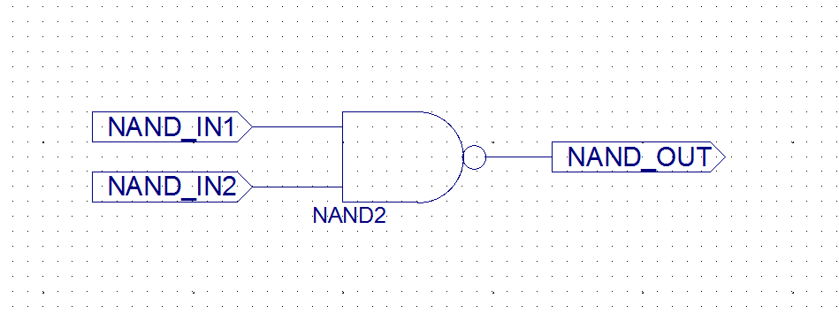
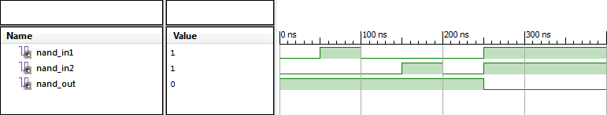
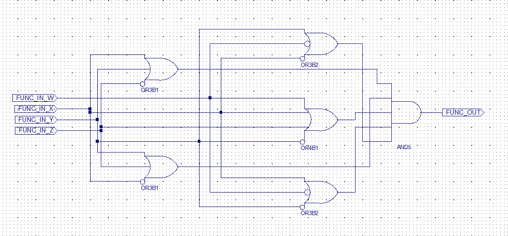
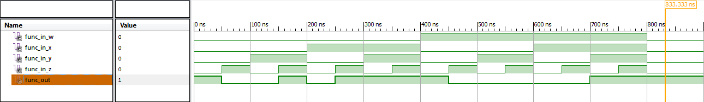
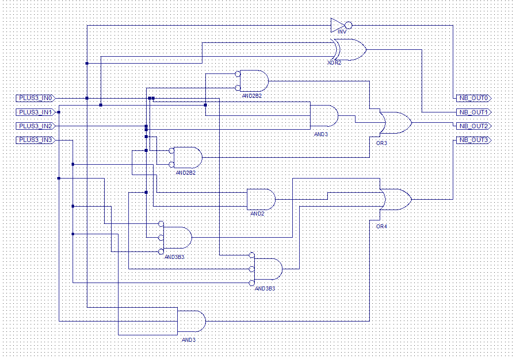
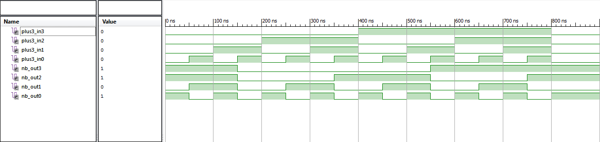

# Układy cyfrowe i systemy wbudowane

## Sprawozdanie z laboratorium

Data				| Tytuł zajęć								| Uczestnicy				
--------------------|-------------------------------------------|---------------------------
11.10.2017 13:00	| Implementacja prostych układów logicznych	| Iwo Bujkiewicz (226203) Adrian Wąż (226042)

### Zadania

Na zajęciach należało zaprojektować następujące układy logiczne, przeprowadzić symulację ich działania oraz zaprogramować mikroukład CPLD z ich użyciem.

1. Dwuwejściowa bramka logiczna
2. Układ realizujący zminimalizowaną funkcję logiczną G(w,x,y,z) = ∏(1,2,4,9,11,12,14)
3. Translator 4-bitowego kodu +3 na kod naturalny binarny

### Kolejne etapy realizacji

#### Bramka logiczna

Bramka logiczna miała być prostym testem sposobu implementacji układów logicznych w laboratorium. Nie wymagała dodatkowych kroków wstępnych. Do realizacji wybrano bramkę NAND.

Symulacja działania bramki przebiegła pomyślnie.

Mikroukład CPLD zaprogramowany bramką logiczną działał zgodnie z oczekiwaniami. Wejścia i wyjścia wyprowadzono na porty mikroukładu zgodnie z poniższą tabelą.

Nazwa portu | Węzeł
---|---
K0 | NAND_IN1
K1 | NAND_IN2
LED7 | NAND_OUT

#### Funkcja G(w,x,y,z) = ∏(1,2,4,9,11,12,14)

Notacja ∏() oznacza definicję maxtermów, tj. kombinacji wejściowych, dla których funkcja daje wartość 0. W tym przypadku przekłada się to na następującą tabelę prawdy.

w x y z | G(w,x,y,z)
--------|------------
0 0 0 0 | 1
0 0 0 1 | 0
0 0 1 0 | 0
0 0 1 1 | 1
0 1 0 0 | 0
0 1 0 1 | 1
0 1 1 0 | 1
0 1 1 1 | 1
1 0 0 0 | 1
1 0 0 1 | 0
1 0 1 0 | 1
1 0 1 1 | 0
1 1 0 0 | 0
1 1 0 1 | 1
1 1 1 0 | 0
1 1 1 1 | 1

Funkcję G(w,x,y,z) zminimalizowano używając siatki Karnaugh'a.

wx \ yz	| 00 | 01 | 11 | 10
--------|----|----|----|----
**00**	|  1 |  0 |  1 |  0
**01**	|  0 |  1 |  1 |  1
**11**	|  0 |  1 |  1 |  0
**10**	|  1 |  0 |  0 |  1

Efektem minimalizacji była postać funkcji:

G(w,x,y,z) = (x ∨ y ∨ ¬z) ∧ (w ∨ x ∨ ¬y ∨ z) ∧ (¬x ∨ y ∨ z) ∧ (¬w ∨ x ∨ ¬z) ∧ (¬w ∨ ¬x ∨ z)

Symulacja układu wykazała błędy, ponieważ podczas tworzenia schematu układu do dwóch bramek OR omyłkowo podłączono niewłaściwy sygnał wejściowy (`y` zamiast `z`).

Programowanie na mikroukładzie CPLD przebiegło bez zarzutu. Wejścia i wyjścia wyprowadzono na porty mikroukładu zgodnie z poniższą tabelą.

Nazwa portu | Węzeł
---|---
K0 | FUNC_IN_Z
K1 | FUNC_IN_Y
K2 | FUNC_IN_X
K3 | FUNC_IN_W
LED7 | FUNC_OUT

#### Translator kodu

Translator miał za zadanie konwertować 4-bitowy kod z obciążeniem (+3) na 4-bitowy kod naturalny binarny. Sposób konwersji przedstawia poniższa tabela prawdy, gdzie X jest reprezentacją +3, a Y jest reprezentacją NB.

x3 x2 x1 x0 | y3 y2 y1 y0
---|---
0 0 0 0 | 1 1 0 1
0 0 0 1 | 1 1 1 0
0 0 1 0 | 1 1 1 1
0 0 1 1 | 0 0 0 0
0 1 0 0 | 0 0 0 1
0 1 0 1 | 0 0 1 0
0 1 1 0 | 0 0 1 1
0 1 1 1 | 0 1 0 0
1 0 0 0 | 0 1 0 1
1 0 0 1 | 0 1 1 0
1 0 1 0 | 0 1 1 1
1 0 1 1 | 1 0 0 0
1 1 0 0 | 1 0 0 1
1 1 0 1 | 1 0 1 0
1 1 1 0 | 1 0 1 1
1 1 1 1 | 1 1 0 0

Dla każdej z osobna cyfry binarnej reprezentacji Y zminimalizowano funkcję logiczną z pomocą siatki Karnaugh'a.

x3x2 \ x1x0 | 00 | 01 | 11 | 10
------------|----|----|----|----
**00**		|  1 |  1 |  0 |  1
**01**		|  0 |  0 |  0 |  0
**11**		|  1 |  1 |  1 |  1
**10**		|  0 |  0 |  1 |  0

y3 = (x3 ∧ x2) ∨ (¬x3 ∧ ¬x2 ∧ ¬x1) ∨ (¬x3 ∧ ¬x2 ∧ ¬x0) ∨ (x3 ∧ x1 ∧ x0)

x3x2 \ x1x0 | 00 | 01 | 11 | 10
------------|----|----|----|----
**00**		|  1 |  1 |  0 |  1
**01**		|  0 |  0 |  1 |  0
**11**		|  0 |  0 |  1 |  0
**10**		|  1 |  1 |  0 |  1

y2 = (¬x2 ∧ ¬x1) ∨ (¬x2 ∧ ¬x0) ∨ (x2 ∧ x1 ∧ x0)

x3x2 \ x1x0 | 00 | 01 | 11 | 10
------------|----|----|----|----
**00**		|  0 |  1 |  0 |  1
**01**		|  0 |  1 |  0 |  1
**11**		|  0 |  1 |  0 |  1
**10**		|  0 |  1 |  0 |  1

y1 = x1 ⊻ x0

x3x2 \ x1x0 | 00 | 01 | 11 | 10
------------|----|----|----|----
**00**		|  1 |  0 |  0 |  1
**01**		|  1 |  0 |  0 |  1
**11**		|  1 |  0 |  0 |  1
**10**		|  1 |  0 |  0 |  1

y0 = ¬x0

Schemat układu przyjął postać:

Symulacja translatora przebiegła pomyślnie.

Programowanie na mikroukładzie CPLD przebiegło bez zarzutu. Wejścia i wyjścia wyprowadzono na porty mikroukładu zgodnie z poniższą tabelą.

Nazwa portu | Węzeł
---|---
K0 | PLUS3_IN0
K1 | PLUS3_IN1
K2 | PLUS3_IN2
K3 | PLUS3_IN3
LED0 | NB_OUT0
LED1 | NB_OUT1
LED2 | NB_OUT2
LED3 | NB_OUT3
