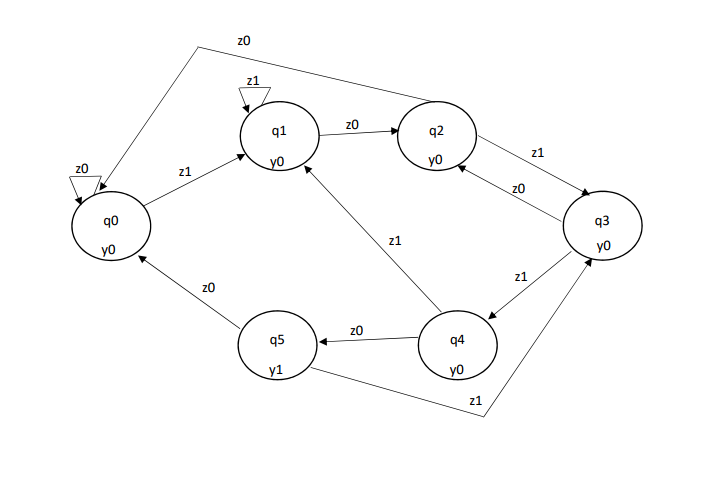

# Układy cyfrowe i systemy wbudowane

## Sprawozdanie z laboratorium

Data				| Tytuł zajęć										| Uczestnicy				
--------------------|---------------------------------------------------|---------------------------
22.11.2017 13:00	| Implementacja detektora sekwencji w języku VHDL	| Iwo Bujkiewicz (226203)<br />Adrian Wąż (226042)

### Zadania

Na zajęciach należało opisać za pomocą języka VHDL, a następnie zaprogramować na mikroukładzie CPLD, układ logiczny detektora sekwencji binarnej, zaprojektowany jako maszyna stanów.

### Kolejne etapy realizacji

#### Detektor sekwencji

Detektor sekwencji miał za zadanie realizować dokładnie tą samą funkcjonalność, co na zajęciach z 25.10.2017, tj. przyjmować na wejściu sygnał (`Z`) z odpowiednim taktowaniem i informować za pomocą sygnały wyjściowego, czy została wykryta sekwencja `10110`. Poniżej znajduje się graf automatu Moore'a detektora oraz listing kodu VHDL.



<div class="page-break"></div>

```VHDL
library IEEE;
use IEEE.STD_LOGIC_1164.ALL;
entity passlock is
	Port ( CLK : in  STD_LOGIC;
		   X : in  STD_LOGIC;
		   CLR : in  STD_LOGIC;
		   Y : out  STD_LOGIC;
		   STATE : inout  STD_LOGIC_VECTOR (3 downto 0));
end passlock;
architecture Behavioral of passlock is
begin
	process (CLK, X, CLR)
	begin
		if CLR = '1' then
			STATE <= "0000";
		elsif (rising_edge(CLK)) then
			case STATE is
				when "0000" =>
					if (X = '1') then
						STATE <="0001";
					end if;
				when"0001" =>
					if (X = '0') then
						STATE <= "0010";
					end if;
				when "0010" =>
					if (X = '1') then
						STATE <= "0011";
					else
						STATE <= "0000";
					end if;
				when "0011" =>
					if (X = '1') then
						STATE <= "0100";
					else
						STATE <= "0010";
					end if;
				when "0100" =>
					if (X = '1') then
						STATE <="0001";
					else
						STATE <= "0101";
					end if;
				when "0101" =>
					if (X = '1') then
						STATE <= "0011";
					else
						STATE <= "0000";
					end if;
				when others =>
					STATE <= "0000";
			end case;
		end if;
	end process;
	process (STATE)
	begin
		case STATE is
			when "0000" =>
				Y <= '0';
			when"0001" =>
				Y <= '0';
			when "0010" =>
				Y <= '0';
			when "0011" =>
				Y <= '0';
			when "0100" =>
				Y <= '0';
			when "0101" =>
				Y <= '1';
			when others =>
				Y <= '0';
		end case;
	end process;
end Behavioral;
```

Mikroukład CPLD zaprogramowany na podstawie powyższego kodu działał zgodnie z oczekiwaniami. Wejścia i wyjścia wyprowadzono na porty mikroukładu zgodnie z poniższą tabelą.

Nazwa portu | Węzeł
---|---
Clk_LF | IN_CLK
K0 | IN_X
K1 | IN_CLR
LED0 | OUT_Y
D7S_S0 | OUT_DISP(0)
D7S_S1 | OUT_DISP(1)
D7S_S2 | OUT_DISP(2)
D7S_S3 | OUT_DISP(3)
D7S_S4 | OUT_DISP(4)
D7S_S5 | OUT_DISP(5)
D7S_S6 | OUT_DISP(6)
