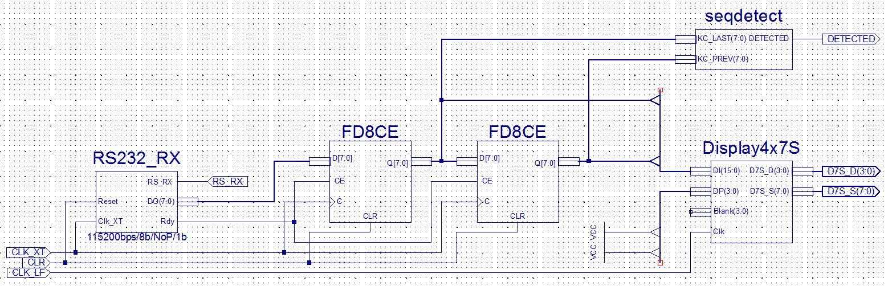
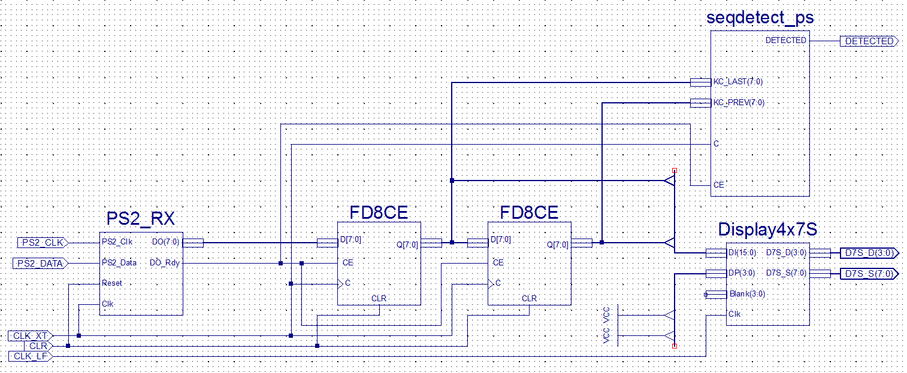

# Układy cyfrowe i systemy wbudowane

## Sprawozdanie z laboratorium

Data				| Tytuł zajęć												| Uczestnicy				
--------------------|-----------------------------------------------------------|---------------------------
06.12.2017 13:00	| Wykrywanie sekwencji bajtowych na wejściach szeregowych	| Iwo Bujkiewicz (226203)<br />Adrian Wąż (226042)

### Zadania

Na zajęciach należało zaprojektować i zaprogramować na mikroukładzie CPLD układ wykrywający wybraną sekwencję dwóch bajtów, pochodzącą najpierw z komputera PC podłączonego do portu RS232, a następnie z klawiatury podłączonej do portu PS/2. Oprócz wykrycia wystąpienia sekwencji, układ miał także kolejno wyświetlać odczytane bajty na wyświetlaczu 7-segmentowym.

### Kolejne etapy realizacji

#### Wybór sekwencji

Do detekcji wybrano sekwencję odpowiadającą naciśnięciu kolejno klawiszy `K` i `RETURN`. Dla portu RS232 była to sekwencja bajtów `0x6B` i `0x0D`. Dla klawiatury podłączonej do portu PS/2 była to sekwencja bajtów `0x42` i `0x5A`.

#### Odczyt z portu RS232

Detektor sekwencji zaimplementowano jako element układu, opisany w języku VHDL. W tym przypadku wystarczyło wykorzystać sygnały wejściowe z rejestrów 8-bitowych, przechowujących dwa ostatnie odczytane z portu bajty, i opisać prosty układ kombinacyjny sterujący włączaniem sygnału wyjściowego oznaczającego wykrycie.

```VHDL
library IEEE;
use IEEE.STD_LOGIC_1164.ALL;

entity seqdetect is
    Port ( KC_LAST : in  STD_LOGIC_VECTOR (7 downto 0);
           KC_PREV : in  STD_LOGIC_VECTOR (7 downto 0);
           DETECTED : out  STD_LOGIC);
end seqdetect;

architecture Behavioral of seqdetect is
begin
	process(KC_PREV, KC_LAST)
	begin
		if KC_PREV = X"6B" and KC_LAST = X"0D" then
			DETECTED <= '1';
		else
			DETECTED <= '0';
		end if;
	end process;
end Behavioral;
```

<div class="page-break"></div>

Element ten, wraz z innymi (gotowymi) elementami, został włączony do układu za pomocą schematu, który umieszczono poniżej.



Mikroukład CPLD zaprogramowany na podstawie powyższego schematu działał zgodnie z oczekiwaniami. Wejścia i wyjścia wyprowadzono na porty mikroukładu zgodnie z poniższą tabelą.

Nazwa portu | Węzeł
---|---
Clk_LF | CLK_LF
Clk_XT | CLK_XT
K0 | CLR
LED0 | DETECTED
D7S_D0 | D7S_D(0)
D7S_D1 | D7S_D(1)
D7S_D2 | D7S_D(2)
D7S_D3 | D7S_D(3)
D7S_S0 | D7S_S(0)
D7S_S1 | D7S_S(1)
D7S_S2 | D7S_S(2)
D7S_S3 | D7S_S(3)
D7S_S4 | D7S_S(4)
D7S_S5 | D7S_S(5)
D7S_S6 | D7S_S(6)
D7S_S7 | D7S_S(7)
RS_RX | RS_RX

#### Odczyt z portu PS/2

Podobnie, jak w przypadku portu RS232, właściwy detektor był elementem układu opisanym w języku VHDL. Tym razem układ kombinacyjny okazał się niewystarczający, ponieważ klawiatura transmitowała kody bajtowe w inny sposób. Po każdej transmisji pojedynczego naciśnięcia klawisza w rejestrze przechowującym ostantio odebrany bajt znajdował się kod klawisza, zaś w rejestrze przechowującym poprzednio odebrany bajt - kod `0xF0`. Element detektora przekształcono zatem w maszynę stanów.

Logikę działania elementu wzbudzało wschodzące zbocze zegara (tego samego, który sterował pracą elementu odczytującego dane z portu PS/2). W elemencie używany był wewnętrznie, oprócz sygnału stanu, sygnał trybu odczytu. Umożliwiał on opóźnienie odczytywania danych z rejestrów o jeden cykl zegara, aby rejestry zdążyły ustawić sygnały na swoich wyjściach na nowo odczytane wartości. Sygnał Clock Enable oznaczał odebranie nowego bajtu z portu PS/2, co powodowało w elemencie detektora włączenie trybu odczytu na następny cykl zegara.

```VHDL
library IEEE;
use IEEE.STD_LOGIC_1164.ALL;

entity seqdetect_ps is
    Port ( KC_LAST : in  STD_LOGIC_VECTOR (7 downto 0);
           KC_PREV : in  STD_LOGIC_VECTOR (7 downto 0);
		   CE : in STD_LOGIC;
		   C : in STD_LOGIC;
           DETECTED : out  STD_LOGIC);
end seqdetect_ps;

architecture Behavioral of seqdetect_ps is
	signal READING : STD_LOGIC;
	signal STATE : STD_LOGIC_VECTOR (1 downto 0);
begin
	process(KC_PREV, KC_LAST, CE, C, READING, STATE)
	begin
		if (rising_edge(C)) then
			if READING = '1' then
				READING <= '0';
				if KC_PREV = X"F0" then
					case STATE is
						when "00" =>
							if KC_LAST = X"42" then
								STATE <= "01";
							end if;
						when "01" =>
							if KC_LAST = X"5A" then
								STATE <= "10";
							elsif KC_LAST = X"42" then
								STATE <= "01";
							else
								STATE <= "00";
							end if;
						when "10" =>
							if KC_LAST = X"42" then
								STATE <= "01";
							else
								STATE <= "00";
							end if;
						when others =>
							STATE <= "00";
					end case;
				end if;
			elsif CE = '1' then
				READING <= '1';
			end if;
		end if;
	end process;
	
	process(STATE)
	begin
		if STATE = "10" then
			DETECTED <= '1';
		else
			DETECTED <= '0';
		end if;
	end process;
end Behavioral;
```

<div class="page-break"></div>

Element ten, wraz z innymi (gotowymi) elementami, został włączony do układu za pomocą schematu, który umieszczono poniżej.



Mikroukład CPLD zaprogramowany na podstawie powyższego schematu działał zgodnie z oczekiwaniami. Wejścia i wyjścia wyprowadzono na porty mikroukładu zgodnie z poniższą tabelą.

Nazwa portu | Węzeł
---|---
Clk_LF | CLK_LF
Clk_XT | CLK_XT
K0 | CLR
LED0 | DETECTED
D7S_D0 | D7S_D(0)
D7S_D1 | D7S_D(1)
D7S_D2 | D7S_D(2)
D7S_D3 | D7S_D(3)
D7S_S0 | D7S_S(0)
D7S_S1 | D7S_S(1)
D7S_S2 | D7S_S(2)
D7S_S3 | D7S_S(3)
D7S_S4 | D7S_S(4)
D7S_S5 | D7S_S(5)
D7S_S6 | D7S_S(6)
D7S_S7 | D7S_S(7)
PS2_Clk | PS2_CLK
PS2_Data | PS2_DATA
