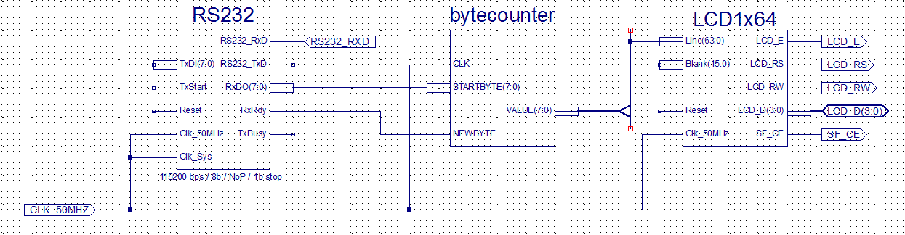

# Układy cyfrowe i systemy wbudowane

## Sprawozdanie z laboratorium

Data				| Tytuł zajęć												| Uczestnicy				
--------------------|-----------------------------------------------------------|---------------------------
20.12.2017 13:00	| Licznik 8 bitowy z wykorzystaniem mikroukładu FPGA Spartan-3E	| Iwo Bujkiewicz (226203)<br />Adrian Wąż (226042)

### Zadania

Na zajęciach należało zaprojektować i zaprogramować na mikroukładzie FPGA układ licznika synchoronicznego lub asynchronicznego, odczytujący z portu RS232 początkowy stan licznika i umożliwiający zmianę kierunku zliczania przez odczytanie z portu RS232 specjalnego bajtu sterującego. Stan licznika miał być prezentowany na wyświetlaczu dwuliniowym.

### Kolejne etapy realizacji

#### Wybór sekwencji

Do zmiany kierunku zliczania wykorzystano bajt `0x01`, co odpowiada wysłaniu naciśnięcia na klawiaturze kombinacji `Ctrl` + `A`.

#### Odczyt z portu RS232

Licznik zaimplementowano jako element opisany w języku VHDL. Jako, że do sterowania układem wykorzystano zegar o częstotliwości 50 MHz, w kodzie zawarto dodatkowy, wewnętrzny licznik, służący do odliczenia 50 milionów taktów zegara przed inkrementacją lub dekrementacją stanu licznika, tak, aby właściwe zliczanie odbywało się co 1 sekundę.

<div class="page-break"></div>

```VHDL
library IEEE;
use IEEE.STD_LOGIC_1164.ALL;
use IEEE.NUMERIC_STD.ALL;

entity bytecounter is
    Port ( STARTBYTE : in  STD_LOGIC_VECTOR (7 downto 0);
           NEWBYTE : in  STD_LOGIC;
           CLK : in  STD_LOGIC;
           VALUE : out  STD_LOGIC_VECTOR (7 downto 0));
end bytecounter;

architecture Behavioral of bytecounter is

	signal VAL : UNSIGNED(7 downto 0);
	signal CLK_CTDN : INTEGER;
	signal DIRECTION : BOOLEAN;
	signal RESTART : BOOLEAN;

begin

	process (CLK, STARTBYTE, NEWBYTE, DIRECTION)
	begin
		if rising_edge(CLK) then
			if (NEWBYTE = '1') then
				if (STARTBYTE = X"01") then
					DIRECTION <= NOT(DIRECTION);
					RESTART <= false;
				else
					RESTART <= true;
				end if;
			else
				RESTART <= false;
			end if;
		end if;
	end process;

	process (CLK, VAL, CLK_CTDN, DIRECTION, RESTART)
	begin
		if rising_edge(CLK) then
			if (RESTART) then
				VAL <= UNSIGNED(STARTBYTE);
				CLK_CTDN <= 49999999;
			elsif (CLK_CTDN = 0) then
				if (DIRECTION) then
					VAL <= VAL + 1;
				else
					VAL <= VAL - 1;
				end if;
				CLK_CTDN <= 49999999;
			else
				CLK_CTDN <= CLK_CTDN - 1;
			end if;
		end if;
	end process;

	VALUE <= STD_LOGIC_VECTOR(VAL);

end Behavioral;
```

<div class="page-break"></div>

Oprócz licznika w budowie układu wykorzystano elementy służące do obsługi portu RS232 oraz wyświetlacza. Wszystkie te elementy zostały włączone do układu za pomocą schematu zamieszczonego poniżej.



Mikroukład FPGA zaprogramowany na podstawie powyższego schematu działał zgodnie z oczekiwaniami. Wejścia i wyjścia wyprowadzono na porty mikroukładu zgodnie z poniższą tabelą.

Nazwa portu | Węzeł
---|---
Clk_50MHz | Clk_50MHz
RS232_RXD | RS232_RXD
LCD_E | LCD_E
LCD_RS | LCD_RS
LCD_RW | LCD_RW
LCD_D<0> | LCD_D(0)
LCD_D<1> | LCD_D(1)
LCD_D<2> | LCD_D(2)
LCD_D<3> | LCD_D(3)
SF_CE | SF_CE
