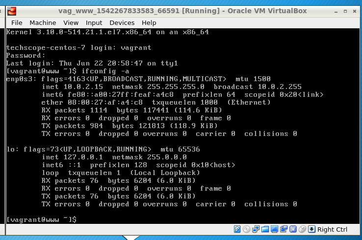
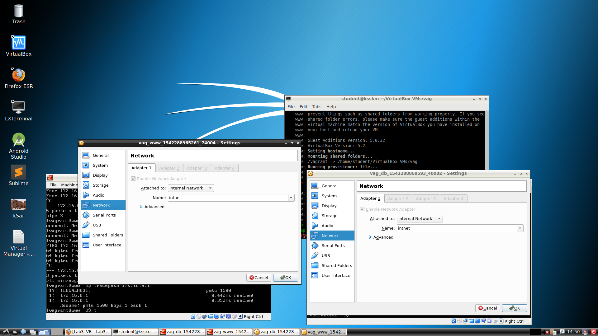
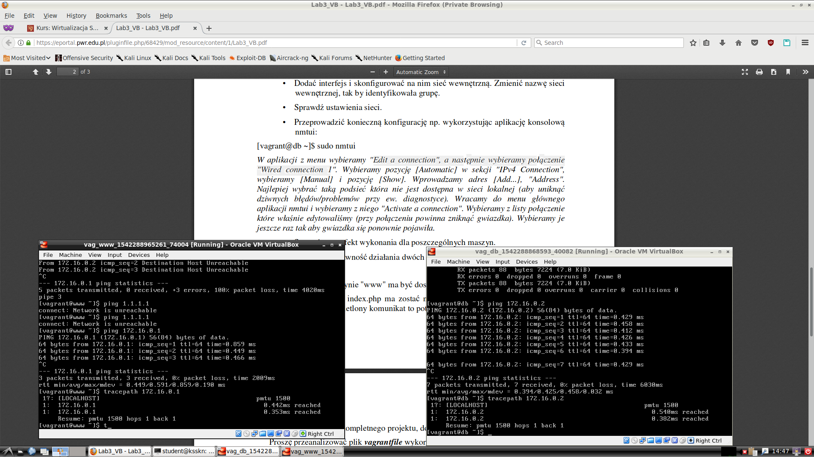
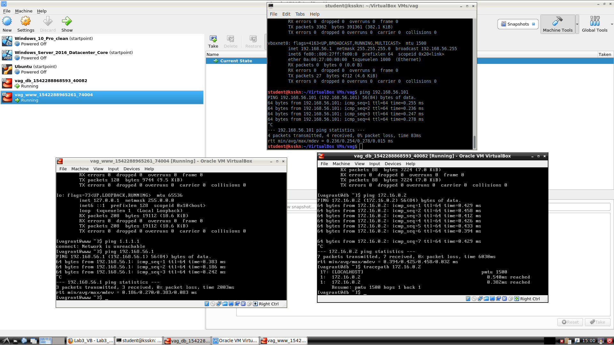
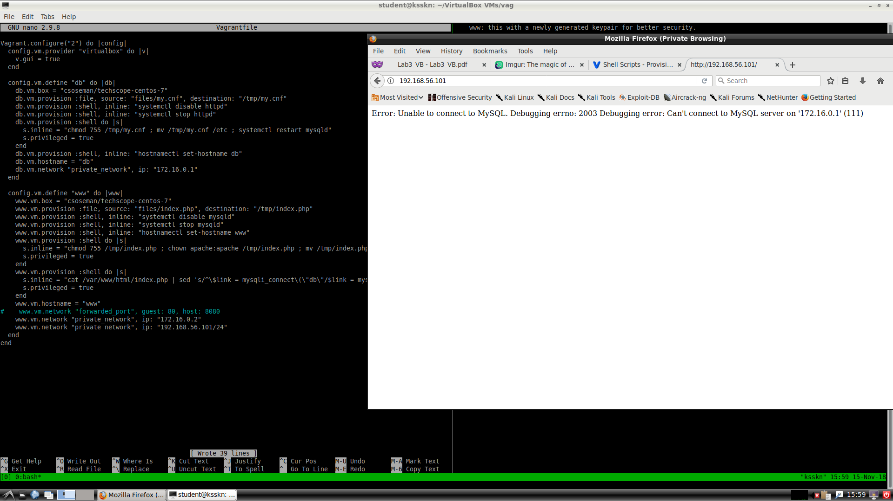
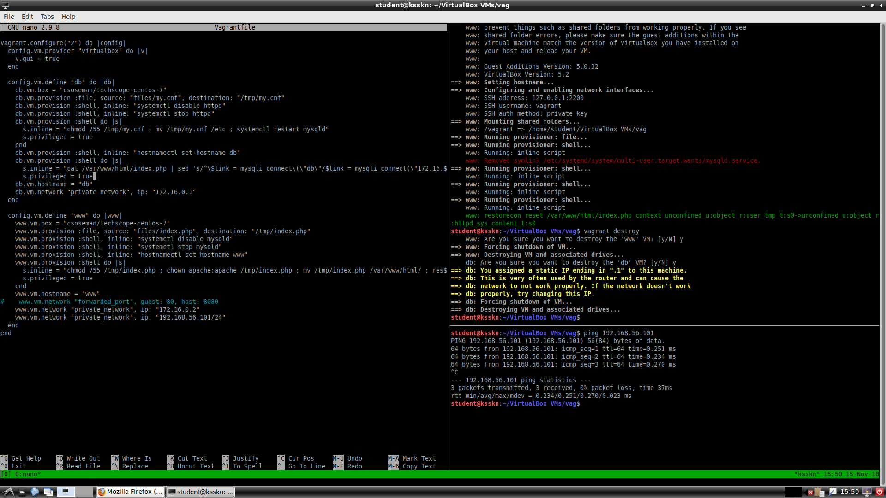

# Wirtualizacja systemów i sieci komputerowych
## Sprawozdanie z laboratorium

Data				| Tytuł zajęć							| Uczestnicy				
--------------------|---------------------------------------|---------------------------
15.11.2018 13:00	| Praca z maszyną wirtualną - Vagrant	| Iwo Bujkiewicz Wojciech Padło

### Odpowiedzi na pytania
##### Zadanie 1

* **Ile i jakie są dostępne interfejsy?**
	
	Dostępne są dwa interfejsy sieciowe:
	* interfejs Ethernet, połączony z domyślnym NAT hypervisora;
	* interfejs loopback.
	
* **Czy i jak został przypisany adres?**
	
	Adres zewnętrznego interfejsu Ethernet został przydzielony przez DHCP hypervisora.
	

###### Po skonfigurowaniu sieci wewnętrznej

* **Ile i jakie są dostępne interfejsy?**
	
	Dostępne są trzy interfejsy sieciowe:
	* interfest Ethernet, połączony z domyślnym NAT hypervisora;
	* interfejs Ethernet, połączony przez sieć wewnętrzną hypervisora z drugą maszyną wirtualną;
	* interfejs loopback.
	
* **Czy i jak został przypisany adres?**
	
	Adres interfejsu podłączonego do sieci wewnętrznej został ustawiony statycznie.
	

### Wyniki realizacji zadań

Początkowo, po skonfigurowaniu sieci wewnętrznej i przełączeniu głównego interfejsu maszyny `www` na host-only network, funkcjonowała łączność TCP/IP pomiędzy maszynami wirtualnymi, a serwer HTTP był osiągalny z hosta, jednak nie mógł on się połączyć z serwerem MySQL. Ten problem został rozwiązany poprzez edycję konfiguracji połączenia z bazą danych w pliku `/var/www/html/index.php`.

W ramach własnego projektu konfiguracja przeprowadzona wcześniej została zautomatyzowana. Maszyny wirtualne otrzymały w `Vagrantfile` wszystkie potrzebne interfejsy sieciowe i ich adresy, a także komendę zamieniającą adres serwera MySQL. Jak widać na zrzucie ekranu, przy pierwszej próbie komenda ta została umieszczona w konfiguracji niewłaściwej maszyny, co naprawiono za kolejnym razem.

