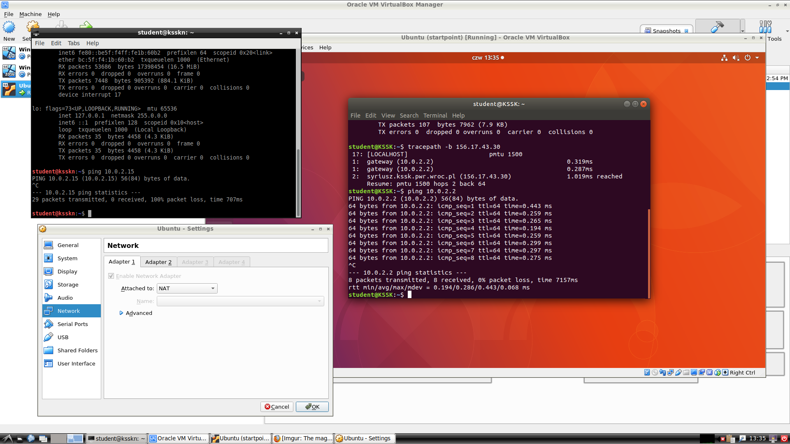
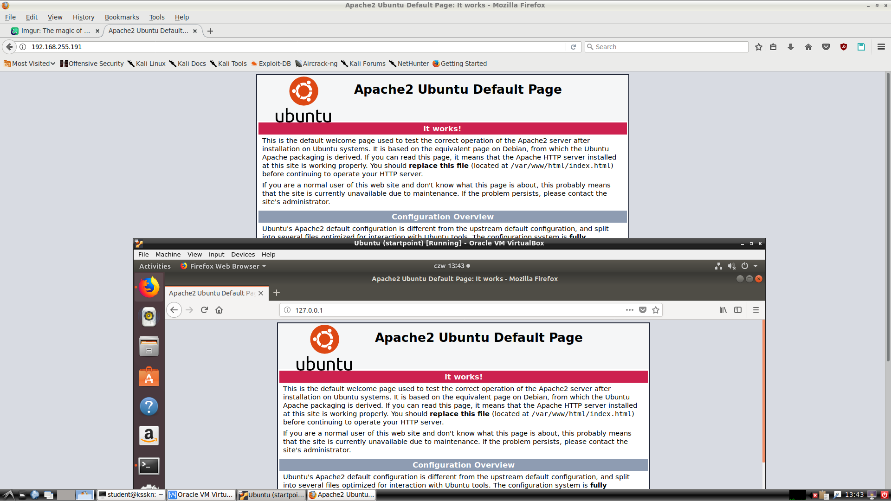
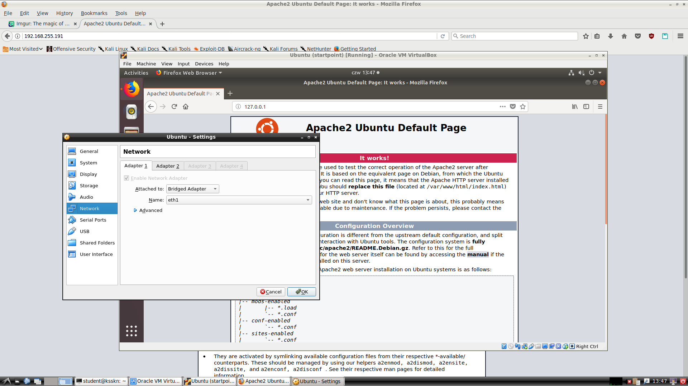
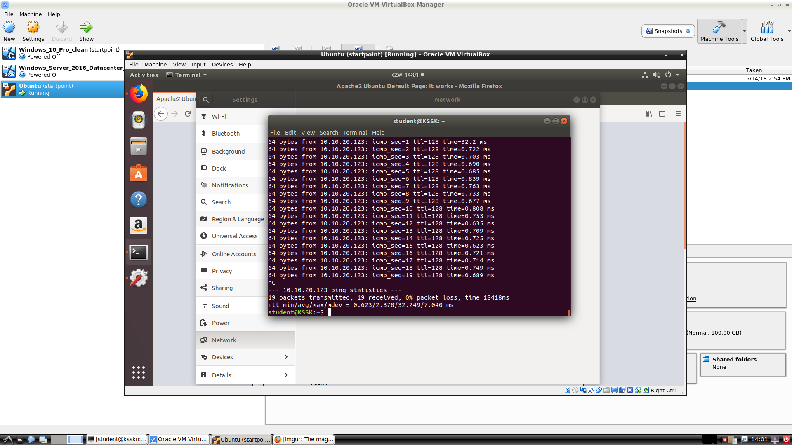
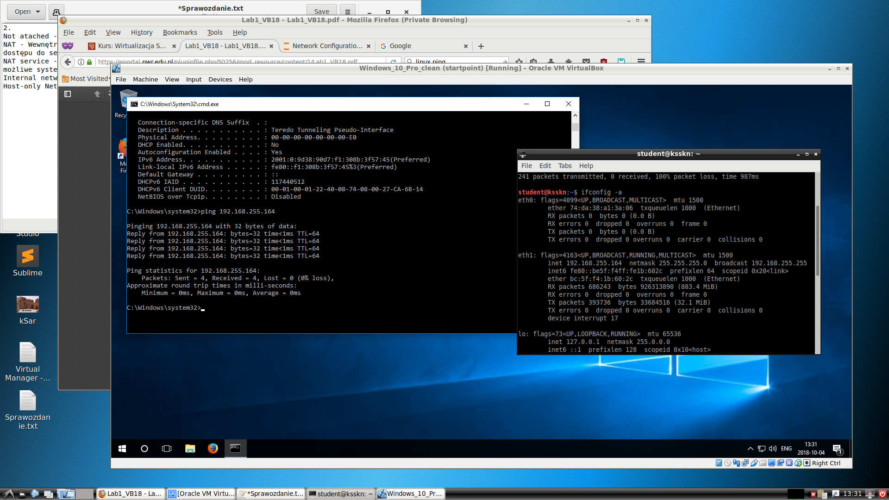
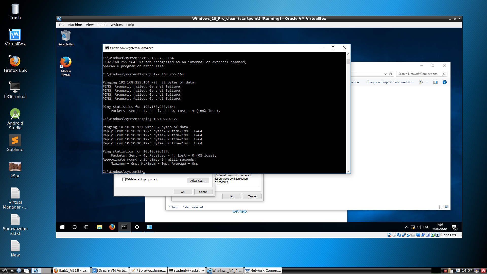

# Wirtualizacja systemów i sieci komputerowych
## Sprawozdanie z laboratorium

Data				| Tytuł zajęć							| Uczestnicy				
--------------------|---------------------------------------|---------------------------
04.10.2018 12:15	| Praca z maszyną wirtualną				| Iwo Bujkiewicz<br />Wojciech Padło

### Odpowiedzi na pytania
##### Zadanie 3

* **W jaki sposób system może uzyskać adres IP?**
	
	* Automatycznie przez DHCP w sieci, do której podłączony jest host;
	* Automatycznie przez DHCP w wirtualnej sieci wewnętrznej, tworzonej na hoście do komunikacji z gościem;
	* Ręcznie przez konfigurację network stacka wewnątrz gościa

* **Jeśli można uzyskać adres automatycznie, z jakiej podsieci jest to adres, gdzie jest serwer DHCP, co jest bramą?**
	
	Z fizycznej podsieci, której częścią jest host, lub z lokalnej podsieci wirtualnej. Serwerem DHCP jest serwer DHCP fizycznej podsieci, której częścią jest host, lub sam host.

* **Czy jest możliwość komunikacji z macierzystym systemem? Jeśli tak, pod jakim adresem go 'widać'?**
	
	Tak. 'Widać' go pod adresem IP przypisanym przez DHCP fizycznej podsieci lub ustalonym przez wirtualny network stack hosta.

* **Czy jest możliwość komunikacji z siecią laboratoryjną i Internetem?**
	
	Tak, w przypadku mostkowanego połączenia z fizyczną podsiecią.

##### Zadanie 5

* **Czy maszyny wirtualne mogą komunikować się?**
	Tak

* **Czy VM może komunikować się z macierzystym systemem operacyjnym?**
	Tak

* **Zmień adresy IP macierzystych systemów operacyjnych na adresy używane przez maszyny wirtualne. Czy VM może komunikować się z macierzystym systemem operacyjnym?**
	Nie

<div class="page-break"></div>

#### Wyniki realizacji zadań













<div class="page-break"></div>

##### Host 1

```sh
student@ksskn:~$ ping 10.0.2.2
PING 10.0.2.2 (10.0.2.2) 56(84) bytes of data.
64 bytes from 10.0.2.2: icmp_seq=1 ttl=247 time=46.6 ms
64 bytes from 10.0.2.2: icmp_seq=2 ttl=247 time=47.1 ms
^C
--- 10.0.2.2 ping statistics ---
2 packets transmitted, 2 received, 0% packet loss, time 2ms
rtt min/avg/max/mdev = 46.605/46.830/47.056/0.312 ms
student@ksskn:~$ ping 10.0.2.15
PING 10.0.2.15 (10.0.2.15) 56(84) bytes of data.
^C
--- 10.0.2.15 ping statistics ---
2 packets transmitted, 0 received, 100% packet loss, time 26ms
```

```sh
student@ksskn:~$ ping 192.168.255.191
PING 192.168.255.191 (192.168.255.191) 56(84) bytes of data.
64 bytes from 192.168.255.191: icmp_seq=1 ttl=64 time=0.387 ms
64 bytes from 192.168.255.191: icmp_seq=2 ttl=64 time=0.247 ms
^C
--- 192.168.255.191 ping statistics ---
2 packets transmitted, 2 received, 0% packet loss, time 14ms
rtt min/avg/max/mdev = 0.247/0.317/0.387/0.070 ms
```

##### Gość 1

```sh
student@KSSK:~$ ping 10.0.2.2
PING 10.0.2.2 (10.0.2.2) 56(84) bytes of data.
64 bytes from 10.0.2.2: icmp_seq=1 ttl=64 time=0.443 ms
64 bytes from 10.0.2.2: icmp_seq=2 ttl=64 time=0.259 ms
64 bytes from 10.0.2.2: icmp_seq=3 ttl=64 time=0.265 ms
64 bytes from 10.0.2.2: icmp_seq=4 ttl=64 time=0.194 ms
64 bytes from 10.0.2.2: icmp_seq=5 ttl=64 time=0.259 ms
64 bytes from 10.0.2.2: icmp_seq=6 ttl=64 time=0.299 ms
64 bytes from 10.0.2.2: icmp_seq=7 ttl=64 time=0.297 ms
64 bytes from 10.0.2.2: icmp_seq=8 ttl=64 time=0.275 ms
^C
--- 10.0.2.2 ping statistics ---
8 packets transmitted, 8 received, 0% packet loss, time 7157ms
rtt min/avg/max/mdev = 0.194/0.286/0.443/0.068 ms
```

```sh
student@KSSK:~$ systemctl status apache2
● apache2.service - The Apache HTTP Server
   Loaded: loaded (/lib/systemd/system/apache2.service; enabled; vendor preset:
  Drop-In: /lib/systemd/system/apache2.service.d
           └─apache2-systemd.conf
   Active: active (running) since Thu 2018-10-04 13:38:43 CEST; 35s ago
 Main PID: 3176 (apache2)
    Tasks: 55 (limit: 4915)
   CGroup: /system.slice/apache2.service
           ├─3176 /usr/sbin/apache2 -k start
           ├─3177 /usr/sbin/apache2 -k start
           └─3178 /usr/sbin/apache2 -k start

paź 04 13:38:43 KSSK systemd[1]: Starting The Apache HTTP Server...
paź 04 13:38:43 KSSK apachectl[3165]: AH00558: apache2: Could not reliably deter
paź 04 13:38:43 KSSK systemd[1]: Started The Apache HTTP Server.
```

<div class="page-break"></div>

##### Gość 2

```cmd
C:\Windows\system32>ping 192.168.255.164

Pinging 192.168.255.164 with 32 bytes of data:
Reply from 192.168.255.164: bytes=32 time<1ms TTL=64
Reply from 192.168.255.164: bytes=32 time<1ms TTL=64
Reply from 192.168.255.164: bytes=32 time<1ms TTL=64
Reply from 192.168.255.164: bytes=32 time<1ms TTL=64

Ping statistics for 192.168.255.164:
    Packets: Sent = 4, Received = 4, Lost = 0 (0% loss),
Approximate round trip times in milli-seconds:
    Minimum = 0ms, Maximum = 0ms, Average = 0ms
```
